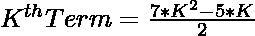
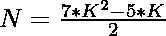
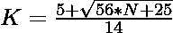

# 检查 N 是否为非正交数的程序

> 原文:[https://www . geesforgeks . org/program-to-check-if-n-is-a-non-gonal-number/](https://www.geeksforgeeks.org/program-to-check-if-n-is-a-nonagonal-number/)

给定一个数字 **N** ，任务是检查 **N** 是否为[非正交数字](https://www.geeksforgeeks.org/nonagonal-number/)。如果编号 **N** 是**非正交编号**，则打印**“是”**否则打印**“否”**。

> [](https://www.geeksforgeeks.org/nonagonal-number/)**是一个将三角形和正方形的概念扩展到非正多边形的图形数。具体来说，**第 n 个**非正交数计算 n 个嵌套非多边形( **9 边多边形**)的图案中的点数，所有多边形共享一个公共角，其中图案中具有非多边形的**具有由相互间隔一个单位的 **i 个点**构成的边。前几个非正交数字是 **1，9，24，46，75，111，154，…******

****示例:****

> ****输入:** N = 9
> **输出:**是
> **说明:**
> 第二个非正交数为 9。**
> 
>  ****输入:**N = 20
> T3】输出:否**

****进场:****

**1.非正交数的第**K**项给出为
**

**2.因为我们必须检查给定的数是否可以表示为非正交数。这可以检查为:**

> **=> 
> = > **

**3.如果用上述公式计算的 **K** 的值是一个整数，那么 **N** 就是一个非正交数。**

**4.否则 **N** 不是一个非正交数。**

**下面是上述方法的实现:**

## **C++**

```
// C++ program for the above approach
#include <bits/stdc++.h>
using namespace std;

// Function to check if N is a
// is a Nonagonal Number
bool isnonagonal(int N)
{
    float n
        = (5 + sqrt(56 * N + 25))
          / 14;

    // Condition to check if the
    // number is a nonagonal number
    return (n - (int)n) == 0;
}

// Driver Code
int main()
{
    // Given Number
    int N = 9;

    // Function call
    if (isnonagonal(N)) {
        cout << "Yes";
    }
    else {
        cout << "No";
    }
    return 0;
}
```

## **Java 语言(一种计算机语言，尤用于创建网站)**

```
// Java program for the above approach
import java.lang.Math;

class GFG{

// Function to check if N is a
// nonagonal number
public static boolean isnonagonal(int N)
{
    double n = (5 + Math.sqrt(56 * N + 25)) / 14;

    // Condition to check if the
    // number is a nonagonal number
    return (n - (int)n) == 0;
}

// Driver code    
public static void main(String[] args)
{

    // Given number
    int N = 9;

    // Function call
    if (isnonagonal(N))
    {
        System.out.println("Yes");
    }
    else
    {
        System.out.println("No");
    }
}
}

// This code is contributed by divyeshrabadiya07
```

## **蟒蛇 3**

```
# Python3 program for the above approach

# Function to check if N is a
# nonagonal number
def isnonagonal(N):
    n = (5 + pow((56 * N + 25), 1 / 2)) / 14;

    # Condition to check if the
    # number is a nonagonal number
    return (n - int(n)) == 0;

# Driver code
if __name__ == '__main__':

    # Given number
    N = 9;

    # Function call
    if (isnonagonal(N)):
        print("Yes");
    else:
        print("No");

# This code is contributed by Rajput-Ji
```

## **C#**

```
// C# program for the above approach
using System;

class GFG{

// Function to check if N is a
// nonagonal number
public static bool isnonagonal(int N)
{
    double n = (5 + Math.Sqrt(56 * N + 25)) / 14;

    // Condition to check if the
    // number is a nonagonal number
    return (n - (int)n) == 0;
}

// Driver code    
public static void Main(string[] args)
{

    // Given number
    int N = 9;

    // Function call
    if (isnonagonal(N))
    {
        Console.Write("Yes");
    }
    else
    {
        Console.Write("No");
    }
}
}

// This code is contributed by rutvik_56
```

## **java 描述语言**

```
<script>
// Javascript program for the above approach

// Function to check if N is a
// is a Nonagonal Number
function isnonagonal(N)
{
    let n
        = (5 + Math.sqrt(56 * N + 25))
          / 14;

    // Condition to check if the
    // number is a nonagonal number
    return (n - parseInt(n)) == 0;
}

// Driver Code

// Given Number
let N = 9;

// Function call
if (isnonagonal(N))
{
    document.write("Yes");
}
else
{
    document.write("No");
}

// This code is contributed by subhammahato348.
</script>
```

****Output:** 

```
Yes
```** 

*****时间复杂度:** O(1)***

*****辅助空间:** O(1)***