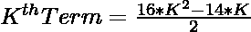
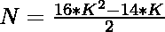
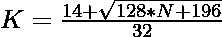

# 检查 N 是否为十八进制数的程序

> 原文:[https://www . geeksforgeeks . org/program-to-check-if-n-is-a-十八烷醇-number/](https://www.geeksforgeeks.org/program-to-check-if-n-is-a-octadecagon-number/)

给定一个数字 **N** ，任务是检查 **N** 是否为[十八宫号](https://en.wikipedia.org/wiki/Octadecagon)。如果数字 **N** 是十八进制数，则打印**“是”**否则打印**“否”**。

> [**十八边数**](https://en.wikipedia.org/wiki/Octadecagon) 是一个 18 边的多边形。前几个十八位数字是 **1，18，51，100，165，246，343，…**

**例:**

> **输入:** N = 18
> **输出:**是
> **说明:**
> 第二个十八宫号是 18。
> **输入:** N = 30
> **输出:**否

**进场:**

1.  十八进制数的第**K**项给出为
    

2.  因为我们必须检查给定的数字是否可以表示为**十八进制数**。可以勾选为:

> => 
> = > 

2.  如果用上述公式计算的 **K** 的值是一个整数，那么 **N** 就是一个十八进制数。
3.  否则 **N** 不是十八进制数。

以下是上述方法的实现:

## C++

```
// C++ program for the above approach
#include <bits/stdc++.h>
using namespace std;

// Function to check if N is a
// Octadecagon Number
bool isOctadecagon(int N)
{
    float n
        = (14 + sqrt(128 * N + 196))
          / 32;

    // Condition to check if the
    // number is a Octadecagon number
    return (n - (int)n) == 0;
}

// Driver Code
int main()
{
    // Given Number
    int N = 18;

    // Function call
    if (isOctadecagon(N)) {
        cout << "Yes";
    }
    else {
        cout << "No";
    }
    return 0;
}
```

## Java 语言(一种计算机语言，尤用于创建网站)

```
// Java program for the above approach
import java.lang.Math;

class GFG{

// Function to check if N is a
// octadecagon Number
public static boolean isOctadecagon(int N)
{
    double n = (14 + Math.sqrt(128 * N +
                               196)) / 32;

    // Condition to check if the
    // number is a octadecagon number
    return (n - (int)n) == 0;
}

// Driver Code   
public static void main(String[] args)
{

    // Given Number
    int N = 18;

    // Function call
    if (isOctadecagon(N))
    {
        System.out.println("Yes");
    }
    else
    {
        System.out.println("No");
    }
}
}

// This code is contributed by divyeshrabadiya07
```

## 蟒蛇 3

```
# Python3 program for the above approach
import math

# Function to check if N is a
# octadecagon number
def isOctadecagon(N):

    n = (14 + math.sqrt(128 * N + 196)) // 32

    # Condition to check if the
    # number is a octadecagon number
    return ((n - int(n)) == 0)

# Driver code
if __name__=='__main__':

    # Given number
    N = 18

    # Function Call
    if isOctadecagon(N):
        print('Yes')
    else:
        print('No')

# This code is contributed by rutvik_56
```

## C#

```
// C# program for the above approach
using System;
class GFG{

// Function to check if N is a
// octadecagon Number
public static bool isOctadecagon(int N)
{
    double n = (14 + Math.Sqrt(128 * N +
                               196)) / 32;

    // Condition to check if the
    // number is a octadecagon number
    return (n - (int)n) == 0;
}

// Driver Code
public static void Main(String[] args)
{

    // Given Number
    int N = 18;

    // Function call
    if (isOctadecagon(N))
    {
        Console.WriteLine("Yes");
    }
    else
    {
        Console.WriteLine("No");
    }
}
}

// This code is contributed by 29AjayKumar
```

## java 描述语言

```
<script>

// javascript program for the above approach

/// Function to check if N is a
// Octadecagon Number
function isOctadecagon( N)
{
    let n
        = (14 + Math.sqrt(128 * N + 196))
          / 32;

    // Condition to check if the
    // number is a Octadecagon number
    return (n - parseInt(n)) == 0;
}

// Driver Code

    // Given Number
    let N = 18;

    // Function Call
    if (isOctadecagon(N)) {
        document.write( "Yes");
    }
    else {
        document.write( "No");
    }

// This code contributed by gauravrajput1

</script>
```

**Output:** 

```
Yes
```

***时间复杂度:** O(1)*

***辅助空间:** O(1)*