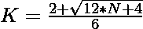

# 检查 N 是否为八边形数字的程序

> 原文:[https://www . geesforgeks . org/program-to-check-if-n-is-a-八角形-number/](https://www.geeksforgeeks.org/program-to-check-if-n-is-a-octagonal-number/)

给定一个数字 **N** ，任务是检查 **N** 是否为[八边形数字](https://www.geeksforgeeks.org/octagonal-number/)。如果编号 **N** 是八边形编号，则打印**“是”**否则打印**“否”**。

> [**八角号**](https://www.geeksforgeeks.org/octagonal-number/) 是代表八角的图号。八边形数字可以通过在正方形的四个边上放置三角形数字来形成。前几个八角数字是 **1、8、21、40、65、96……**

**例:**

> **输入:** N = 8
> **输出:**是
> **说明:**
> 第二个八角数为 8。
> **输入:** N = 30
> **输出:**否

**进场:**

1.  八角数的第**K**项给出为
    

2.  因为我们必须检查给定的数是否可以表示为八边形数。可以勾选为:

> => 
> = > 

2.  如果用上述公式计算的 **K** 的值是一个整数，那么 **N** 就是一个八边形数。
3.  否则 **N** 不是八边形数。

以下是上述方法的实现:

## C++

```
// C++ program for the above approach
#include <bits/stdc++.h>
using namespace std;

// Function to check if N is a
// Octagonal Number
bool isoctagonal(int N)
{
    float n
        = (2 + sqrt(12 * N + 4))
          / 6;

    // Condition to check if the
    // number is a octagonal number
    return (n - (int)n) == 0;
}

// Driver Code
int main()
{
    // Given Number
    int N = 8;

    // Function call
    if (isoctagonal(N)) {
        cout << "Yes";
    }
    else {
        cout << "No";
    }
    return 0;
}
```

## Java 语言(一种计算机语言，尤用于创建网站)

```
// Java program for the above approach
import java.io.*;
import java.util.*;

class GFG {

// Function to check if N is a
// octagonal number
public static boolean isoctagonal(int N)
{
    double n = (2 + Math.sqrt(12 * N + 4)) / 6;

    // Condition to check if the
    // number is a octagonal number
    return (n - (int)n) == 0;
}

// Driver code
public static void main(String[] args)
{

    // Given Number
    int N = 8;

    // Function call
    if (isoctagonal(N))
    {
        System.out.println("Yes");
    }
    else
    {
        System.out.println("No");
    }
}
}

// This code is contributed by coder001
```

## 蟒蛇 3

```
# Python3 program for the above approach
from math import sqrt

# Function to check if N is a
# octagonal number
def isoctagonal(N):

    n = (2 + sqrt(12 * N + 4)) / 6;

    # Condition to check if the
    # number is a octagonal number
    return (n - int(n)) == 0;

# Driver Code
if __name__ == "__main__":

    # Given number
    N = 8;

    # Function call
    if (isoctagonal(N)):
        print("Yes");

    else:
        print("No");

# This code is contributed by AnkitRai01
```

## C#

```
// C# program for the above approach
using System;

class GFG {

// Function to check if N is a
// octagonal number
public static bool isoctagonal(int N)
{
    double n = (2 + Math.Sqrt(12 * N +
                              4)) / 6;

    // Condition to check if the
    // number is a octagonal number
    return (n - (int)n) == 0;
}

// Driver code
public static void Main(String[] args)
{

    // Given number
    int N = 8;

    // Function call
    if (isoctagonal(N))
    {
        Console.WriteLine("Yes");
    }
    else
    {
        Console.WriteLine("No");
    }
}
}

// This code is contributed by Rohit_ranjan
```

## java 描述语言

```
<script>

// JavaScript program for the above approach

// Function to check if N is a
// Octagonal Number
function isoctagonal(N)
{
    var n = (2 + Math.sqrt(12 * N + 4)) / 6;

    // Condition to check if the
    // number is a octagonal number
    return (n - parseInt(n) == 0);
}

// Given Number
var N = 8;

// Function call
if (isoctagonal(N)) {
    document.write("Yes");
}
else {
    document.write("No");
}

</script>
```

**Output:** 

```
Yes
```

***时间复杂度:** O(1)*

***辅助空间:** O(1)*