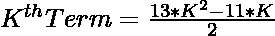
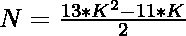
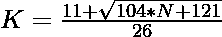

# 检查 N 是否为五边形数的程序

> 原文:[https://www . geesforgeks . org/program-to-check-if-n-is-a-penta decadenal-number/](https://www.geeksforgeeks.org/program-to-check-if-n-is-a-pentadecagonal-number/)

给定一个数字 **N** ，任务是检查 **N** 是否为[十五边形数字](https://en.wikipedia.org/wiki/Pentadecagon)。如果数字 **N** 是五边形数字，则打印**“是”**否则打印**“否”**。

> [**十五边形数字**](https://en.wikipedia.org/wiki/Pentadecagon) 是一个 15 边的多边形..前几个十边形数字是 **1，15，42，82，135，201，…**

**例:**

> **输入:** N = 15
> **输出:**是
> **说明:**
> 秒五边形数为 15。
> **输入:** N = 30
> **输出:**否

**进场:**

1.  十五边形编号的第**K**项给出为
    

2.  因为我们必须检查给定的数是否可以表示为五边形数。可以勾选为:

> => 
> = > 

2.  如果用上述公式计算出的 **K** 的值是一个整数，那么 **N** 就是一个十边形数。
3.  否则 **N** 不是五边形数。

以下是上述方法的实现:

## C++

```
// C++ program for the above approach
#include <bits/stdc++.h>
using namespace std;

// Function to check if N is a
// Pentadecagon number
bool isPentadecagon(int N)
{
    float n
        = (11 + sqrt(104 * N + 121))
          / 26;

    // Condition to check if the
    // number is a Pentadecagon number
    return (n - (int)n) == 0;
}

// Driver Code
int main()
{
    // Given Number
    int N = 15;

    // Function call
    if (isPentadecagon(N)) {
        cout << "Yes";
    }
    else {
        cout << "No";
    }
    return 0;
}
```

## Java 语言(一种计算机语言，尤用于创建网站)

```
// Java program for the above approach
import java.io.*;
import java.util.*;

class GFG {

// Function to check if N is
// a pentadecagon number
public static boolean isPentadecagon(int N)
{
    double n = (11 + Math.sqrt(104 * N +
                               121)) / 26;

    // Condition to check if the number
    // is a pentadecagon number
    return (n - (int)n) == 0;
}

// Driver code
public static void main(String[] args)
{

    // Given Number
    int N = 15;

    // Function call
    if (isPentadecagon(N))
    {
        System.out.println("Yes");
    }
    else
    {
        System.out.println("No");
    }
}
}

// This code is contributed by coder001
```

## 蟒蛇 3

```
# Python3 program for the above approach
from math import sqrt

# Function to check if N is a
# pentadecagon number
def isPentadecagon(N):

    n = (11 + sqrt(104 * N + 121)) / 26;

    # Condition to check if the
    # number is a pentadecagon number
    return (n - int(n) == 0);

# Driver Code
if __name__ == "__main__":

    # Given number
    N = 15;

    # Function call
    if (isPentadecagon(N)):
        print("Yes");

    else :
        print("No");

# This code is contributed by AnkitRai01
```

## C#

```
// C# program for the above approach
using System;

class GFG {

// Function to check if N is
// a pentadecagon number
public static bool isPentadecagon(int N)
{
    double n = (11 + Math.Sqrt(104 * N +
                               121)) / 26;

    // Condition to check if the number
    // is a pentadecagon number
    return (n - (int)n) == 0;
}

// Driver code
public static void Main(String[] args)
{

    // Given Number
    int N = 15;

    // Function call
    if (isPentadecagon(N))
    {
        Console.WriteLine("Yes");
    }
    else
    {
        Console.WriteLine("No");
    }
}
}

// This code is contributed by Amit Katiyar
```

## java 描述语言

```
<script>

// JavaScript program for the above approach

// Function to check if N is a
// Pentadecagon number
function isPentadecagon(N)
{
    var n = (11 + Math.sqrt(104 * N + 121))
          / 26;

    // Condition to check if the
    // number is a Pentadecagon number
    return (n - parseInt(n)) == 0;
}

// Given Number
var N = 15;
// Function call
if (isPentadecagon(N)) {
    document.write("Yes");
}
else {
    document.write("No");
}

</script>
```

**Output:** 

```
Yes
```

***时间复杂度:** O(1)*

***辅助空间:** O(1)*