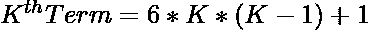
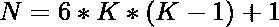
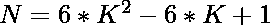
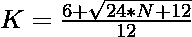

# 检查 N 是否为星号的程序

> 原文:[https://www . geesforgeks . org/program-to-check-if-n-is-star-number/](https://www.geeksforgeeks.org/program-to-check-if-n-is-a-star-number/)

给定一个整数 **N** ，任务是检查它是否是一个[星号](https://www.geeksforgeeks.org/program-to-find-star-number/)。

> [**星号**](https://www.geeksforgeeks.org/program-to-find-star-number/) 是一个居中的数字，代表一个类似中国棋局的居中卦(六芒星)。前几个星号是 1，13，37，73 …

**例:**

> **输入:** N = 13
> **输出:**是
> **说明:**
> 第二颗星号为 13。
> **输入:** 14
> **输出:**否
> **说明:**
> 第二颗星号为 13，其中 as 37 为第三颗。
> 因此，14 不是一个星号。

**进场:**

1.  星号的第 K <sup>个</sup>项给出为
    

2.  因为我们必须检查给定的数是否可以表示为星形数。这可以通过以下方式进行检查–

> = >
> =>
> =>

2.  最后，检查使用此公式计算的值是否为整数，这意味着 N 是一个星形数。

以下是上述方法的实现:

## C++

```
// C++ implementation to check that
// a number is a star number or not

#include <bits/stdc++.h>

using namespace std;

// Function to check that the
// number is a star number
bool isStar(int N)
{
    float n
        = (6 + sqrt(24 * N + 12))
          / 6;

    // Condition to check if the
    // number is a star number
    return (n - (int)n) == 0;
}

// Driver Code
int main()
{
    int i = 13;

    // Function call
    if (isStar(i)) {
        cout << "Yes";
    }
    else {
        cout << "No";
    }
    return 0;
}
```

## Java 语言(一种计算机语言，尤用于创建网站)

```
// Java implementation to check that
// a number is a star number or not
import java.io.*;
import java.util.*;

class GFG{

// Function to check that the
// number is a star number
static boolean isStar(int N)
{
    double n = (6 + Math.sqrt(24 * N + 12)) / 6;

    // Condition to check if the
    // number is a star number
    return (n - (int)n) == 0;
}

// Driver code
public static void main(String[] args)
{
    int i = 13;

    // Function call
    if (isStar(i))
    {
        System.out.println("Yes");
    }
    else
    {
        System.out.println("No");
    }
}
}

// This code is contributed by coder001
```

## 蟒蛇 3

```
# Python3 implementation to check that
# a number is a star number or not
import math

# Function to check that the
# number is a star number
def isStar(N):

    n = (math.sqrt(24 * N + 12) + 6) / 6

    # Condition to check if the
    # number is a star number
    return (n - int(n)) == 0

# Driver Code
i = 13

# Function call
if isStar(i):
    print("Yes")
else:
    print("No")

# This code is contributed by ishayadav181
```

## C#

```
// C# implementation to check that
// a number is a star number or not
using System;

class GFG{

// Function to check that the
// number is a star number
static bool isStar(int N)
{
    double n = (6 + Math.Sqrt(24 * N + 12)) / 6;

    // Condition to check if the
    // number is a star number
    return (n - (int)n) == 0;
}

// Driver code
public static void Main()
{
    int i = 13;

    // Function call
    if (isStar(i))
    {
        Console.WriteLine("Yes");
    }
    else
    {
        Console.WriteLine("No");
    }
}
}

// This code is contributed by Code_Mech
```

## java 描述语言

```
<script>
// Javascript implementation to check that
// a number is a star number or not

// Function to check that the
// number is a star number
function isStar(N)
{
    let n
        = (6 + Math.sqrt(24 * N + 12))
          / 6;

    // Condition to check if the
    // number is a star number
    return (n - parseInt(n)) == 0;
}

// Driver Code
let i = 13;

// Function call
if (isStar(i)) {
    document.write("Yes");
}
else {
    document.write("No");
}

// This code is contributed by rishavmahato348.
</script>
```

**Output:** 

```
Yes
```

时间复杂度:O(n <sup>1/2</sup> )

辅助空间:0(1)