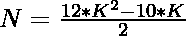
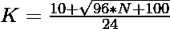

# 检查 N 是否为四边形数的程序

> 原文:[https://www . geesforgeks . org/program-to-check-if-n-is-a-tetra decoral-number/](https://www.geeksforgeeks.org/program-to-check-if-n-is-a-tetradecagonal-number/)

给定一个整数 **N** ，任务是检查 **N** 是否为[十边形数](https://www.geeksforgeeks.org/tetradecagonal-number/)。如果数字 **N** 是四边形数字，则打印**“是”**否则打印**“否”**。

> [**四角形数**](https://www.geeksforgeeks.org/tetradecagonal-number/) 是 **14 边多边形**称为四角形或四角形，属于具象数。**第 n 个**十边形数字加上一些点，形成一系列的图案。他们有一个共同的分享角点，彼此都很喜欢自己的空间。圆点以第 n 个嵌套循环继续。前几个十边形数字是 **1，14，39，76，125，186，…**

**例:**

> **输入:** N = 14
> **输出:**是
> **说明:**
> 第二个十边形数是 14。
> **输入:** N = 40
> **输出:**否

**进场:**

1.  四边形数的第**K**项给出为
    

2.  因为我们必须检查给定的数是否可以表示为四边形数。可以勾选为:

> => 
> = > 

2.  如果用上述公式计算的 **K** 的值是一个整数，那么 **N** 就是一个四边形数。
3.  否则 **N** 不是一个四边形数。

以下是上述方法的实现:

## C++

```
// C++ program for the above approach
#include <bits/stdc++.h>
using namespace std;

// Function to check if N is a
// Tetradecagonal Number
bool istetradecagonal(int N)
{
    float n
        = (10 + sqrt(96 * N + 100))
          / 24;

    // Condition to check if the
    // number is a tetradecagonal number
    return (n - (int)n) == 0;
}

// Driver Code
int main()
{
    // Given Number
    int N = 11;

    // Function call
    if (istetradecagonal(N)) {
        cout << "Yes";
    }
    else {
        cout << "No";
    }
    return 0;
}
```

## Java 语言(一种计算机语言，尤用于创建网站)

```
// Java program for the above approach
import java.lang.Math;

class GFG{

// Function to check if N is a
// tetradecagonal number
public static boolean istetradecagonal(int N)
{
    double n = (10 + Math.sqrt(96 * N +
                               100)) / 24;

    // Condition to check if the number
    // is a tetradecagonal number
    return (n - (int)n) == 0;
}

// Driver Code   
public static void main(String[] args)
{

    // Given number
    int N = 11;

    // Function call
    if (istetradecagonal(N))
    {
        System.out.println("Yes");
    }
    else
    {
        System.out.println("No");
    }
}
}

// This code is contributed by divyeshrabadiya07       
```

## 蟒蛇 3

```
# Python3 program for the above approach
import math

# Function to check if N is a
# Tetradecagonal Number
def istetradecagonal(N):

    n = (10 + math.sqrt(96 * N + 100)) / 24

    # Condition to check if the
    # number is a tetradecagonal number
    if (n - int(n)) == 0:
        return True

    return False

# Driver Code

# Given Number
N = 11

# Function call
if (istetradecagonal(N)):
    print("Yes")
else:
    print("No")

# This code is contributed by shubhamsingh10
```

## C#

```
// C# program for the above approach
using System;

class GFG{

// Function to check if N is a
// tetradecagonal number
public static bool istetradecagonal(int N)
{
    double n = (10 + Math.Sqrt(96 * N +
                               100)) / 24;

    // Condition to check if the number
    // is a tetradecagonal number
    return (n - (int)n) == 0;
}

// Driver Code
static public void Main ()
{

    // Given number
    int N = 11;

    // Function call
    if (istetradecagonal(N))
    {
        Console.Write("Yes");
    }
    else
    {
        Console.Write("No");
    }
}
}

// This code is contributed by shubhamsingh10
```

## java 描述语言

```
<script>

// Javascript program for the above approach

// Function to check if N is a
// Tetradecagonal Number
function istetradecagonal(N)
{
    n = (10 + Math.sqrt(96 * N + 100))
          / 24;

    // Condition to check if the
    // number is a tetradecagonal number
    return (n - parseInt(n)) == 0;
}

// Driver Code
// Given Number
N = 11;
// Function call
if (istetradecagonal(N)) {
    document.write("Yes");
}
else {
    document.write("No");
}

</script>
```

**Output:** 

```
No
```

***时间复杂度:** O(1)*

***辅助空间:** O(1)*