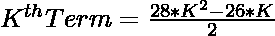
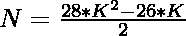
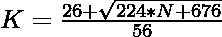

# 程序检查 N 是否是一个三十进制数

> 原文:[https://www . geesforgeks . org/program-to-check-if-n-is-a-triangonal-number/](https://www.geeksforgeeks.org/program-to-check-if-n-is-a-triacontagonal-number/)

给定一个数字 **N** ，任务是检查这个数字是否是一个[三角数](https://www.geeksforgeeks.org/triacontagon-number/)。

> 一个[三十进制数](https://www.geeksforgeeks.org/triacontagon-number/)是一类图形数。它有 30 边的多边形，叫做三十边形。第 N 个三十进制数是 30 个数的点，所有其他点用一个公共的共享角包围并形成一个图案。前几个三十烷醇数字是 1，30，87，172 …

**例:**

> **输入:** N = 30
> **输出:**是
> **说明:**
> 第二个三十进制数是 30。
> **输入:** 32
> **输出:**否

**进场:**

1.  三十进制数的第 K<sup>项给出为:</sup> 

> 

1.  因为我们必须检查给定的数是否可以表示为三十进制数。这可以通过以下方式进行检查:

> =>
> 
> 
> 
> =>
> 
> 

2.  最后，检查使用此公式计算的值是否为整数，这意味着 N 是一个三十进制数。

以下是上述方法的实现:

## C++

```
// C++ program to check whether a
// number is an triacontagonal
// number or not
#include <bits/stdc++.h>
using namespace std;

// Function to check whether a
// number is an triacontagonal
// number or not
bool istriacontagonal(int N)
{
    float n
        = (26 + sqrt(224 * N + 676))
          / 56;

    // Condition to check whether a
    // number is an triacontagonal
    // number or not
    return (n - (int)n) == 0;
}

// Driver Code
int main()
{

    // Given number
    int i = 30;

    // Function call
    if (istriacontagonal(i)) {
        cout << "Yes";
    }
    else {
        cout << "No";
    }
    return 0;
}
```

## Java 语言(一种计算机语言，尤用于创建网站)

```
// Java program to check whether a
// number is an triacontagonal
// number or not
class GFG{

// Function to check whether a
// number is an triacontagonal
// number or not
static boolean istriacontagonal(int N)
{
    float n = (float) ((26 + Math.sqrt(224 * N +
                                       676)) / 56);

    // Condition to check whether a
    // number is an triacontagonal
    // number or not
    return (n - (int)n) == 0;
}

// Driver code
public static void main(String[] args)
{

    // Given number
    int N = 30;

    // Function call
    if (istriacontagonal(N))
    {
        System.out.print("Yes");
    }
    else
    {
        System.out.print("No");
    }
}
}

// This code is contributed by shubham
```

## 蟒蛇 3

```
# Python3 program to check whether a
# number is an triacontagonal
# number or not
import math;

# Function to check whether a
# number is an triacontagonal
# number or not
def istriacontagonal(N):

    n = (26 + math.sqrt(224 * N + 676)) // 56;

    # Condition to check whether a
    # number is an triacontagonal
    # number or not
    return (n - int(n)) == 0;

# Driver Code

# Given number
i = 30;

# Function call
if (istriacontagonal(i)):
    print("Yes");
else:
    print("No");

# This code is contributed by Code_Mech
```

## C#

```
// C# program to check whether a
// number is an triacontagonal
// number or not
using System;
class GFG{

// Function to check whether a
// number is an triacontagonal
// number or not
static bool istriacontagonal(int N)
{
    float n = (float)((26 + Math.Sqrt(224 * N +
                                      676)) / 56);

    // Condition to check whether a
    // number is an triacontagonal
    // number or not
    return (n - (int)n) == 0;
}

// Driver code
public static void Main(String[] args)
{

    // Given number
    int N = 30;

    // Function call
    if (istriacontagonal(N))
    {
        Console.Write("Yes");
    }
    else
    {
        Console.Write("No");
    }
}
}

// This code is contributed by sapnasingh4991
```

## java 描述语言

```
<script>
// javascript  program to check whether a
// number is an triacontagonal
// number or not

// Function to check whether a
// number is an triacontagonal
// number or not
function istriacontagonal( N)
{
    let n = ((26 + Math.sqrt(224 * N +
                                       676)) / 56);

    // Condition to check whether a
    // number is an triacontagonal
    // number or not
    return (n - parseInt(n)) == 0;
}

// Driver code

    // Given number
    let N = 30;

    // Function call
    if (istriacontagonal(N))
    {
          document.write("Yes");
    }
    else
    {
         document.write("No");
    }

    // This code is contributed by aashish1995
</script>
```

**Output**

```
Yes
```

***时间复杂度:** O(sqrt(n))*

***辅助空间:** O(1)*