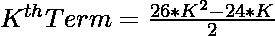
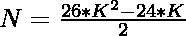

# 检查 N 是否为 Icosikaioctagonal 数字的程序

> 原文:[https://www . geeksforgeeks . org/program-to-check-if-n-is-icosikaiotagonal-number/](https://www.geeksforgeeks.org/program-to-check-if-n-is-an-icosikaioctagonal-number/)

给定一个整数 **N** ，任务是检查它是否是一个[icosikalioctonal 数字](https://www.geeksforgeeks.org/icosikaioctagon-or-icosioctagon-number/)。

> 一个[icosikaliocational 数](https://www.geeksforgeeks.org/icosikaioctagon-or-icosioctagon-number/)是一类图形数。它有一个 28 边的多边形，叫做 icosikaioctagon。第 N 个 icosikaioctagonal 数字计数是 28 个点的数量，所有其他点都被一个公共共享角包围并形成一个图案。icosikaioctagonol 的前几个数字是 1、28、81、160 …

**示例:**

> **输入:** N = 28
> **输出:**是
> **解释:**
> 第二个 icosikaioctagonal 数是 28。
> 
> **输入:**30
> T3】输出:否

**进场:**

1.icosikaioctagonal 数的第 K<sup>项给出如下:</sup>

> 

2.因为我们必须检查给定的数字是否可以表示为 icosikaioctagonal 数。这可以通过以下方式进行检查–

> => 
> = > 

3.最后，检查使用这些公式计算的值是否为整数，这意味着 N 是一个 icosikaioctagonal 数。

下面是上述方法的实现:

## C++

```
// C++ program to check whether a
// number is an icosikaioctagonal
// number or not

#include <bits/stdc++.h>

using namespace std;

// Function to check whether a number
// is an icosikaioctagonal number or not
bool isicosikaioctagonal(int N)
{
    float n
        = (24 + sqrt(208 * N + 576))
          / 52;

    // Condition to check if the
    // number is an
    // icosikaioctagonal number
    return (n - (int)n) == 0;
}

// Driver code
int main()
{
    int i = 28;

    if (isicosikaioctagonal(i)) {
        cout << "Yes";
    }
    else {
        cout << "No";
    }
    return 0;
}
```

## Java 语言(一种计算机语言，尤用于创建网站)

```
// Java program to check whether a
// number is an icosikaioctagonal
// number or not
class GFG{

// Function to check whether a
// number is an icosikaioctagonal
// number or not
static boolean isicosikaioctagonal(int N)
{
    float n = (float) ((24 + Math.sqrt(208 * N +
                                       576)) / 52);

    // Condition to check whether a
    // number is an icosikaioctagonal
    // number or not
    return (n - (int)n) == 0;
}

// Driver Code
public static void main(String[] args)
{

    // Given number
    int N = 28;

    // Function call
    if (isicosikaioctagonal(N))
    {
        System.out.print("Yes");
    }
    else
    {
        System.out.print("No");
    }
}
}

// This code is contributed by shubham
```

## 蟒蛇 3

```
# Python3 program to check whether a
# number is an icosikaioctagonal
# number or not
import math

# Function to check whether a number
# is an icosikaioctagonal number or not
def isicosikaioctagonal(N):

    n = (24 + math.sqrt(208 * N +
                        576)) // 52;

    # Condition to check if the
    # number is an
    # icosikaioctagonal number
    return (n - int(n)) == 0;

# Driver code
i = 28;

if (isicosikaioctagonal(i)):
    print("Yes");
else:
    print("No");

# This code is contributed by Code_Mech
```

## C#

```
// C# program to check whether a
// number is an icosikaioctagonal
// number or not
using System;
class GFG{

// Function to check whether a
// number is an icosikaioctagonal
// number or not
static bool isicosikaioctagonal(int N)
{
    float n = (float)((24 + Math.Sqrt(208 * N +
                                      576)) / 52);

    // Condition to check whether a
    // number is an icosikaioctagonal
    // number or not
    return (n - (int)n) == 0;
}

// Driver Code
public static void Main()
{

    // Given number
    int N = 28;

    // Function call
    if (isicosikaioctagonal(N))
    {
        Console.Write("Yes");
    }
    else
    {
        Console.Write("No");
    }
}
}

// This code is contributed by Code_Mech
```

## java 描述语言

```
<script>
// Javascript program to check whether a
// number is an icosikaioctagonal
// number or not

// Function to check whether a number
// is an icosikaioctagonal number or not
function isicosikaioctagonal(N)
{
    let n
        = (24 + Math.sqrt(208 * N + 576))
          / 52;

    // Condition to check if the
    // number is an
    // icosikaioctagonal number
    return (n - parseInt(n)) == 0;
}

// Driver code
let i = 28;

if (isicosikaioctagonal(i)) {
    document.write("Yes");
}
else {
    document.write("No");
}

// This code is contributed by rishavmahato348.
</script>
```

**Output:** 

```
Yes
```

**时间复杂度:** O(1)

**辅助空间:** O(1)