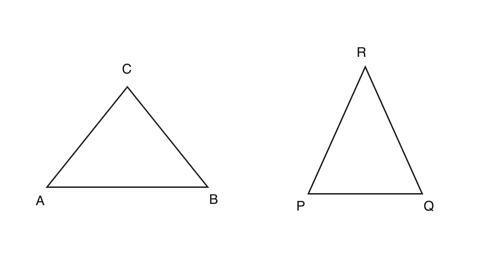
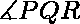
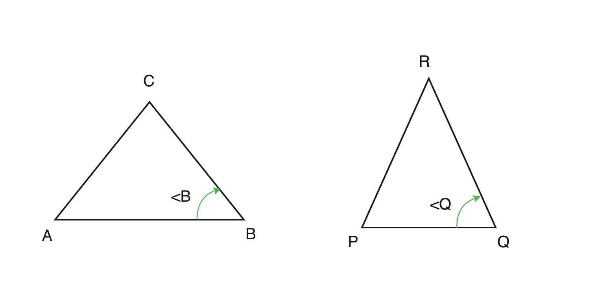
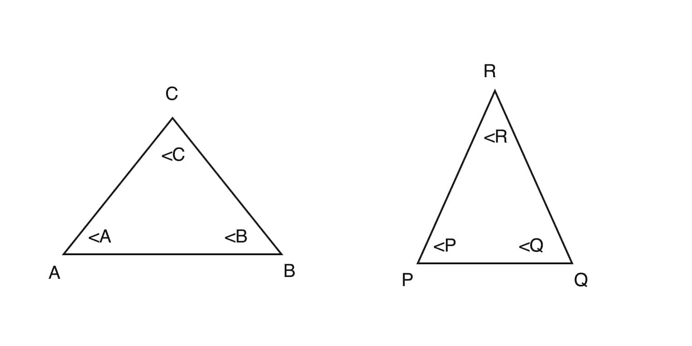

# 检查给定两个三角形相似性的程序

> 原文:[https://www . geeksforgeeks . org/程序检查给定两个三角形的相似性/](https://www.geeksforgeeks.org/program-to-check-similarity-of-given-two-triangles/)

给定四个由 3 个数字组成的数组，每个数字代表两个三角形的边和角。任务是检查两个三角形是否相似。如果相似，打印它所依据的定理。
**例:**

```
Input : side1 = [2, 3, 3] angle1 = [80, 60, 40]
        side2 = [4, 6, 6]  angle2 = [40, 60, 80]
Output: Triangles are similar by SSS AAA SAS 

Input : side1 = [2, 3, 4] angle1 = [85, 45, 50]
        side2 = [4, 6, 6]  angle2 = [40, 60, 80]
Output: Triangles are not similar
```

相似三角形是指两个或两个以上的三角形，其所有对应的角度相等，所有对应的边成比例。三角形面向哪个方向并不重要。它们的大小并不重要，只要每一方是相称的。三角形的相似性可以通过以下定理来证明:

1.  **边-边-边(SSS)相似性标准:**
    如果一个三角形的所有边都与另一个三角形的相应边成比例，那么通过*边-边-边* (SSS)的性质来说，这些三角形是相似的。
    在三角形 ABC 和 PQR if 中，AB/PQ = BC/QR = CA/RP 三角形相似。



1.  **侧角-边(SAS)相似性标准:**
    如果两个三角形的两个边是成比例的，并且它们之间的角度在两个三角形中都是相同的，那么通过*侧角-边* (SAS)的性质，这两个三角形被认为是相似的。
    在三角形 ABC 和 PQR if 中，AB/PQ = BC/QR 和 = 三角形相似。



1.  **角度-角度-角度(AAA)相似性标准:**
    如果一个三角形的所有角度都等于另一个三角形的相应角度，那么通过*角度-角度-角度* (AAA)的性质，可以说这些三角形是相似的。
    在三角形 ABC 和 PQR 中如果 = 、 = 和 = 那么三角形是相似的。



以下是上述方法的实现:

## C++

```
// C++ program to check
// similarity between
// two triangles.
#include<bits/stdc++.h>
using namespace std;

//Function for AAA similarity
int simi_aaa(int a1[], int a2[])
{
    sort(a1, a1 + 3);
    sort(a2, a2 + 3);

    // Check for AAA
    if (a1[0] == a2[0] &&
        a1[1] == a2[1] &&
        a1[2] == a2[2])
    return 1;
    else
    return 0;

}

// Function for
// SAS similarity
int simi_sas(int s1[], int s2[],
             int a1[], int a2[])
{
    sort(a1, a1 + 3);
    sort(a2, a2 + 3);
    sort(s1, s1 + 3);
    sort(s2, s2 + 3);

    // Check for SAS

    // angle b / w two smallest
    // sides is largest.
    if( s1[0] / s2[0] == s1[1] /
                         s2[1])
    {
        // since we take angle
        // b / w the sides.
        if (a1[2] == a2[2])        
            return 1;
    }
    if (s1[1] / s2[1] == s1[2] /
                         s2[2])
    {
        if (a1[0] == a2[0])
            return 1;
        }
    if (s1[2] / s2[2] == s1[0] /   
                         s2[0])
    {
        if(a1[1] == a2[1])
            return 1;
        }
    return 0;
}

// Function for SSS similarity
int simi_sss(int s1[], int s2[])
{
    sort(s1, s1 + 3);
    sort(s2, s2 + 3);

    // Check for SSS
    if(s1[0] / s2[0] == s1[1] / s2[1] &&
       s1[1] / s2[1] == s1[2] / s2[2] &&
       s1[2] / s2[2] == s1[0] / s2[0])
        return 1;

    return 0;
}

// Driver Code
int main()
{
    int s1[] = {2, 3, 3};
    int s2[] = {4, 6, 6};

    int a1[] = {80, 60, 40};
    int a2[] = {40, 60, 80};

    // function call for
    // AAA similarity
    int aaa = simi_aaa(a1, a2);

    // function call for
    // SSS similarity
    int sss = simi_sss(s1, s2) ;

    // function call for
    // SAS similarity
    int sas = simi_sas(s1, s2,
                       a1, a2) ;

    // Check if triangles
    // are similar or not
    if(aaa == 1 ||
       sss == 1 || sas == 1)
    {
        cout << "Triangles are "
             << "similar by ";
        if(aaa == 1) cout << "AAA ";
        if(sss == 1) cout << "SSS ";
        if(sas == 1) cout << "SAS.";
    }

    else
        cout << "Triangles are "
             << "not similar";
    return 0;
}

// This code is contributed
// by Arnab Kundu
```

## Java 语言(一种计算机语言，尤用于创建网站)

```
// Java program to check
// similarity between
// two triangles.
import java.util.*;
class GFG1
{

// Function for
// AAA similarity
static int simi_aaa(int a1[],
                    int a2[])
{
    Arrays.sort(a1);
    Arrays.sort(a2);

    // Check for AAA
    if (a1[0] == a2[0] &&
        a1[1] == a2[1] &&
        a1[2] == a2[2])
    return 1;
    else
    return 0;

}

// Function for
// SAS similarity
static int simi_sas(int s1[], int s2[],
                    int a1[], int a2[])
{
    Arrays.sort(a1);
    Arrays.sort(a2);
    Arrays.sort(s1);
    Arrays.sort(s2);

    // Check for SAS

    // angle b / w two smallest
    // sides is largest.
    if(s1[0] / s2[0] == s1[1] / s2[1])
    {
        // since we take angle
        // b / w the sides.
        if (a1[2] == a2[2])        
            return 1;
    }
    if (s1[1] / s2[1] == s1[2] / s2[2])
    {
        if (a1[0] == a2[0])
            return 1;
    }
    if (s1[2] / s2[2] == s1[0] / s2[0])
    {
        if(a1[1] == a2[1])
            return 1;
    }
    return 0;
}

// Function for
// SSS similarity
static int simi_sss(int s1[],
                    int s2[])
{
    Arrays.sort(s1);
    Arrays.sort(s2);

    // Check for SSS
    if(s1[0] / s2[0] == s1[1] / s2[1] &&
       s1[1] / s2[1] == s1[2] / s2[2] &&
       s1[2] / s2[2] == s1[0] / s2[0])
        return 1;

    return 0;
}

// Driver Code
public static void main(String args[])
{
    int s1[] = {2, 3, 3};
    int s2[] = {4, 6, 6};

    int a1[] = {80, 60, 40};
    int a2[] = {40, 60, 80};

    // function call for
    // AAA similarity
    int aaa = simi_aaa(a1, a2);

    // function call for
    // SSS similarity
    int sss = simi_sss(s1, s2) ;

    // function call for
    // SAS similarity
    int sas = simi_sas(s1, s2,
                       a1, a2) ;

    // Check if triangles
    // are similar or not
    if(aaa == 1 ||
       sss == 1 || sas == 1)
    {
        System.out.print("Triangles are " +
                         "similar by ");
        if(aaa == 1) System.out.print("AAA ");
        if(sss == 1) System.out.print("SSS ");
        if(sas == 1) System.out.print("SAS.");
    }
    else
        System.out.println("Triangles are " +
                           "not similar");
}
}

// This code is contributed
// by Arnab Kundu
```

## 计算机编程语言

```
# Python program to check
# similarity between two triangles.

# Function for AAA similarity
def simi_aaa(a1, a2):            
    a1 = [float(i) for i in a1]
    a2 = [float(i) for i in a2]
    a1.sort()
    a2.sort()

    # Check for AAA
    if a1[0] == a2[0] and a1[1] == a2[1] and a1[2] == a2[2]:
        return 1
    return 0

# Function for SAS similarity
def simi_sas(s1, s2, a1, a2):

    s1 = [float(i) for i in s1]
    s2 = [float(i) for i in s2]
    a1 = [float(i) for i in a1]
    a2 = [float(i) for i in a2]

    s1.sort()
    s2.sort()
    a1.sort()
    a2.sort()

    # Check for SAS

    # angle b / w two smallest sides is largest.
    if s1[0] / s2[0] == s1[1] / s2[1]:

        # since we take angle b / w the sides.
        if a1[2] == a2[2]:        
            return 1

    if s1[1] / s2[1] == s1[2] / s2[2]:
        if a1[0] == a2[0]:
            return 1

    if s1[2] / s2[2] == s1[0] / s2[0]:
        if a1[1] == a2[1]:
            return 1

    return 0

# Function for SSS similarity
def simi_sss(s1, s2):

    s1 = [float(i) for i in s1]
    s2 = [float(i) for i in s2]
    s1.sort()
    s2.sort()

    # Check for SSS
    if(s1[0] / s2[0] == s1[1] / s2[1]
        and s1[1] / s2[1] == s1[2] / s2[2]
        and s1[2] / s2[2] == s1[0] / s2[0]):
        return 1

    return 0

# Driver Code
s1 = [2, 3, 3]
s2 = [4, 6, 6]

a1 = [80, 60, 40]
a2 = [40, 60, 80]

# function call for AAA similarity
aaa = simi_aaa(a1, a2)

# function call for SSS similarity
sss = simi_sss(s1, s2)

# function call for SAS similarity
sas = simi_sas(s1, s2, a1, a2)

# Check if triangles are similar or not
if aaa or sss or sas:
    print "Triangles are similar by",
    if aaa: print "AAA",
    if sss: print "SSS",
    if sas: print "SAS"
else: print "Triangles are not similar"

```

## C#

```
// C# program to check
// similarity between
// two triangles.

using System;

class GFG1
{

// Function for
// AAA similarity
static int simi_aaa(int [] a1,
                    int [] a2)
{
    Array.Sort(a1);
    Array.Sort(a2);

    // Check for AAA
    if (a1[0] == a2[0] &&
        a1[1] == a2[1] &&
        a1[2] == a2[2])
    return 1;
    else
    return 0;

}

// Function for
// SAS similarity
static int simi_sas(int [] s1, int [] s2,
                    int [] a1, int [] a2)
{
    Array.Sort(a1);
    Array.Sort(a2);
    Array.Sort(s1);
    Array.Sort(s2);

    // Check for SAS

    // angle b / w two smallest
    // sides is largest.
    if(s1[0] / s2[0] == s1[1] / s2[1])
    {
        // since we take angle
        // b / w the sides.
        if (a1[2] == a2[2])        
            return 1;
    }
    if (s1[1] / s2[1] == s1[2] / s2[2])
    {
        if (a1[0] == a2[0])
            return 1;
    }
    if (s1[2] / s2[2] == s1[0] / s2[0])
    {
        if(a1[1] == a2[1])
            return 1;
    }
    return 0;
}

// Function for
// SSS similarity
static int simi_sss(int [] s1,
                    int [] s2)
{
    Array.Sort(s1);
    Array.Sort(s2);

    // Check for SSS
    if(s1[0] / s2[0] == s1[1] / s2[1] &&
    s1[1] / s2[1] == s1[2] / s2[2] &&
    s1[2] / s2[2] == s1[0] / s2[0])
        return 1;

    return 0;
}

// Driver Code
public static void Main()
{
    int [] s1 = {2, 3, 3};
    int [] s2 = {4, 6, 6};

    int [] a1 = {80, 60, 40};
    int [] a2 = {40, 60, 80};

    // function call for
    // AAA similarity
    int aaa = simi_aaa(a1, a2);

    // function call for
    // SSS similarity
    int sss = simi_sss(s1, s2) ;

    // function call for
    // SAS similarity
    int sas = simi_sas(s1, s2,
                    a1, a2) ;

    // Check if triangles
    // are similar or not
    if(aaa == 1 ||
    sss == 1 || sas == 1)
    {
        Console.Write("Triangles are " +
                        "similar by ");
        if(aaa == 1) Console.Write("AAA ");
        if(sss == 1) Console.Write("SSS ");
        if(sas == 1) Console.Write("SAS.");
    }
    else
        Console.WriteLine("Triangles are " +
                        "not similar");
}
}

// This code is contributed
// by Ryuga
```

## 服务器端编程语言（Professional Hypertext Preprocessor 的缩写）

```
<?php
// PHP program to check similarity between
// two triangles.

// Function for AAA similarity
function simi_aaa($a1, $a2)
{
    sort($a1);
    sort($a2);

    // Check for AAA
    if ($a1[0] == $a2[0] && $a1[1] == $a2[1] &&
                            $a1[2] == $a2[2])
        return 1;
    else
        return 0;

}

// Function for SAS similarity
function simi_sas($s1, $s2, $a1, $a2)
{
    sort($a1);
    sort($a2);
    sort($s1);
    sort($s2);

    // Check for SAS

    // angle b / w two smallest
    // sides is largest.
    if( $s1[0] / $s2[0] == $s1[1] / $s2[1])
    {
        // since we take angle b / w the sides.
        if ($a1[2] == $a2[2])    
            return 1;
    }
    if ($s1[1] / $s2[1] == $s1[2] / $s2[2])
    {
        if ($a1[0] == $a2[0])
            return 1;
    }
    if ($s1[2] / $s2[2] == $s1[0] / $s2[0])
    {
        if($a1[1] == $a2[1])
            return 1;
    }
    return 0;
}

// Function for SSS similarity
function simi_sss($s1, $s2)
{
    sort($s1);
    sort($s2);

    // Check for SSS
    if($s1[0] / $s2[0] == $s1[1] / $s2[1] &&
       $s1[1] / $s2[1] == $s1[2] / $s2[2] &&
       $s1[2] / $s2[2] == $s1[0] / $s2[0])
        return 1;

    return 0;
}

// Driver Code
$s1 = array(2, 3, 3);
$s2 = array(4, 6, 6);

$a1 = array(80, 60, 40);
$a2 = array(40, 60, 80);

// function call for
// AAA similarity
$aaa = simi_aaa($a1, $a2);

// function call for
// SSS similarity
$sss = simi_sss($s1, $s2) ;

// function call for
// SAS similarity
$sas = simi_sas($s1, $s2,
                $a1, $a2) ;

// Check if triangles
// are similar or not
if($aaa == 1 || $sss == 1 || $sas == 1)
{
    echo "Triangles are similar by ";
    if($aaa == 1) echo "AAA ";
    if($sss == 1) echo "SSS ";
    if($sas == 1) echo "SAS.";
}

else
    echo "Triangles are not similar";

// This code is contributed
// by ajit.
?>
```

## java 描述语言

```
<script>
    // Javascript program to check
    // similarity between
    // two triangles.

    // Function for
    // AAA similarity
    function simi_aaa(a1, a2)
    {
        a1.sort(function(a, b){return a - b});
        a2.sort(function(a, b){return a - b});

        // Check for AAA
        if (a1[0] == a2[0] &&
            a1[1] == a2[1] &&
            a1[2] == a2[2])
            return 1;
        else
            return 0;

    }

    // Function for
    // SAS similarity
    function simi_sas(s1, s2, a1, a2)
    {
        a1.sort(function(a, b){return a - b});
        a2.sort(function(a, b){return a - b});
        s1.sort(function(a, b){return a - b});
        s2.sort(function(a, b){return a - b});

        // Check for SAS

        // angle b / w two smallest
        // sides is largest.
        if(s1[0] / s2[0] == s1[1] / s2[1])
        {
            // since we take angle
            // b / w the sides.
            if (a1[2] == a2[2])        
                return 1;
        }
        if (s1[1] / s2[1] == s1[2] / s2[2])
        {
            if (a1[0] == a2[0])
                return 1;
        }
        if (s1[2] / s2[2] == s1[0] / s2[0])
        {
            if(a1[1] == a2[1])
                return 1;
        }
        return 0;
    }

    // Function for
    // SSS similarity
    function simi_sss(s1, s2)
    {
        s1.sort(function(a, b){return a - b});
        s2.sort(function(a, b){return a - b});

        // Check for SSS
        if(s1[0] / s2[0] == s1[1] / s2[1] &&
        s1[1] / s2[1] == s1[2] / s2[2] &&
        s1[2] / s2[2] == s1[0] / s2[0])
            return 1;

        return 0;
    }

    let s1 = [2, 3, 3];
    let s2 = [4, 6, 6];

    let a1 = [80, 60, 40];
    let a2 = [40, 60, 80];

    // function call for
    // AAA similarity
    let aaa = simi_aaa(a1, a2);

    // function call for
    // SSS similarity
    let sss = simi_sss(s1, s2) ;

    // function call for
    // SAS similarity
    let sas = simi_sas(s1, s2, a1, a2) ;

    // Check if triangles
    // are similar or not
    if(aaa == 1 || sss == 1 || sas == 1)
    {
        document.write("Triangles are " + "similar by ");
        if(aaa == 1) document.write("AAA ");
        if(sss == 1) document.write("SSS ");
        if(sas == 1) document.write("SAS.");
    }
    else
        document.write("Triangles are not similar");

// This code is contributed by rameshtravel07.
</script>
```

**Output:** 

```
Triangles are similar by AAA SSS SAS
```