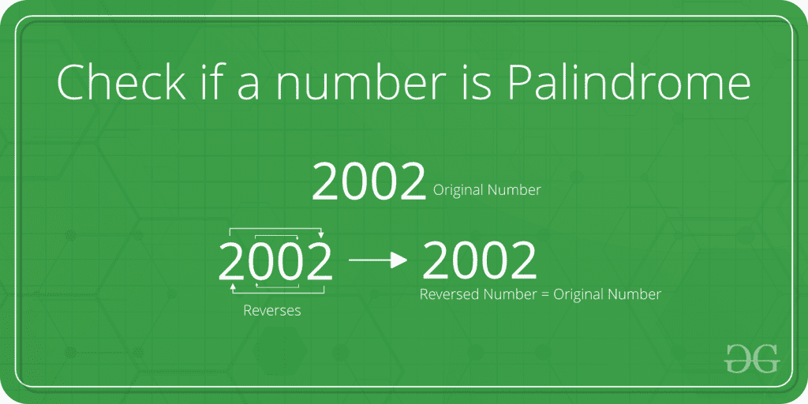

# 检查号码是否回文的程序

> 原文:[https://www . geesforgeks . org/program-to-check-number-is-回文-or-not/](https://www.geeksforgeeks.org/program-to-check-the-number-is-palindrome-or-not/)

给定一个整数 **N** ，编写一个程序，如果给定的数字是回文，则返回 true，否则返回 false。
**例:**

```
Input: N = 2002 
Output: true

Input: N = 1234
Output: false
```



**方法:**
这个问题的一个简单方法是先将 *n* 的[倒位，然后将 *n* 的倒位与 *n* 进行对比。如果两者相同，则返回真，否则返回假。
以下是上述方法的实施:](https://www.geeksforgeeks.org/write-a-c-program-to-reverse-digits-of-a-number/) 

## C++

```
// C program to check whether a number
// is Palindrome or not.

#include <stdio.h>

/* Iterative function to reverse digits of num*/
int reverseDigits(int num)
{
    int rev_num = 0;
    while (num > 0) {
        rev_num = rev_num * 10 + num % 10;
        num = num / 10;
    }
    return rev_num;
}

/* Function to check if n is Palindrome*/
int isPalindrome(int n)
{

    // get the reverse of n
    int rev_n = reverseDigits(n);

    // Check if rev_n and n are same or not.
    if (rev_n == n)
        return 1;
    else
        return 0;
}

/*Driver program to test reversDigits*/
int main()
{
    int n = 4562;
    printf("Is %d a Palindrome number? -> %s\n", n,
           isPalindrome(n) == 1 ? "true" : "false");

    n = 2002;
    printf("Is %d a Palindrome number? -> %s\n", n,
           isPalindrome(n) == 1 ? "true" : "false");
    return 0;
}
```

## Java 语言(一种计算机语言，尤用于创建网站)

```
// Java program to check whether a number
// is Palindrome or not.

class GFG
{
    /* Iterative function to reverse digits of num*/
    static int reverseDigits(int num)
    {
        int rev_num = 0;
        while (num > 0) {
            rev_num = rev_num * 10 + num % 10;
            num = num / 10;
        }
        return rev_num;
    }

    /* Function to check if n is Palindrome*/
    static int isPalindrome(int n)
    {

        // get the reverse of n
        int rev_n = reverseDigits(n);

        // Check if rev_n and n are same or not.
        if (rev_n == n)
            return 1;
        else
            return 0;
    }

    /*Driver program to test reversDigits*/
    public static void  main(String []args)
    {
        int n = 4562;
        System.out.println("Is" + n + "a Palindrome number? -> " +
            (isPalindrome(n) == 1 ? "true" : "false"));

        n = 2002;

        System.out.println("Is" + n + "a Palindrome number? -> " +
            (isPalindrome(n) == 1 ? "true" : "false"));

    }

}

// This code is contributed
// by Hritik Raj ( ihritik )
```

## 蟒蛇 3

```
# Python3 program to check whether a
# number is Palindrome or not.

# Iterative function to reverse
# digits of num
def reverseDigits(num) :

    rev_num = 0;
    while (num > 0) :
        rev_num = rev_num * 10 + num % 10
        num = num // 10

    return rev_num

# Function to check if n is Palindrome
def isPalindrome(n) :

    # get the reverse of n
    rev_n = reverseDigits(n);

    # Check if rev_n and n are same or not.
    if (rev_n == n) :
        return 1
    else :
        return 0

# Driver Code
if __name__ == "__main__" :

    n = 4562

    if isPalindrome(n) == 1 :
        print("Is", n, "a Palindrome number? ->", True)

    else :
        print("Is", n, "a Palindrome number? ->", False)

    n = 2002

    if isPalindrome(n) == 1 :
        print("Is", n, "a Palindrome number? ->", True)

    else :
        print("Is", n, "a Palindrome number? ->", False)

# This code is contributed by Ryuga
```

## C#

```
// C# program to check whether a number
// is Palindrome or not.

using System;
class GFG
{
    /* Iterative function to reverse digits of num*/
    static int reverseDigits(int num)
    {
        int rev_num = 0;
        while (num > 0) {
            rev_num = rev_num * 10 + num % 10;
            num = num / 10;
        }
        return rev_num;
    }

    /* Function to check if n is Palindrome*/
    static int isPalindrome(int n)
    {

        // get the reverse of n
        int rev_n = reverseDigits(n);

        // Check if rev_n and n are same or not.
        if (rev_n == n)
            return 1;
        else
            return 0;
    }

    /*Driver program to test reversDigits*/
    public static void  Main()
    {
        int n = 4562;
        Console.WriteLine("Is" + n + "a Palindrome number? -> " +
            (isPalindrome(n) == 1 ? "true" : "false"));

        n = 2002;

        Console.WriteLine("Is" + n + "a Palindrome number? -> " +
            (isPalindrome(n) == 1 ? "true" : "false"));

    }

}

// This code is contributed
// by Hritik Raj ( ihritik )
```

## 服务器端编程语言（Professional Hypertext Preprocessor 的缩写）

```
<?php
// PHP program to check whether a number
// is Palindrome or not.

// Iterative function to reverse
// digits of num
function reverseDigits($num)
{
    $rev_num = 0;
    while ($num > 0)
    {
        $rev_num = $rev_num * 10 +
                   $num % 10;
        $num = $num / 10;
    }
    return $rev_num;
}

// Function to check if n is Palindrome
function isPalindrome($n)
{

    // get the reverse of n
    $rev_n = reverseDigits($n);

    // Check if rev_n and n are same or not.
    if ($rev_n == $n)
        return 1;
    else
        return 0;
}

// Driver Code
$n = 4562;
echo "Is ", $n , " a Palindrome number? ->";

if(isPalindrome($n) == 1)
    echo "true" ;
else
    echo "false";
echo "\n";

$n = 2002;
echo "Is ", $n , " a Palindrome number? ->";
if(isPalindrome(!$n))
    echo "true" ;
else
    echo "false";

// This code is contributed by jit_t
?>
```

## java 描述语言

```
<script>

// Javascript program to check whether a number
// is Palindrome or not.

/* Iterative function to reverse digits of num*/
function reverseDigits(num)
{
    let rev_num = 0;
    while (num > 0) {
        rev_num = rev_num * 10 + num % 10;
        num = Math.floor(num / 10);
    }
    return rev_num;
}

/* Function to check if n is Palindrome*/
function isPalindrome(n)
{

    // get the reverse of n
    let rev_n = reverseDigits(n);

    // Check if rev_n and n are same or not.
    if (rev_n == n)
        return 1;
    else
        return 0;
}

/*Driver program to test reversDigits*/

    let n = 4562;
    document.write("Is " + n + " a Palindrome number? -> ")
    document.write(isPalindrome(n) == 1 ? "true" : "false" + "<br>");

    n = 2002;
    document.write("Is " + n + " a Palindrome number? -> ")
    document.write(isPalindrome(n) == 1 ? "true" : "false");

// This code is contributed by Mayank Tyagi

</script>
```

**Output:** 

```
Is 4562 a Palindrome number? -> false
Is 2002 a Palindrome number? -> true
```

**时间复杂度:**O(logN)
T3】辅助空间: O(1)