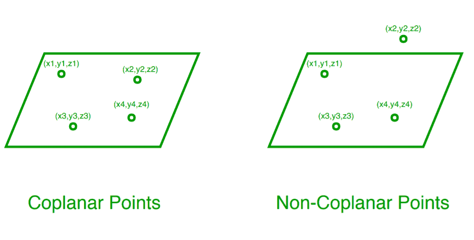

# 检查三维平面中 4 个点是否共面的程序

> 原文:[https://www . geesforgeks . org/program-to-check-a-3d-plane-4 点是否共面/](https://www.geeksforgeeks.org/program-to-check-whether-4-points-in-a-3-d-plane-are-coplanar/)

给定 4 个点(x1，y1，z1)，(x2，y2，z2)，(x3，y3，z3)，(x4，y4，z4)。任务是写程序检查这 4 点是否共面。
**注:**三维平面中的 4 个点如果位于同一平面，则称它们共面。



**例:**

```
Input:
x1 = 3, y1 = 2, z1 = -5
x2 = -1, y2 = 4, z2 = -3
x3 = -3, y3 = 8, z3 = -5
x4 = -3, y4 = 2, z4 = 1
Output: Coplanar

Input:
x1 = 0, y1 = -1, z1 = -1
x2 = 4, y2 = 5, z2 = 1
x3 = 3, y3 = 9, z3 = 4
x4 = -4, y4 = 4, z4 = 3
Output: Not Coplanar
```

**进场:**

1.  要检查 4 个点是否共面，首先要求出平面通过任意三个给定点的方程。
    [求平面通过 3 点的方程的方法](https://www.geeksforgeeks.org/program-to-find-equation-of-a-plane-passing-through-3-points/)。
2.  然后，检查第四点是否满足步骤 1 中获得的等式。也就是说，将第 4 点的值放入得到的方程中。如果它满足方程，那么 4 个点共面，否则不共面。

以下是上述思路的实现:

## C++

```
// C++ program to check if 4 points
// in a 3-D plane are Coplanar

#include<bits/stdc++.h>
using namespace std ;

// Function to find equation of plane.
void equation_plane(int x1,int y1,int z1,int x2,int y2,int z2,
             int x3, int y3, int z3, int x, int y, int z)
    {
    int a1 = x2 - x1 ;
    int b1 = y2 - y1 ;
    int c1 = z2 - z1 ;
    int a2 = x3 - x1 ;
    int b2 = y3 - y1 ;
    int c2 = z3 - z1 ;
    int a = b1 * c2 - b2 * c1 ;
    int b = a2 * c1 - a1 * c2 ;
    int c = a1 * b2 - b1 * a2 ;
    int d = (- a * x1 - b * y1 - c * z1) ;

    // equation of plane is: a*x + b*y + c*z = 0 #

    // checking if the 4th point satisfies
    // the above equation
    if(a * x + b * y + c * z + d == 0)
        cout << "Coplanar" << endl;
    else
        cout << "Not Coplanar" << endl;

    }

// Driver Code
int main()
{

int x1 = 3 ;
int y1 = 2 ;
int z1 = -5 ;
int x2 = -1 ;
int y2 = 4 ;
int z2 = -3 ;
int x3 = -3 ;
int y3 = 8 ;
int z3 = -5 ;
int x4 = -3 ;
int y4 = 2 ;
int z4 = 1 ;

// function calling
equation_plane(x1, y1, z1, x2, y2, z2, x3, 
                            y3, z3, x4, y4, z4) ;                           
return 0;

// This code is contributed by ANKITRAI1
}
```

## Java 语言(一种计算机语言，尤用于创建网站)

```
//Java program to check if 4 points
//in a 3-D plane are Coplanar

public class GFG {

    //Function to find equation of plane.
    static void equation_plane(int x1,int y1,int z1,int x2,int y2,int z2,
              int x3, int y3, int z3, int x, int y, int z)
     {
     int a1 = x2 - x1 ;
     int b1 = y2 - y1 ;
     int c1 = z2 - z1 ;
     int a2 = x3 - x1 ;
     int b2 = y3 - y1 ;
     int c2 = z3 - z1 ;
     int a = b1 * c2 - b2 * c1 ;
     int b = a2 * c1 - a1 * c2 ;
     int c = a1 * b2 - b1 * a2 ;
     int d = (- a * x1 - b * y1 - c * z1) ;

     // equation of plane is: a*x + b*y + c*z = 0 #

     // checking if the 4th point satisfies
     // the above equation
     if(a * x + b * y + c * z + d == 0)
         System.out.println("Coplanar");
     else
         System.out.println("Not Coplanar");

     }

    //Driver Code
    public static void main(String[] args) {

        int x1 = 3 ;
        int y1 = 2 ;
        int z1 = -5 ;
        int x2 = -1 ;
        int y2 = 4 ;
        int z2 = -3 ;
        int x3 = -3 ;
        int y3 = 8 ;
        int z3 = -5 ;
        int x4 = -3 ;
        int y4 = 2 ;
        int z4 = 1 ;

        //function calling
        equation_plane(x1, y1, z1, x2, y2, z2, x3, 
                                 y3, z3, x4, y4, z4) ;                           
    }
}
```

## 蟒蛇 3

```
# Python program to check if 4 points
# in a 3-D plane are Coplanar

# Function to find equation of plane.
def equation_plane(x1, y1, z1, x2, y2, z2, x3,
                                y3, z3, x, y, z):

    a1 = x2 - x1
    b1 = y2 - y1
    c1 = z2 - z1
    a2 = x3 - x1
    b2 = y3 - y1
    c2 = z3 - z1
    a = b1 * c2 - b2 * c1
    b = a2 * c1 - a1 * c2
    c = a1 * b2 - b1 * a2
    d = (- a * x1 - b * y1 - c * z1)

    # equation of plane is: a*x + b*y + c*z = 0 #

    # checking if the 4th point satisfies
    # the above equation
    if(a * x + b * y + c * z + d == 0):
        print("Coplanar")
    else:
        print("Not Coplanar")

# Driver Code
x1 = 3
y1 = 2
z1 = -5
x2 = -1
y2 = 4
z2 = -3
x3 = -3
y3 = 8
z3 = -5
x4 = -3
y4 = 2
z4 = 1
equation_plane(x1, y1, z1, x2, y2, z2, x3,
                            y3, z3, x4, y4, z4)
```

## C#

```
// C# program to check if 4 points
// in a 3-D plane are Coplanar
using System;

class GFG
{

// Function to find equation of plane.
static void equation_plane(int x1, int y1, int z1,
                           int x2, int y2, int z2,
                           int x3, int y3, int z3,
                           int x, int y, int z)
{
    int a1 = x2 - x1 ;
    int b1 = y2 - y1 ;
    int c1 = z2 - z1 ;
    int a2 = x3 - x1 ;
    int b2 = y3 - y1 ;
    int c2 = z3 - z1 ;
    int a = b1 * c2 - b2 * c1 ;
    int b = a2 * c1 - a1 * c2 ;
    int c = a1 * b2 - b1 * a2 ;
    int d = (- a * x1 - b * y1 - c * z1) ;

    // equation of plane is: a*x + b*y + c*z = 0 #

    // checking if the 4th point satisfies
    // the above equation
    if(a * x + b * y + c * z + d == 0)
        Console.WriteLine("Coplanar");
    else
        Console.WriteLine("Not Coplanar");

}

// Driver Code
static public void Main ()
{
    int x1 = 3 ;
    int y1 = 2 ;
    int z1 = -5 ;
    int x2 = -1 ;
    int y2 = 4 ;
    int z2 = -3 ;
    int x3 = -3 ;
    int y3 = 8 ;
    int z3 = -5 ;
    int x4 = -3 ;
    int y4 = 2 ;
    int z4 = 1 ;

    //function calling
    equation_plane(x1, y1, z1, x2, y2, z2,
                   x3, y3, z3, x4, y4, z4);                        
}
}

// This code is contributed by jit_t
```

## 服务器端编程语言（Professional Hypertext Preprocessor 的缩写）

```
<?php
// PHP program to check if 4 points
// in a 3-D plane are Coplanar

// Function to find equation of plane.
function equation_plane($x1, $y1, $z1, $x2,
                        $y2, $z2, $x3, $y3,
                        $z3, $x, $y, $z)
{
    $a1 = $x2 - $x1;
    $b1 = $y2 - $y1;
    $c1 = $z2 - $z1;
    $a2 = $x3 - $x1;
    $b2 = $y3 - $y1;
    $c2 = $z3 - $z1;
    $a = $b1 * $c2 - $b2 * $c1;
    $b = $a2 * $c1 - $a1 * $c2;
    $c = $a1 * $b2 - $b1 * $a2;
    $d = (- $a * $x1 - $b *
            $y1 - $c * $z1);

    // equation of plane is:
    // a*x + b*y + c*z = 0 #

    // checking if the 4th point 
    // satisfies the above equation
    if($a * $x + $b * $y +
       $c * $z + $d == 0)
        echo ("Coplanar");
    else
        echo ("Not Coplanar");
}

// Driver Code
$x1 = 3; $y1 = 2; $z1 = -5;
$x2 = -1; $y2 = 4; $z2 = -3;
$x3 = -3; $y3 = 8; $z3 = -5;
$x4 = -3; $y4 = 2; $z4 = 1;

// function calling
equation_plane($x1, $y1, $z1,
               $x2, $y2, $z2,
               $x3, $y3, $z3,
               $x4, $y4, $z4);                    

// This code is contributed
// by Shivi_Aggarwal
?>
```

## java 描述语言

```
<script>
//javascript program to check if 4 points
//in a 3-D plane are Coplanar

    // Function to find equation of plane.
    function equation_plane(x1 , y1 , z1 , x2 , y2 , z2
    , x3 , y3 , z3 , x , y, z)
    {
        var a1 = x2 - x1;
        var b1 = y2 - y1;
        var c1 = z2 - z1;
        var a2 = x3 - x1;
        var b2 = y3 - y1;
        var c2 = z3 - z1;
        var a = b1 * c2 - b2 * c1;
        var b = a2 * c1 - a1 * c2;
        var c = a1 * b2 - b1 * a2;
        var d = (-a * x1 - b * y1 - c * z1);

        // equation of plane is: a*x + b*y + c*z = 0 #

        // checking if the 4th point satisfies
        // the above equation
        if (a * x + b * y + c * z + d == 0)
            document.write("Coplanar");
        else
            document.write("Not Coplanar");

    }

    // Driver Code
        var x1 = 3;
        var y1 = 2;
        var z1 = -5;
        var x2 = -1;
        var y2 = 4;
        var z2 = -3;
        var x3 = -3;
        var y3 = 8;
        var z3 = -5;
        var x4 = -3;
        var y4 = 2;
        var z4 = 1;

        // function calling
        equation_plane(x1, y1, z1, x2, y2, z2,
        x3, y3, z3, x4, y4, z4);

// This code is contributed by Rajput-Ji
</script>
```

**Output:** 

```
Coplanar
```