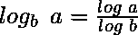

# 计算任意基 b 的对数 a 的程序(对数 a)

> 原文:[https://www . geesforgeks . org/program-to-compute-log-a to-any-base-B- log B- a/](https://www.geeksforgeeks.org/program-to-compute-log-a-to-any-base-b-logb-a/)

给定两个整数 **a** 和 **b** ，任务是找到 a 到任意基 b 的原木，即**原木 <sub>b</sub> a** 。
**举例:**

```
Input: a = 3, b = 2
Output: 1

Input: a = 256, b = 4
Output: 4
```

### <u>使用内置的</u> [<u>日志功能</u>](https://www.geeksforgeeks.org/program-to-compute-log-n/)

1.  借助 log()方法
    找到 **a** 到底座 2 的原木
2.  借助 log()方法
    找到 **b** 到底座 2 的原木
3.  将计算日志 **a** 与日志 **b** 相除，得到**日志 <sub>b</sub> a** ，即

以下是上述方法的实施

## C++

```
// C++ program to find log(a) on any base b
#include <bits/stdc++.h>
using namespace std;

int log_a_to_base_b(int a, int b)
{
    return log(a) / log(b);
}

// Driver code
int main()
{
    int a = 3;
    int b = 2;
    cout << log_a_to_base_b(a, b) << endl;

    a = 256;
    b = 4;
    cout << log_a_to_base_b(a, b) << endl;

    return 0;
}

// This code is contributed by shubhamsingh10
```

## C

```
// C program to find log(a) on any base b

#include <math.h>
#include <stdio.h>

int log_a_to_base_b(int a, int b)
{
    return log(a) / log(b);
}

// Driver code
int main()
{
    int a = 3;
    int b = 2;
    printf("%d\n",
           log_a_to_base_b(a, b));

    a = 256;
    b = 4;
    printf("%d\n",
           log_a_to_base_b(a, b));

    return 0;
}
```

## Java 语言(一种计算机语言，尤用于创建网站)

```
// Java program to find log(a) on any base b
class GFG
{

    static int log_a_to_base_b(int a, int b)
    {
        return (int)(Math.log(a) / Math.log(b));
    }

    // Driver code
    public static void main (String[] args)
    {
        int a = 3;
        int b = 2;
        System.out.println(log_a_to_base_b(a, b));

        a = 256;
        b = 4;
        System.out.println(log_a_to_base_b(a, b));
    }
}

// This code is contributed by AnkitRai01
```

## 蟒蛇 3

```
# Python3 program to find log(a) on any base b
from math import log

def log_a_to_base_b(a, b) :
    return log(a) // log(b);

# Driver code
if __name__ == "__main__" :

    a = 3;
    b = 2;
    print(log_a_to_base_b(a, b));

    a = 256;
    b = 4;
    print(log_a_to_base_b(a, b));

# This code is contributed by AnkitRai01
```

## C#

```
// C# program to find log(a) on any base b

using System;

public class GFG
{

    static int log_a_to_base_b(int a, int b)
    {
        return (int)(Math.Log(a) / Math.Log(b));
    }

    // Driver code
    public static void Main()
    {
        int a = 3;
        int b = 2;
        Console.WriteLine(log_a_to_base_b(a, b));

        a = 256;
        b = 4;
        Console.WriteLine(log_a_to_base_b(a, b));
    }
}

// This code is contributed by AnkitRai01
```

## java 描述语言

```
<script>

// Javascript program to find log(a) on any base b

function log_a_to_base_b(a, b)
{
    return parseInt(Math.log(a) / Math.log(b));
}

// Driver code
var a = 3;
var b = 2;
document.write(log_a_to_base_b(a, b) + "<br>");
a = 256;
b = 4;
document.write(log_a_to_base_b(a, b));

// This code is contributed by rutvik_56.
</script>
```

**Output:** 

```
1
4
```

### <u>使用</u> [<u>递归</u>](https://www.geeksforgeeks.org/recursion/)

1.  递归地用 b 除 a，直到 a 大于 b 为止

2.  计算除法可能的次数。这是 a 到 b 基地的日志，即**日志<sub>b</sub>a**T4】

以下是上述方法的实施

## C++

```
// C++ program to find log(a) on
// any base b using Recursion
#include <iostream>
using namespace std;

// Recursive function to compute
// log a to the base b
int log_a_to_base_b(int a, int b)
{
    return (a > b - 1)
            ? 1 + log_a_to_base_b(a / b, b)
            : 0;
}

// Driver code
int main()
{
    int a = 3;
    int b = 2;
    cout << log_a_to_base_b(a, b) << endl;

    a = 256;
    b = 4;
    cout << log_a_to_base_b(a, b) << endl;

    return 0;
}

// This code is contributed by shubhamsingh10
```

## C

```
// C program to find log(a) on
// any base b using Recursion

#include <stdio.h>

// Recursive function to compute
// log a to the base b
int log_a_to_base_b(int a, int b)
{
    return (a > b - 1)
               ? 1 + log_a_to_base_b(a / b, b)
               : 0;
}

// Driver code
int main()
{
    int a = 3;
    int b = 2;
    printf("%d\n",
           log_a_to_base_b(a, b));

    a = 256;
    b = 4;
    printf("%d\n",
           log_a_to_base_b(a, b));

    return 0;
}
```

## Java 语言(一种计算机语言，尤用于创建网站)

```
// Java program to find log(a) on
// any base b using Recursion
class GFG
{

    // Recursive function to compute
    // log a to the base b
    static int log_a_to_base_b(int a, int b)
    {
        int rslt = (a > b - 1)? 1 + log_a_to_base_b(a / b, b): 0;
        return rslt;
    }

    // Driver code
    public static void main (String[] args)
    {
        int a = 3;
        int b = 2;
        System.out.println(log_a_to_base_b(a, b));

        a = 256;
        b = 4;
        System.out.println(log_a_to_base_b(a, b));
    }
}

// This code is contributed by AnkitRai01
```

## 蟒蛇 3

```
# Python3 program to find log(a) on
# any base b using Recursion

# Recursive function to compute
# log a to the base b
def log_a_to_base_b(a, b) :

    rslt = (1 + log_a_to_base_b(a // b, b)) if (a > (b - 1)) else 0;

    return rslt;

# Driver code
if __name__ == "__main__" :

    a = 3;
    b = 2;
    print(log_a_to_base_b(a, b));

    a = 256;
    b = 4;
    print(log_a_to_base_b(a, b));

# This code is contributed by AnkitRai01
```

## C#

```
// C# program to find log(a) on
// any base b using Recursion
using System;

class GFG
{

    // Recursive function to compute
    // log a to the base b
    static int log_a_to_base_b(int a, int b)
    {
        int rslt = (a > b - 1)? 1 + log_a_to_base_b(a / b, b): 0;
        return rslt;
    }

    // Driver code
    public static void Main()
    {
        int a = 3;
        int b = 2;
        Console.WriteLine(log_a_to_base_b(a, b));

        a = 256;
        b = 4;
        Console.WriteLine(log_a_to_base_b(a, b));
    }
}

// This code is contributed by Yash_R
```

## java 描述语言

```
<script>
// javascript program to find log(a) on
// any base b using Recursion   

// Recursive function to compute
    // log a to the base b
    function log_a_to_base_b(a , b)
    {
        var rslt = (a > b - 1) ? 1 + log_a_to_base_b(parseInt(a / b), b) : 0;
        return rslt;
    }

    // Driver code
        var a = 3;
        var b = 2;
        document.write(log_a_to_base_b(a, b)+"<br/>");

        a = 256;
        b = 4;
        document.write(log_a_to_base_b(a, b));

// This code is contributed by umadevi9616
</script>
```

**Output:** 

```
1
4
```