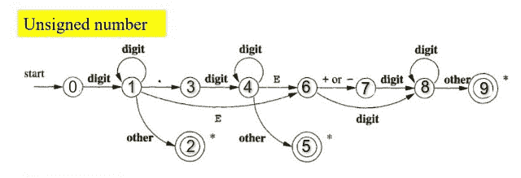

# 构造一个 DFA 来检查给定整数是否无符号的程序

> 原文:[https://www . geesforgeks . org/program-to-construction-a-DFA-to-check-if-a-给定整数是无符号或非符号/](https://www.geeksforgeeks.org/program-to-construct-a-dfa-to-check-if-a-given-integer-is-unsigned-or-not/)

给定一个代表整数的[字符串](https://www.geeksforgeeks.org/string-data-structure/) **S** ，任务是通过[构造 DFA](https://www.geeksforgeeks.org/designing-deterministic-finite-automata-set-1/) 来检查给定的字符串 **S** 是否代表[无符号整数](https://www.geeksforgeeks.org/c-data-types/)。如果给定的字符串表示无符号整数，则打印**“无符号整数”**。否则，打印**“不是无符号整数”**。

**示例:**

> **输入:**S =“+4554”
> T3】输出:不是无符号整数
> 
> **输入:**S = " 1729 "
> T3】输出:无符号整数

**方法:**下面是给定问题的 DFA 的过渡状态:

[](https://media.geeksforgeeks.org/wp-content/uploads/20210227231800/togfg.jpeg)

按照以下步骤解决问题:

*   根据给定的条件，声明一个[函数](https://www.geeksforgeeks.org/functions-in-c/)来建立和连接 [DFA](https://www.geeksforgeeks.org/minimization-of-dfa/) 状态。下面是过渡状态的表示:
    *   **0** 代表一个**数字**。
    *   **1** 代表**符号“+/-”**。
    *   **2** 代表**。”**或**圆点**。
    *   **3** 代表任何**其他角色**。
    *   **4** 代表**指数(e/E 符号)**。
*   初始化一个变量，比如说**当前状态**为 **0** ，它将当前状态存储在 DFA 中。
*   [遍历字符串](https://www.geeksforgeeks.org/iterate-over-characters-of-a-string-in-c/) **S** 并根据当前状态和当前索引处的当前字符决定 **DFA** 的下一个状态。
*   完成上述步骤后，如果**当前状态**的值为 **1** 或 **4** 或 **8** ，则打印**“无符号整数”**。否则，打印**“不是无符号整数”**。

下面是上述方法的实现:

## C++

```
// C++ program for the above approach

#include "bits/stdc++.h"
using namespace std;

string digits = "0123456789", sign = "+-";
string dot = ".", ex = "eE";
int dfa[11][5];

// Function to construct DFA as per the
// given conditions
void makeDFA()
{
    // If at state 0 and a digit has
    // occurred then set it to state 1
    dfa[0][0] = 1;

    // Similarly for all other states
    dfa[1][0] = 1;
    dfa[1][2] = 3;
    dfa[1][3] = 2;
    dfa[1][4] = 6;

    dfa[3][0] = 4;

    dfa[4][0] = 4;
    dfa[4][3] = 5;
    dfa[4][4] = 6;

    dfa[6][0] = 8;
    dfa[6][1] = 7;

    dfa[7][0] = 8;

    dfa[8][0] = 8;
    dfa[8][3] = 9;
}

// Function to build and connect
// the DFA states
void buildDFA()
{
    // Connect all the states to the
    // dead state
    for (int i = 0; i < 11; i++)
        for (int j = 0; j < 5; j++)
            dfa[i][j] = 10;

    // Function call to make DFA as
    // per the given conditions
    makeDFA();
}

// Function call to check whether an
// integer in the form of string is
// unsigned integer or not
void checkDFA(string s)
{
    // Build the DFA
    buildDFA();

    // Stores the current state
    int currentstate = 0;

    // Traverse the string
    for (int i = 0; i < s.size(); i++) {

        if (digits.find(s[i])
            != digits.npos)

            // If at a certain state a
            // digit occurs then change
            // the current state according
            // to the DFA
            currentstate
                = dfa[currentstate][0];

        // Or +/- sign
        else if (sign.find(s[i])
                 != sign.npos)
            currentstate
                = dfa[currentstate][1];

        // Or decimal occurred
        else if (dot.find(s[i])
                 != dot.npos)
            currentstate
                = dfa[currentstate][2];

        // Or any other character
        else if (ex.find(s[i])
                 != ex.npos)
            currentstate
                = dfa[currentstate][4];

        // Or e/E or exponent sign
        else
            currentstate
                = dfa[currentstate][3];
    }

    // State 1, 4, 8 will give
    // the final answer
    if (currentstate == 1
        || currentstate == 4
        || currentstate == 8) {
        cout << "Unsigned integer";
    }
    else {
        cout << "Not an unsigned integer";
    }
}

// Driver Code
int main()
{
    string S = "1729";
    checkDFA(S);

    return 0;
}
```

## Java 语言(一种计算机语言，尤用于创建网站)

```
// Java program for the above approach
import java.io.*;
import java.lang.*;
import java.util.*;

class GFG{

static String digits = "0123456789", sign = "+-";
static String dot = ".", ex = "eE";
static int dfa[][] = new int[11][5];

// Function to construct DFA as per the
// given conditions
static void makeDFA()
{

    // If at state 0 and a digit has
    // occurred then set it to state 1
    dfa[0][0] = 1;

    // Similarly for all other states
    dfa[1][0] = 1;
    dfa[1][2] = 3;
    dfa[1][3] = 2;
    dfa[1][4] = 6;

    dfa[3][0] = 4;

    dfa[4][0] = 4;
    dfa[4][3] = 5;
    dfa[4][4] = 6;

    dfa[6][0] = 8;
    dfa[6][1] = 7;

    dfa[7][0] = 8;

    dfa[8][0] = 8;
    dfa[8][3] = 9;
}

// Function to build and connect
// the DFA states
static void buildDFA()
{

    // Connect all the states to the
    // dead state
    for(int i = 0; i < 11; i++)
        for(int j = 0; j < 5; j++)
            dfa[i][j] = 10;

    // Function call to make DFA as
    // per the given conditions
    makeDFA();
}

// Function call to check whether an
// integer in the form of string is
// unsigned integer or not
static void checkDFA(String s)
{

    // Build the DFA
    buildDFA();

    // Stores the current state
    int currentstate = 0;

    // Traverse the string
    for(int i = 0; i < s.length(); i++)
    {
        if (digits.indexOf(s.charAt(i)) != -1)

            // If at a certain state a
            // digit occurs then change
            // the current state according
            // to the DFA
            currentstate = dfa[currentstate][0];

        // Or +/- sign
        else if (sign.indexOf(s.charAt(i)) != -1)
            currentstate = dfa[currentstate][1];

        // Or decimal occurred
        else if (dot.indexOf(s.charAt(i)) != -1)
            currentstate = dfa[currentstate][2];

        // Or any other character
        else if (ex.indexOf(s.charAt(i)) != -1)
            currentstate = dfa[currentstate][4];

        // Or e/E or exponent sign
        else
            currentstate = dfa[currentstate][3];
    }

    // State 1, 4, 8 will give
    // the final answer
    if (currentstate == 1 || currentstate == 4 ||
        currentstate == 8)
    {
        System.out.println("Unsigned integer");
    }
    else
    {
        System.out.println("Not an unsigned integer");
    }
}

// Driver Code
public static void main(String[] args)
{
    String S = "1729";

    checkDFA(S);
}
}

// This code is contributed by Kingash
```

## 蟒蛇 3

```
# Python3 program for the above approach
digits,sign = "0123456789", "+-"
dot, ex = ".", "eE"
dfa = [[0 for i in range(5)] for i in range(11)]

# Function to construct DFA as per the
# given conditions
def makeDFA():
    global dfa

    # If at state 0 and a digit has
    # occurred then set it to state 1
    dfa[0][0] = 1

    # Similarly for all other states
    dfa[1][0] = 1
    dfa[1][2] = 3
    dfa[1][3] = 2
    dfa[1][4] = 6

    dfa[3][0] = 4

    dfa[4][0] = 4
    dfa[4][3] = 5
    dfa[4][4] = 6

    dfa[6][0] = 8
    dfa[6][1] = 7

    dfa[7][0] = 8

    dfa[8][0] = 8
    dfa[8][3] = 9

# Function to build and connect
# the DFA states
def buildDFA():
    global dfa
    # Connect all the states to the
    # dead state
    for i in range(11):
        for j in range(5):
            dfa[i][j] = 10

    # Function call to make DFA as
    # per the given conditions
    makeDFA()

# Function call to check whether an
# integer in the form of is
# unsigned integer or not
def checkDFA(s):
    # Build the DFA
    buildDFA()

    # Stores the current state
    currentstate = 0

    # Traverse the string
    for i in range(len(s)):

        if (s[i] in digits):

            # If at a certain state a
            # digit occurs then change
            # the current state according
            # to the DFA
            currentstate = dfa[currentstate][0]

        # Or +/- sign
        elif (s[i] in sign):
            currentstate = dfa[currentstate][1]

        # Or decimal occurred
        elif (s[i] in dot):
            currentstate = dfa[currentstate][2]

        # Or any other character
        elif (s[i] in ex):
            currentstate = dfa[currentstate][4]

        # Or e/E or exponent sign
        else:
            currentstate = dfa[currentstate][3]

    # State 1, 4, 8 will give
    # the final answer
    if (currentstate == 1 or currentstate == 4 or currentstate == 8):
        print("Unsigned integer")
    else:
        print("Not an unsigned integer")

# Driver Code
if __name__ == '__main__':
    S = "1729"
    checkDFA(S)

    # This code is contributed by mohit kumar 29.
```

## C#

```
// C# program for the above approach
using System;

class GFG{

static string digits = "0123456789", sign = "+-";
static string dot = ".", ex = "eE";
static int[,] dfa = new int[11, 5];

// Function to construct DFA as per the
// given conditions
static void makeDFA()
{

    // If at state 0 and a digit has
    // occurred then set it to state 1
    dfa[0, 0] = 1;

    // Similarly for all other states
    dfa[1, 0] = 1;
    dfa[1, 2] = 3;
    dfa[1, 3] = 2;
    dfa[1, 4] = 6;

    dfa[3, 0] = 4;

    dfa[4, 0] = 4;
    dfa[4, 3] = 5;
    dfa[4, 4] = 6;

    dfa[6, 0] = 8;
    dfa[6, 1] = 7;

    dfa[7, 0] = 8;

    dfa[8, 0] = 8;
    dfa[8, 3] = 9;
}

// Function to build and connect
// the DFA states
static void buildDFA()
{

    // Connect all the states to the
    // dead state
    for(int i = 0; i < 11; i++)
        for(int j = 0; j < 5; j++)
            dfa[i, j] = 10;

    // Function call to make DFA as
    // per the given conditions
    makeDFA();
}

// Function call to check whether an
// integer in the form of string is
// unsigned integer or not
static void checkDFA(string s)
{

    // Build the DFA
    buildDFA();

    // Stores the current state
    int currentstate = 0;

    // Traverse the string
    for(int i = 0; i < s.Length; i++)
    {
        if (digits.IndexOf(s[i]) != -1)

            // If at a certain state a
            // digit occurs then change
            // the current state according
            // to the DFA
            currentstate = dfa[currentstate, 0];

        // Or +/- sign
        else if (sign.IndexOf(s[i]) != -1)
            currentstate = dfa[currentstate, 1];

        // Or decimal occurred
        else if (dot.IndexOf(s[i]) != -1)
            currentstate = dfa[currentstate, 2];

        // Or any other character
        else if (ex.IndexOf(s[i]) != -1)
            currentstate = dfa[currentstate, 4];

        // Or e/E or exponent sign
        else
            currentstate = dfa[currentstate, 3];
    }

    // State 1, 4, 8 will give
    // the final answer
    if (currentstate == 1 || currentstate == 4 ||
        currentstate == 8)
    {
        Console.WriteLine("Unsigned integer");
    }
    else
    {
        Console.WriteLine("Not an unsigned integer");
    }
}

// Driver Code
public static void Main(string[] args)
{
    string S = "1729";

    checkDFA(S);
}
}

// This code is contributed by ukasp
```

## java 描述语言

```
<script>

// JavaScript program for the above approach

let digits = "0123456789", sign = "+-";
let dot = ".", ex = "eE";

let dfa = new Array(11);
for(let i=0;i<11;i++)
{
    dfa[i]=new Array(5);

}

// Function to construct DFA as per the
// given conditions
function makeDFA()
{
    // If at state 0 and a digit has
    // occurred then set it to state 1
    dfa[0][0] = 1;

    // Similarly for all other states
    dfa[1][0] = 1;
    dfa[1][2] = 3;
    dfa[1][3] = 2;
    dfa[1][4] = 6;

    dfa[3][0] = 4;

    dfa[4][0] = 4;
    dfa[4][3] = 5;
    dfa[4][4] = 6;

    dfa[6][0] = 8;
    dfa[6][1] = 7;

    dfa[7][0] = 8;

    dfa[8][0] = 8;
    dfa[8][3] = 9;
}

// Function to build and connect
// the DFA states
function buildDFA()
{
    // Connect all the states to the
    // dead state
    for(let i = 0; i < 11; i++)
        for(let j = 0; j < 5; j++)
            dfa[i][j] = 10;

    // Function call to make DFA as
    // per the given conditions
    makeDFA();
}

// Function call to check whether an
// integer in the form of string is
// unsigned integer or not
function  checkDFA(s)
{
    // Build the DFA
    buildDFA();

    // Stores the current state
    let currentstate = 0;

    // Traverse the string
    for(let i = 0; i < s.length; i++)
    {
        if (digits.indexOf(s[i]) != -1)

            // If at a certain state a
            // digit occurs then change
            // the current state according
            // to the DFA
            currentstate = dfa[currentstate][0];

        // Or +/- sign
        else if (sign.indexOf(s[i]) != -1)
            currentstate = dfa[currentstate][1];

        // Or decimal occurred
        else if (dot.indexOf(s[i]) != -1)
            currentstate = dfa[currentstate][2];

        // Or any other character
        else if (ex.indexOf(s[i]) != -1)
            currentstate = dfa[currentstate][4];

        // Or e/E or exponent sign
        else
            currentstate = dfa[currentstate][3];
    }

    // State 1, 4, 8 will give
    // the final answer
    if (currentstate == 1 || currentstate == 4 ||
        currentstate == 8)
    {
        document.write("Unsigned integer<br>");
    }
    else
    {
        document.write("Not an unsigned integer");
    }
}
// Driver Code
let S = "1729";

checkDFA(S);

// This code is contributed by avanitrachhadiya2155

</script>
```

**Output:** 

```
Unsigned integer
```

***时间复杂度:**O(N)*
T5**辅助空间:** O(1)