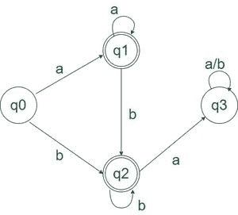

# 构建 DFA 的程序，该程序接受在所有“b”之前都有“a”的语言

> 原文:[https://www . geesforgeks . org/program-to-construction-a-DFA-哪一个接受语言-先有全 a 后有全 b/](https://www.geeksforgeeks.org/program-to-construct-a-dfa-which-accepts-the-language-having-all-a-before-all-b/)

给定一个字符串 **S** ，t 他的任务是设计一个 [<u>确定性有限自动机(DFA)</u>](https://www.geeksforgeeks.org/designing-deterministic-finite-automata-set-1/) 用于接受语言**L = { a<sup>N</sup>b<sup>M</sup>| N≥0，M ≥ 0，N+M ≥ 1}** 。，即常规语言 **L** 使得所有的“a”都出现在“b”{ a，ab，aab，bb…，}的第一个出现之前。如果给定字符串遵循给定语言 **L** ，则打印 **【接受】** 。否则，打印 **【不接受】** 。

**示例**

> **输入:**S = " aabbb "
> T3】输出:接受
> T6】说明:所有的‘a’都在‘b’之前
> 
> **输入:**S = " ba "
> T3】输出:不接受
> T6】说明:“b”在“a”之前。
> 
> **输入:**S =“AAA”
> T3】输出:接受
> **说明:**注意‘b’不需要出现在 S 中
> 
> **输入:**S =【b】
> T3】输出:接受
> T6】说明:注意‘a’不需要出现在 S 中

**接近**:满足以下情况才能接受问题:

*   所有的字符都可以是 a。
*   所有的字符都可以是 b。
*   所有的“b”出现在所有的“a”之后。
*   字符串中至少有一个字符。

借助于 DFA 的状态转移图，这可以更好地可视化

**状态转移图:**



上述 DFA 的状态转换图

下面是上述方法的实现:

## C++

```
// C++ Program to implement
// the above approach
#include <bits/stdc++.h>
using namespace std; 

// Function for state zero Q0
int startStateQ0(char s) {

    int state;
    if (s == 'a')
        state = 1;
    else if (s == 'b')
        state = 2;
    else
        state = -1;

    return state;
}

// Function for first state Q1
int firstStateQ1(char s) {

    int state;
    if (s == 'a')
        state = 1;
    else if (s == 'b')
        state = 2;
    else
        state = -1;

    return state;
}

// Function for second state Q2
int secondStateQ2(char s) {

    int state;
    if (s == 'b')
        state = 2;
    else if (s == 'a')
        state = 3;
    else
        state = -1;

    return state;
}

// Function for third state Q3
int thirdStateQ3(char s) {

    int state = 3;
    return state;
}

// Function to check
// if the string is accepted or not
int isAcceptedString(string String) {

    int l = String.length();

    // dfa tells the number associated
    // with the present dfa = state
    int state = 0;
    for (int i = 0; i < l; i++) {
        if (state == 0)
            state = startStateQ0(String[i]);
        else if (state == 1)
            state = firstStateQ1(String[i]);
        else if (state == 2)
            state = secondStateQ2(String[i]);
        else if (state == 3)
            state = thirdStateQ3(String[i]);
        else
            return 0;
    }
    if (state == 1 || state == 2)
        return 1;
    else
        return 0;
}

int main() {

    string String = "ba";
    if (isAcceptedString(String))
        cout << "ACCEPTED";
    else
        cout << "NOT ACCEPTED";
}    

// This code is contributed by Samim Hossain Mondal.
```

## Java 语言(一种计算机语言，尤用于创建网站)

```
// Java Program to implement
// the above approach
import java.util.*;
public class GFG {

    // Function for state zero Q0
    static int startStateQ0(char s)
    {

        int state;
        if (s == 'a')
            state = 1;
        else if (s == 'b')
            state = 2;
        else
            state = -1;

        return state;
    }

    // Function for first state Q1
    static int firstStateQ1(char s)
    {

        int state;
        if (s == 'a')
            state = 1;
        else if (s == 'b')
            state = 2;
        else
            state = -1;

        return state;
    }

    // Function for second state Q2
    static int secondStateQ2(char s)
    {

        int state;
        if (s == 'b')
            state = 2;
        else if (s == 'a')
            state = 3;
        else
            state = -1;

        return state;
    }

    // Function for third state Q3
    static int thirdStateQ3(char s)
    {

        int state = 3;
        return state;
    }

    // Function to check
    // if the string is accepted or not
    static int isAcceptedString(String Str)
    {

        int l = Str.length();

        // dfa tells the number associated
        // with the present dfa = state
        int state = 0;
        for (int i = 0; i < l; i++) {
            if (state == 0)
                state = startStateQ0(Str.charAt(i));
            else if (state == 1)
                state = firstStateQ1(Str.charAt(i));
            else if (state == 2)
                state = secondStateQ2(Str.charAt(i));
            else if (state == 3)
                state = thirdStateQ3(Str.charAt(i));
            else
                return 0;
        }
        if (state == 1 || state == 2)
            return 1;
        else
            return 0;
    }

    public static void main(String args[])
    {

        String Str = "ba";
        if (isAcceptedString(Str) != 0)
            System.out.println("ACCEPTED");
        else
            System.out.println("NOT ACCEPTED");
    }
}

// This code is contributed by Samim Hossain Mondal.
```

## 蟒蛇 3

```
# Function for state zero Q0
def startStateQ0(s):
    if (s == 'a'):
        state = 1
    elif (s == 'b'):
        state = 2
    else:
        state = -1
    return state

# Function for first state Q1
def firstStateQ1(s):
    if (s == 'a'):
        state = 1
    elif (s == 'b'):
        state = 2
    else:
        state = -1
    return state

# Function for second state Q2
def secondStateQ2(s):
    if (s == 'b'):
        state = 2
    elif (s == 'a'):
        state = 3
    else:
        state = -1
    return state

# Function for third state Q3
def thirdStateQ3(s):
    state = 3
    return state

#Function to check
#if the string is accepted or not
def isAcceptedString(String):
    l = len(String)

    # dfa tells the number associated
    # with the present dfa = state
    state = 0
    for i in range(l):
        if (state == 0):
            state = startStateQ0(String[i])
        elif (state == 1):
            state = firstStateQ1(String[i])
        elif (state == 2):
            state = secondStateQ2(String[i])
        elif (state == 3):
            state = thirdStateQ3(String[i])
        else:
            return 0
    if(state == 1 or state == 2):
        return 1
    else:
        return 0

# Driver code
if __name__ == "__main__":

    String = "ba"
    if (isAcceptedString(String)):
        print("ACCEPTED")
    else:
        print("NOT ACCEPTED")
```

## C#

```
// C# Program to implement
// the above approach
using System;
class GFG {

    // Function for state zero Q0
    static int startStateQ0(char s)
    {

        int state;
        if (s == 'a')
            state = 1;
        else if (s == 'b')
            state = 2;
        else
            state = -1;

        return state;
    }

    // Function for first state Q1
    static int firstStateQ1(char s)
    {

        int state;
        if (s == 'a')
            state = 1;
        else if (s == 'b')
            state = 2;
        else
            state = -1;

        return state;
    }

    // Function for second state Q2
    static int secondStateQ2(char s)
    {

        int state;
        if (s == 'b')
            state = 2;
        else if (s == 'a')
            state = 3;
        else
            state = -1;

        return state;
    }

    // Function for third state Q3
    static int thirdStateQ3(char s)
    {

        int state = 3;
        return state;
    }

    // Function to check
    // if the string is accepted or not
    static int isAcceptedString(string Str)
    {

        int l = Str.Length;

        // dfa tells the number associated
        // with the present dfa = state
        int state = 0;
        for (int i = 0; i < l; i++) {
            if (state == 0)
                state = startStateQ0(Str[i]);
            else if (state == 1)
                state = firstStateQ1(Str[i]);
            else if (state == 2)
                state = secondStateQ2(Str[i]);
            else if (state == 3)
                state = thirdStateQ3(Str[i]);
            else
                return 0;
        }
        if (state == 1 || state == 2)
            return 1;
        else
            return 0;
    }

    public static void Main()
    {

        string Str = "ba";
        if (isAcceptedString(Str) != 0)
            Console.Write("ACCEPTED");
        else
            Console.Write("NOT ACCEPTED");
    }
}

// This code is contributed by ukasp.
```

## java 描述语言

```
<script>

       // JavaScript Program to implement
       // the above approach

       // Function for state zero Q0
       function startStateQ0(s) {
           if (s == 'a')
               state = 1
           else if (s == 'b')
               state = 2
           else
               state = -1
           return state
       }

       // Function for first state Q1
       function firstStateQ1(s) {
           if (s == 'a')
               state = 1
           else if (s == 'b')
               state = 2
           else
               state = -1
           return state
       }

       // Function for second state Q2
       function secondStateQ2(s) {
           if (s == 'b')
               state = 2
           else if (s == 'a')
               state = 3
           else
               state = -1
           return state
       }

       // Function for third state Q3
       function thirdStateQ3(s) {
           state = 3
           return state
       }

       // Function to check
       // if the string is accepted or not
       function isAcceptedString(String) {
           l = String.length;

           // dfa tells the number associated
           // with the present dfa = state
           state = 0
           for (let i = 0; i < l; i++) {
               if (state == 0)
                   state = startStateQ0(String[i])
               else if (state == 1)
                   state = firstStateQ1(String[i])
               else if (state == 2)
                   state = secondStateQ2(String[i])
               else if (state == 3)
                   state = thirdStateQ3(String[i])
               else
                   return 0
           }
           if (state == 1 || state == 2)
               return 1
           else
               return 0
       }

       let String = "ba"
       if (isAcceptedString(String))
           document.write("ACCEPTED")
       else
           document.write("NOT ACCEPTED")

   // This code is contributed by Potta Lokesh
   </script>
```

**Output**

```
NOT ACCEPTED
```

**时间复杂度:** O(N)其中 N 为弦的长度
T3】辅助空间: O(1)