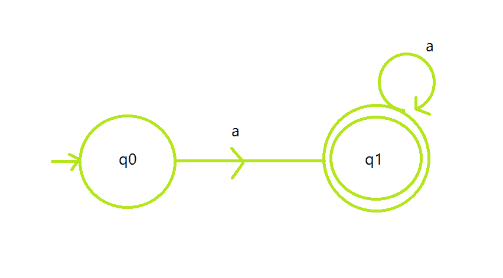

# 构建接受语言 L = {aN | N ≥ 1}

的 DFA 的程序

> 原文:[https://www . geesforgeks . org/program-to-construction-a-DFA-接受语言-l-an-n-1/](https://www.geeksforgeeks.org/program-to-construct-a-dfa-which-accepts-the-language-l-an-n-1/)

**先决条件:** [有限自动机](https://www.geeksforgeeks.org/toc-finite-automata-introduction/)

给定一个大小为 **N** 的字符串 **S** ，任务是设计一个[确定性有限自动机(DFA)](https://www.geeksforgeeks.org/designing-deterministic-finite-automata-set-1/) 来接受语言 **L = {a <sup>N</sup> | N ≥ 1}** 。常规语言 **L** 是{a，aa，aaa，aaaaaa…，}。如果给定字符串遵循给定语言 **L** ，则打印**“接受”**。否则，打印**“不接受”**。

**示例:**

> **输入:**S = " aabbb "
> T3】输出:不接受
> T6】说明:字符串必须只包含一个
> 
> **输入:**S = " aa "
> T3】输出:接受

**方法:**自动机导致接受字符串的思想分步骤陈述如下:

*   自动机将接受所有只包含字符**‘a’**的字符串。如果用户试图输入除“a”以外的任何字符，机器将拒绝它。
*   让状态 **q0** 为**初始**状态代表所有长度弦的集合 **0** ，状态 **q1** 为**最终**状态代表从 **1** 到 **N** 的所有弦的集合。
*   状态 **q1** 包含 a 的自循环，表示可以根据需要重复。
*   代码的逻辑非常基本，因为它只有一个 for 循环，用于计算给定字符串中 **a 的**的数量，如果 **a** 的数量与 **N** 相同，那么它将被接受。否则，字符串将被拒绝。

**<u>DFA 状态转移图</u> :**

[](https://media.geeksforgeeks.org/wp-content/uploads/20201116213048/Screenshot20201116213023.png)

下面是上述方法的实现:

## C++

```
// C++ program for the above approach

#include <bits/stdc++.h>
using namespace std;

// Function to check whether the string
// S satisfy the given DFA or not
void isAcceptedDFA(string s, int N)
{
    // Stores the count of characters
    int count = 0;

    // Iterate over the range [0, N]
    for (int i = 0; i < N; i++) {

        // Count and check every
        // element for 'a'
        if (s[i] == 'a')
            count++;
    }

    // If string matches with DFA
    if (count == N && count != 0) {
        cout << "Accepted";
    }

    // If not matches
    else {
        cout << "Not Accepted";
    }
}

// Driver Code
int main()
{
    string S = "aaaaa";

    // Function Call
    isAcceptedDFA(S, S.size());

    return 0;
}
```

## Java 语言(一种计算机语言，尤用于创建网站)

```
// Java program for the above approach
class GFG
{

// Function to check whether the String
// S satisfy the given DFA or not
static void isAcceptedDFA(String s, int N)
{
    // Stores the count of characters
    int count = 0;

    // Iterate over the range [0, N]
    for (int i = 0; i < N; i++)
    {

        // Count and check every
        // element for 'a'
        if (s.charAt(i) == 'a')
            count++;
    }

    // If String matches with DFA
    if (count == N && count != 0)
    {
        System.out.print("Accepted");
    }

    // If not matches
    else
    {
        System.out.print("Not Accepted");
    }
}

// Driver Code
public static void main(String[] args)
{
    String S = "aaaaa";

    // Function Call
    isAcceptedDFA(S, S.length());
}
}

// This code is contributed by 29AjayKumar
```

## 蟒蛇 3

```
# Python3 program for the above approach

# Function to check whether the string
# S satisfy the given DFA or not
def isAcceptedDFA(s, N):

    # Stores the count of characters
    count = 0

    # Iterate over the range [0, N]
    for i in range(N):

        # Count and check every
        # element for 'a'
        if (s[i] == 'a'):
            count += 1

    # If string matches with DFA
    if (count == N and count != 0):
        print ("Accepted")

    # If not matches
    else :
        print ("Not Accepted")

# Driver Code
if __name__ == '__main__':
    S = "aaaaa"

    # Function Call
    isAcceptedDFA(S, len(S))

# This code is contributed by mohit kumar 29
```

## C#

```
// C# program for the above approach
using System;
class GFG
{

// Function to check whether the String
// S satisfy the given DFA or not
static void isAcceptedDFA(String s, int N)
{

    // Stores the count of characters
    int count = 0;

    // Iterate over the range [0, N]
    for (int i = 0; i < N; i++)
    {

        // Count and check every
        // element for 'a'
        if (s[i] == 'a')
            count++;
    }

    // If String matches with DFA
    if (count == N && count != 0)
    {
        Console.Write("Accepted");
    }

    // If not matches
    else
    {
        Console.Write("Not Accepted");
    }
}

// Driver Code
public static void Main(String[] args)
{
    String S = "aaaaa";

    // Function Call
    isAcceptedDFA(S, S.Length);
}
}

// This code is contributed by 29AjayKumar
```

## java 描述语言

```
<script>

      // JavaScript program for the above approach
      // Function to check whether the String
      // S satisfy the given DFA or not
      function isAcceptedDFA(s, N) {
        // Stores the count of characters
        var count = 0;

        // Iterate over the range [0, N]
        for (var i = 0; i < N; i++) {
          // Count and check every
          // element for 'a'
          if (s[i] === "a") count++;
        }

        // If String matches with DFA
        if (count === N && count !== 0) {
          document.write("Accepted");
        }

        // If not matches
        else {
          document.write("Not Accepted");
        }
      }

      // Driver Code
      var S = "aaaaa";

      // Function Call
      isAcceptedDFA(S, S.length);

</script>
```

**Output:** 

```
Accepted
```

***时间复杂度:**O(N)*
T5**辅助空间:** O(1)