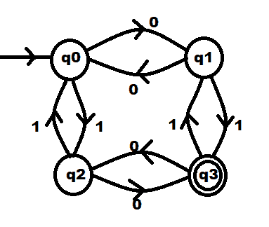

# 构造接受奇数个 0 和奇数个 1 的 DFA 的程序

> 原文:[https://www . geesforgeks . org/program-to-construction-DFA-接受奇数个 0 和奇数个 1/](https://www.geeksforgeeks.org/program-to-construct-dfa-accepting-odd-number-of-0s-and-odd-number-of-1s/)

给定一个[二进制字符串](https://www.geeksforgeeks.org/tag/binary-string/) **S** ，任务是为 [DFA 机器](https://www.geeksforgeeks.org/designing-deterministic-finite-automata-set-1/)编写一个程序，该程序接受一个奇数为 **0s** 和 **1s** 的字符串。

**示例:**

> **输入:** S = "010011"
> **输出:**接受
> **解释:**
> 给定字符串 S 包含奇数个 0 和 1。
> 
> **输入:**S =【00000】
> T3】输出:未接受
> T6】解释:T8】给定字符串 S 不包含奇数个 0 和 1。

**方法:**下面是针对给定问题设计的 DFA 机器。为 DFA 状态构建一个转换表，并分析每个状态之间的转换。以下是步骤:

[](https://media.geeksforgeeks.org/wp-content/uploads/20201021234702/odd0and1.png)

*   有 4 种状态 **q <sub>0</sub> ，q <sub>1</sub> ，q <sub>2</sub> ，q<sub>3</sub>T9【其中**q<sub>0</sub>T13】为初始状态，**q<sub>3</sub>T17】为最终状态。******
*   上述 DFA 的过渡表如下:

<figure class="table">

| **当前状态** | **最终状态** |
| **0** | **1** |
| q <sub>0</sub> | q <sub>1</sub> | q <sub>2</sub> |
| q <sub>1</sub> | q <sub>0</sub> | q <sub>3</sub> |
| q <sub>2</sub> | q <sub>3</sub> | q <sub>0</sub> |
| q <sub>3</sub> | q <sub>2</sub> | q <sub>1</sub> |

</figure>

*   通过此表，了解 DFA 中的过渡。
*   如果在读取整个字符串后达到最终状态( **q <sub>3</sub>** )，则该字符串被接受，否则不被接受。

下面是上述方法的实现:

## C++

```
// C++ program for the above approach

#include <bits/stdc++.h>
using namespace std;

// Function to check whether the given
// string is accepted by DFA or not
void checkValidDFA(string s)
{
    // Stores initial state of DFA
    int initial_state = 0;

    // Stores final state of DFA
    int final_state;

    // Stores previous state of DFA
    int previous_state = 0;

    // Iterate through the string
    for (int i = 0; i < s.length(); i++) {

        // Checking for all combinations
        if ((s[i] == '0'
             && previous_state == 0)
            || (s[i] == '1'
                && previous_state == 3)) {
            final_state = 1;
        }
        else if ((s[i] == '0'
                  && previous_state == 3)
                 || (s[i] == '1'
                     && previous_state == 0)) {
            final_state = 2;
        }
        else if ((s[i] == '0'
                  && previous_state == 1)
                 || (s[i] == '1'
                     && previous_state == 2)) {
            final_state = 0;
        }
        else if ((s[i] == '0'
                  && previous_state == 2)
                 || (s[i] == '1'
                     && previous_state == 1)) {
            final_state = 3;
        }

        // Update the previous_state
        previous_state = final_state;
    }

    // If final state is reached
    if (final_state == 3) {
        cout << "Accepted" << endl;
    }

    // Otherwise
    else {
        cout << "Not Accepted" << endl;
    }
}

// Driver Code
int main()
{
    // Given string
    string s = "010011";

    // Function Call
    checkValidDFA(s);

    return 0;
}
```

## 蟒蛇 3

```
# Python3 program for the above approach

# Function to check whether the given
# is accepted by DFA or not
def checkValidDFA(s):

    # Stores initial state of DFA
    initial_state = 0

    # Stores final state of DFA
    final_state = 0

    # Stores previous state of DFA
    previous_state = 0

    # Iterate through the string
    for i in range(len(s)):

        # Checking for all combinations
        if ((s[i] == '0' and previous_state == 0) or
            (s[i] == '1' and previous_state == 3)):
            final_state = 1
        elif ((s[i] == '0' and previous_state == 3) or
              (s[i] == '1' and previous_state == 0)):
            final_state = 2
        elif ((s[i] == '0' and previous_state == 1) or
              (s[i] == '1' and previous_state == 2)):
            final_state = 0
        elif ((s[i] == '0' and previous_state == 2) or
              (s[i] == '1' and previous_state == 1)):
            final_state = 3

        # Update the previous_state
        previous_state = final_state

    # If final state is reached
    if (final_state == 3):
        print("Accepted")

    # Otherwise
    else:
        print("Not Accepted")

# Driver Code
if __name__ == '__main__':

    # Given string
    s = "010011"

    # Function Call
    checkValidDFA(s)

# This code is contributed by mohit kumar 29
```

## Java 语言(一种计算机语言，尤用于创建网站)

```
// Java program for the above approach
import java.util.*;

class GFG{

// Function to check whether the given
// string is accepted by DFA or not
static void checkValidDFA(String s)
{

    // Stores initial state of DFA
    int initial_state = 0;

    // Stores final state of DFA
    int final_state = 0;

    // Stores previous state of DFA
    int previous_state = 0;

    // Iterate through the string
    for(int i = 0; i < s.length(); i++)
    {

        // Checking for all combinations
        if ((s.charAt(i) == '0' && previous_state == 0) ||
            (s.charAt(i) == '1' && previous_state == 3))
        {
            final_state = 1;
        }
        else if ((s.charAt(i) == '0' && previous_state == 3) ||
                 (s.charAt(i) == '1' && previous_state == 0))
        {
            final_state = 2;
        }
        else if ((s.charAt(i) == '0' && previous_state == 1) ||
                 (s.charAt(i) == '1' && previous_state == 2))
        {
            final_state = 0;
        }
        else if ((s.charAt(i) == '0' && previous_state == 2) ||
                 (s.charAt(i) == '1' && previous_state == 1))
        {
            final_state = 3;
        }

        // Update the previous_state
        previous_state = final_state;
    }

    // If final state is reached
    if (final_state == 3)
    {
        System.out.println("Accepted");
    }

    // Otherwise
    else
    {
        System.out.println("Not Accepted");
    }
}

// Driver Code
public static void main(String args[])
{

    // Given string
    String s = "010011";

    // Function Call
    checkValidDFA(s);
}
}

// This code is contributed by bgangwar59
```

## C#

```
// C# program for the above approach
using System;

class GFG{

// Function to check whether the given
// string is accepted by DFA or not
static void checkValidDFA(string s)
{

    // Stores initial state of DFA
    //int initial_state = 0;

    // Stores final state of DFA
    int final_state = 0;

    // Stores previous state of DFA
    int previous_state = 0;

    // Iterate through the string
    for(int i = 0; i < s.Length; i++)
    {

        // Checking for all combinations
        if ((s[i] == '0' && previous_state == 0) ||
            (s[i] == '1' && previous_state == 3))
        {
            final_state = 1;
        }
        else if ((s[i] == '0' && previous_state == 3) ||
                 (s[i] == '1' && previous_state == 0))
        {
            final_state = 2;
        }
        else if ((s[i] == '0' && previous_state == 1) ||
                 (s[i] == '1' && previous_state == 2))
        {
            final_state = 0;
        }
        else if ((s[i] == '0' && previous_state == 2) ||
                 (s[i] == '1' && previous_state == 1))
        {
            final_state = 3;
        }

        // Update the previous_state
        previous_state = final_state;
    }

    // If final state is reached
    if (final_state == 3)
    {
        Console.WriteLine("Accepted");
    }

    // Otherwise
    else
    {
        Console.WriteLine("Not Accepted");
    }
}

// Driver Code
public static void Main()
{

    // Given string
    string s = "010011";

    // Function Call
    checkValidDFA(s);
}
}

// This code is contributed by sanjoy_62
```

## java 描述语言

```
<script>

      // JavaScript program for the above approach
      // Function to check whether the given
      // string is accepted by DFA or not
      function checkValidDFA(s) {
        // Stores initial state of DFA
        // int initial_state = 0;

        // Stores final state of DFA
        var final_state = 0;

        // Stores previous state of DFA
        var previous_state = 0;

        // Iterate through the string
        for (var i = 0; i < s.length; i++) {
          // Checking for all combinations
          if (
            (s[i] === "0" && previous_state === 0) ||
            (s[i] === "1" && previous_state === 3)
          ) {
            final_state = 1;
          } else if (
            (s[i] === "0" && previous_state === 3) ||
            (s[i] === "1" && previous_state === 0)
          ) {
            final_state = 2;
          } else if (
            (s[i] === "0" && previous_state === 1) ||
            (s[i] === "1" && previous_state === 2)
          ) {
            final_state = 0;
          } else if (
            (s[i] === "0" && previous_state === 2) ||
            (s[i] === "1" && previous_state === 1)
          ) {
            final_state = 3;
          }

          // Update the previous_state
          previous_state = final_state;
        }

        // If final state is reached
        if (final_state === 3) {
          document.write("Accepted");
        }

        // Otherwise
        else {
          document.write("Not Accepted");
        }
      }

      // Driver Code
      // Given string
      var s = "010011";

      // Function Call
      checkValidDFA(s);

</script>
```

**Output:** 

```
Accepted
```

***时间复杂度:**O(N)*
T5**辅助空间:** O(1)