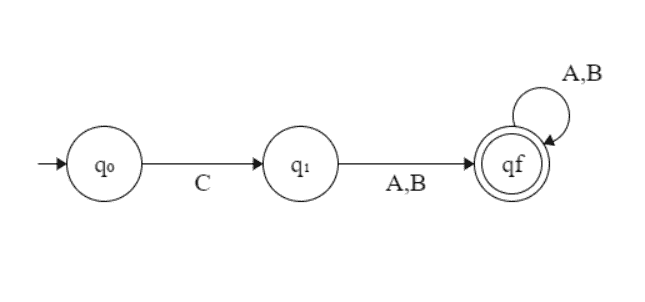

# 为正则表达式 C( A + B)+

构造 DFA 的程序

> 原文:[https://www . geesforgeks . org/program-to-construct-DFA-for-正则表达式-c-a-b/](https://www.geeksforgeeks.org/program-to-construct-dfa-for-regular-expression-c-a-b/)

给定一个[字符串](https://www.geeksforgeeks.org/string-data-structure/) **S** ，任务是设计一个[确定性有限自动机(DFA)](https://www.geeksforgeeks.org/designing-deterministic-finite-automata-set-1/) 来接受语言 **L = C (A + B)+** 。如果给定字符串被 DFA 接受，则打印**“是”**。否则，打印**“否”**。

**示例:**

> **输入:** S = "CABABABAB"
> **输出:**是
> **说明:**给定字符串的形式是 C(A + B)+因为第一个字符是 C，后面是 A 或 B
> 
> **输入:**S = " ABAB "
> T3】输出:否

**方法:**思路是解释给定的语言 **L = C (A + B)+** 而对于 C(A+B)+**形式的** [正则表达式](https://www.geeksforgeeks.org/write-regular-expressions/)，下面是 [**DFA 状态转移图**](https://www.geeksforgeeks.org/designing-deterministic-finite-automata-set-2/) **:**



按照以下步骤解决问题:

*   如果给定字符串的长度小于或等于 **1** ，则打印**“否”**。
*   如果**第一个**字符始终是 **C** ，则遍历剩余的字符串并检查是否有任何字符是 **A** 或 **B** 。
*   如果在上述步骤中遍历时存在除 **A** 或 **B** 以外的字符，则打印**“否”**。
*   否则，打印**“是”**。

下面是上述方法的实现:

## C++

```
// C++ program for the above approach

#include <bits/stdc++.h>
using namespace std;

// Function to find whether the given
// string is Accepted by the DFA
void DFA(string str, int N)
{
    // If n <= 1, then print No
    if (N <= 1) {
        cout << "No";
        return;
    }

    // To count the matched characters
    int count = 0;

    // Check if the first character is C
    if (str[0] == 'C') {
        count++;

        // Traverse the rest of string
        for (int i = 1; i < N; i++) {

            // If character is A or B,
            // increment count by 1
            if (str[i] == 'A' || str[i] == 'B')
                count++;
            else
                break;
        }
    }
    else {

        // If the first character
        // is not C, print -1
        cout << "No";
        return;
    }

    // If all characters matches
    if (count == N)
        cout << "Yes";
    else
        cout << "No";
}

// Driver Code
int main()
{
    string str = "CAABBAAB";
    int N = str.size();
    DFA(str, N);

    return 0;
}
```

## Java 语言(一种计算机语言，尤用于创建网站)

```
// Java program for the above approach
import java.util.*;
class GFG
{

  // Function to find whether the given
  // String is Accepted by the DFA
  static void DFA(String str, int N)
  {

    // If n <= 1, then print No
    if (N <= 1)
    {
      System.out.print("No");
      return;
    }

    // To count the matched characters
    int count = 0;

    // Check if the first character is C
    if (str.charAt(0) == 'C')
    {
      count++;

      // Traverse the rest of String
      for (int i = 1; i < N; i++)
      {

        // If character is A or B,
        // increment count by 1
        if (str.charAt(i) == 'A' ||
            str.charAt(i) == 'B')
          count++;
        else
          break;
      }
    }
    else
    {

      // If the first character
      // is not C, print -1
      System.out.print("No");
      return;
    }

    // If all characters matches
    if (count == N)
      System.out.print("Yes");
    else
      System.out.print("No");
  }

  // Driver Code
  public static void main(String[] args)
  {
    String str = "CAABBAAB";
    int N = str.length();
    DFA(str, N);
  }
}

// This code is contributed by 29AjayKumar
```

## 蟒蛇 3

```
# Python3 program for the above approach

# Function to find whether the given
# is Accepted by the DFA
def DFA(str, N):

    # If n <= 1, then prNo
    if (N <= 1):
        print("No")
        return

    # To count the matched characters
    count = 0

    # Check if the first character is C
    if (str[0] == 'C'):
        count += 1

        # Traverse the rest of string
        for i in range(1, N):

            # If character is A or B,
            # increment count by 1
            if (str[i] == 'A' or str[i] == 'B'):
                count += 1
            else:
                break
    else:
        # If the first character
        # is not C, pr-1
        print("No")
        return

    # If all characters matches
    if (count == N):
        print("Yes")
    else:
        print("No")

# Driver Code
if __name__ == '__main__':
    str = "CAABBAAB"
    N = len(str)
    DFA(str, N)

# This code is contributed by mohit kumar 29.
```

## C#

```
// C# program for the above approach
using System;
class GFG
{

  // Function to find whether the given
  // String is Accepted by the DFA
  static void DFA(string str, int N)
  {

    // If n <= 1, then print No
    if (N <= 1)
    {
      Console.Write("No");
      return;
    }

    // To count the matched characters
    int count = 0;

    // Check if the first character is C
    if (str[0] == 'C') {
      count++;

      // Traverse the rest of String
      for (int i = 1; i < N; i++) {

        // If character is A or B,
        // increment count by 1
        if (str[i] == 'A'
            || str[i] == 'B')
          count++;
        else
          break;
      }
    }
    else {

      // If the first character
      // is not C, print -1
      Console.Write("No");
      return;
    }

    // If all characters matches
    if (count == N)
      Console.Write("Yes");
    else
      Console.Write("No");
  }

  // Driver Code
  static public void Main()
  {

    string str = "CAABBAAB";
    int N = str.Length;
    DFA(str, N);
  }
}

// This code is contributed by Dharanendra L V
```

## java 描述语言

```
<script>
    // Javascript program for the above approach

      // Function to find whether the given
      // String is Accepted by the DFA
function  DFA(str,N) {
    // If n <= 1, then print No
    if (N <= 1)
    {
          document.write("No");
          return;
    }

    // To count the matched characters
    let count = 0;

    // Check if the first character is C
    if (str[0] == 'C')
    {
      count++;

      // Traverse the rest of String
      for (let i = 1; i < N; i++)
      {

        // If character is A or B,
        // increment count by 1
        if (str[i] == 'A' ||
            str[i] == 'B')
          count++;
        else
          break;
      }
    }
    else
    {

      // If the first character
      // is not C, print -1
      document.write("No");
      return;
    }

    // If all characters matches
    if (count == N)
      document.write("Yes");
    else
      document.write("No");
}

    // Driver Code
    let str = "CAABBAAB";
    let N = str.length;
    DFA(str, N);

// This code is contributed by patel2127
</script>
```

**Output:** 

```
Yes
```

***时间复杂度:**O(N)*
T5**辅助空间:** O(1)