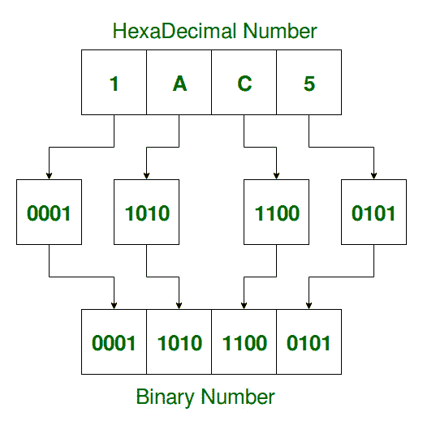

# 将十六进制数转换为二进制数的程序

> 原文:[https://www . geesforgeks . org/program-to-convert-十六进制-number-to-binary/](https://www.geeksforgeeks.org/program-to-convert-hexadecimal-number-to-binary/)

给定一个十六进制数作为输入，任务是将该数转换为二进制数。
**例:**

```
Input: Hexadecimal = 1AC5
Output: Binary = 0001101011000101
Explanation:
    Equivalent binary value of 1: 0001
    Equivalent binary value of A: 1010
    Equivalent binary value of C: 1100
    Equivalent binary value of 5: 0101

Input: Hexadecimal = 5D1F
Output: Binary = 0101110100011111
```

**方法:**一个**十六进制数**是一个以 16 为基数的位置数字系统，使用十六个不同的符号。
A **二进制数**是用基数-2 二进制数制表示的数，只使用两个符号:0(零)和 1(一)。

> **要将十六进制数转换为二进制数，需要对十六进制数的每个数字的二进制等价物进行求值，并在最后进行组合，得到等价的二进制数。**



以下是上述方法的实现:

## C++

```
// C++ program to convert
// Hexadecimal number to Binary

#include <bits/stdc++.h>
using namespace std;

// function to convert
// Hexadecimal to Binary Number
void HexToBin(string hexdec)
{
    long int i = 0;

    while (hexdec[i]) {

        switch (hexdec[i]) {
        case '0':
            cout << "0000";
            break;
        case '1':
            cout << "0001";
            break;
        case '2':
            cout << "0010";
            break;
        case '3':
            cout << "0011";
            break;
        case '4':
            cout << "0100";
            break;
        case '5':
            cout << "0101";
            break;
        case '6':
            cout << "0110";
            break;
        case '7':
            cout << "0111";
            break;
        case '8':
            cout << "1000";
            break;
        case '9':
            cout << "1001";
            break;
        case 'A':
        case 'a':
            cout << "1010";
            break;
        case 'B':
        case 'b':
            cout << "1011";
            break;
        case 'C':
        case 'c':
            cout << "1100";
            break;
        case 'D':
        case 'd':
            cout << "1101";
            break;
        case 'E':
        case 'e':
            cout << "1110";
            break;
        case 'F':
        case 'f':
            cout << "1111";
            break;
        default:
            cout << "\nInvalid hexadecimal digit "
                 << hexdec[i];
        }
        i++;
    }
}

// driver code
int main()
{

    // Get the Hexadecimal number
    char hexdec[100] = "1AC5";

    // Convert HexaDecimal to Binary
    cout << "\nEquivalent Binary value is : ";
    HexToBin(hexdec);

    return 0;
}
```

## C

```
// C program to convert
// Hexadecimal number to Binary

#include <stdio.h>

// function to convert Hexadecimal to Binary Number
void HexToBin(char* hexdec)
{

    long int i = 0;

    while (hexdec[i]) {

        switch (hexdec[i]) {
        case '0':
            printf("0000");
            break;
        case '1':
            printf("0001");
            break;
        case '2':
            printf("0010");
            break;
        case '3':
            printf("0011");
            break;
        case '4':
            printf("0100");
            break;
        case '5':
            printf("0101");
            break;
        case '6':
            printf("0110");
            break;
        case '7':
            printf("0111");
            break;
        case '8':
            printf("1000");
            break;
        case '9':
            printf("1001");
            break;
        case 'A':
        case 'a':
            printf("1010");
            break;
        case 'B':
        case 'b':
            printf("1011");
            break;
        case 'C':
        case 'c':
            printf("1100");
            break;
        case 'D':
        case 'd':
            printf("1101");
            break;
        case 'E':
        case 'e':
            printf("1110");
            break;
        case 'F':
        case 'f':
            printf("1111");
            break;
        default:
            printf("\nInvalid hexadecimal digit %c",
                   hexdec[i]);
        }
        i++;
    }
}

// driver code
int main()
{

    // Get the Hexadecimal number
    char hexdec[100] = "1AC5";

    // Convert HexaDecimal to Binary
    printf("\nEquivalent Binary value is : ");
    HexToBin(hexdec);
}
```

## Java 语言(一种计算机语言，尤用于创建网站)

```
// Java program to convert
// Hexadecimal number to Binary

public class Improve {

    // function to convert
    // Hexadecimal to Binary Number
    static void HexToBin(char hexdec[])
    {
        int i = 0;

        while (hexdec[i] != '\u0000') {

            switch (hexdec[i]) {
            case '0':
                System.out.print("0000");
                break;
            case '1':
                System.out.print("0001");
                break;
            case '2':
                System.out.print("0010");
                break;
            case '3':
                System.out.print("0011");
                break;
            case '4':
                System.out.print("0100");
                break;
            case '5':
                System.out.print("0101");
                break;
            case '6':
                System.out.print("0110");
                break;
            case '7':
                System.out.print("0111");
                break;
            case '8':
                System.out.print("1000");
                break;
            case '9':
                System.out.print("1001");
                break;
            case 'A':
            case 'a':
                System.out.print("1010");
                break;
            case 'B':
            case 'b':
                System.out.print("1011");
                break;
            case 'C':
            case 'c':
                System.out.print("1100");
                break;
            case 'D':
            case 'd':
                System.out.print("1101");
                break;
            case 'E':
            case 'e':
                System.out.print("1110");
                break;
            case 'F':
            case 'f':
                System.out.print("1111");
                break;
            default:
                System.out.print("\nInvalid hexadecimal digit " + hexdec[i]);
            }
            i++;
        }
    }

    // Driver code
    public static void main(String args[])
    {
        // Get the Hexadecimal number
        String s = "1AC5" ;
        char hexdec[] = new char[100] ;
            hexdec = s.toCharArray() ;

        // Convert HexaDecimal to Binary
        System.out.print("\nEquivalent Binary value is : ");
        try{
            HexToBin(hexdec);
        }
        catch (ArrayIndexOutOfBoundsException e){
            System.out.print("");
        }

    }
    // This code is contributed by ANKITRAI1
}
```

## 蟒蛇 3

```
# Python3 program to convert
# Hexadecimal number to Binary

# Function to convert
# Hexadecimal to Binary Number
def HexToBin(hexdec):

    for i in hexdec:       
        if i == '0':
            print('0000', end = '')
        elif i == '1':
            print('0001', end = '')
        elif i == '2':
            print('0010', end = '')
        elif i == '3':
            print('0011', end = '')
        elif i == '4':
            print('0100', end = '')
        elif i == '5':
            print('0101', end = '')
        elif i == '6':
            print('0110', end = '')
        elif i == '7':
            print('0111', end = '')
        elif i == '8':
            print('1000', end = '')
        elif i == '9':
            print('1001', end = '')
        elif i == 'A' or i == 'a':
            print('1010', end = '')
        elif i == 'B' or i == 'b':
            print('1011', end = '')
        elif i == 'C' or i == 'c':
            print('1100', end = '')
        elif i == 'D' or i == 'd':
            print('1101', end = '')
        elif i == 'E' or i == 'e':
            print('1110', end = '')
        elif i == 'F' or i == 'f':
            print('1111', end = '')
        else:
            print("\nInvalid hexadecimal digit " +
                    str(hexdec[i]), end = '')

# Driver code
if __name__=="__main__":

    # Get the Hexadecimal number
    hexdec= "1AC5";

    # Convert HexaDecimal to Binary
    print("Equivalent Binary value is : ",
           end = '')
    HexToBin(hexdec)

# This code is contributed by Rutvik_56
```

## C#

```
// C# program to convert Hexadecimal
// number to Binary

class GFG
{

// function to convert
// Hexadecimal to Binary Number
static void HexToBin(char[] hexdec)
{
int i = 0;

while (hexdec[i] != '\u0000')
{

    switch (hexdec[i])
    {
    case '0':
        System.Console.Write("0000");
        break;
    case '1':
        System.Console.Write("0001");
        break;
    case '2':
        System.Console.Write("0010");
        break;
    case '3':
        System.Console.Write("0011");
        break;
    case '4':
        System.Console.Write("0100");
        break;
    case '5':
        System.Console.Write("0101");
        break;
    case '6':
        System.Console.Write("0110");
        break;
    case '7':
        System.Console.Write("0111");
        break;
    case '8':
        System.Console.Write("1000");
        break;
    case '9':
        System.Console.Write("1001");
        break;
    case 'A':
    case 'a':
        System.Console.Write("1010");
        break;
    case 'B':
    case 'b':
        System.Console.Write("1011");
        break;
    case 'C':
    case 'c':
        System.Console.Write("1100");
        break;
    case 'D':
    case 'd':
        System.Console.Write("1101");
        break;
    case 'E':
    case 'e':
        System.Console.Write("1110");
        break;
    case 'F':
    case 'f':
        System.Console.Write("1111");
        break;
    default:
        System.Console.Write("\nInvalid hexadecimal digit " +
                                                  hexdec[i]);
        break;
    }
    i++;
}
}

// Driver code
static void Main()
{
    // Get the Hexadecimal number
    string s = "1AC5" ;
    char[] hexdec = new char[100];
           hexdec = s.ToCharArray();

    // Convert HexaDecimal to Binary
    System.Console.Write("Equivalent Binary value is : ");
    try
    {
        HexToBin(hexdec);
    }
    catch (System.IndexOutOfRangeException)
    {
        System.Console.Write("");
    }
}
}

// This code is contributed by mits
```

## 服务器端编程语言（Professional Hypertext Preprocessor 的缩写）

```
<?php
// PHP program to convert
// Hexadecimal number to Binary

// function to convert
// Hexadecimal to Binary Number
function HexToBin($hexdec)
{
    $i = 0;

    while ($hexdec[$i])
    {
        switch ($hexdec[$i])
        {
        case '0':
            echo "0000";
            break;
        case '1':
            echo "0001";
            break;
        case '2':
            echo "0010";
            break;
        case '3':
            echo "0011";
            break;
        case '4':
            echo "0100";
            break;
        case '5':
            echo "0101";
            break;
        case '6':
            echo "0110";
            break;
        case '7':
            echo "0111";
            break;
        case '8':
            echo "1000";
            break;
        case '9':
            echo "1001";
            break;
        case 'A':
        case 'a':
            echo "1010";
            break;
        case 'B':
        case 'b':
            echo "1011";
            break;
        case 'C':
        case 'c':
            echo "1100";
            break;
        case 'D':
        case 'd':
            echo "1101";
            break;
        case 'E':
        case 'e':
            echo "1110";
            break;
        case 'F':
        case 'f':
            echo "1111";
            break;
        default:
            echo "\nInvalid hexadecimal digit ".
                                    $hexdec[$i];
        }
        $i++;
    }
}

// Driver Code

// Get the Hexadecimal number
$hexdec = "1AC5";

// Convert HexaDecimal to Binary
echo "\nEquivalent Binary value is : ";
HexToBin($hexdec);

// This code is contributed
// by Akanksha Rai
```

**Output:** 

```
Equivalent Binary value is : 0001101011000101
```

**备选方案:**

## 计算机编程语言

```
# Python3 program to convert
# Hexadecimal number to Binary

def to4DigitBin(value):

    # Converts given binary value into 4-digit
    # Binary representation.
    # If given value is '10', it returns '0010'
    # i.e. 2 times '0' + '10'='00'+'10'
    return '0'*(4-len(value))+value

def HexadecimalToBinary(inputHexadecimal):
    resultBinary = '' # Initialize Empty string

    for eachElement in inputHexadecimal:

        # If it's a number digit (in 0 to 9), find it's binary form.
        if(eachElement.isdigit()):

            # Here bin(number) function returns Binary
            # representation of number
            # Ex: bin(10) returns '0b1010', so slice away
            # the first 2 characters to get '1010'
            binaryOfSingleDigit = bin(int(eachElement))[2:]

            # Now add the 4-digit Binary representation to
            # result string
            resultBinary += to4DigitBin(binaryOfSingleDigit)

        # Since the element is alphabet (in A to E), (assuming
        # only capital letters)
        # 'ord(element)-65+10' gives the number representation
        # ranging 10 to 16 (for A to E)
        # Ex: For 'B', ord('B')=66, thus 'ord('B')-65+10' => '
        # 66-65+10' => '11'
        elif(eachElement.isalpha() and ord(eachElement) < 71):
            resultBinary += to4DigitBin(bin(ord(eachElement)-55)[2:])

        # If invalid character is present 
        else:           
            resultBinary = 'Invalid hexadecimal digit: ' + eachElement
            break

    return 'Equivalent Binary value is: '+ resultBinary

# Driver code
inputHexadecimal = '1AC5'   # input('Enter Hexadecimal: ')
print(HexadecimalToBinary(inputHexadecimal))

# This code is contributed by SBVKrishna
```

## Java 语言(一种计算机语言，尤用于创建网站)

```
/*package whatever //do not write package name here */

import java.io.*;

class HexToBinary {
    public static void main(String[] args)
    {
        String s = "1AC5";
        String result = hexToBinary(s);
        System.out.println(result);
    }
    private static String hexToBinary(String input)
    {
        /*Using Integer.parseInt() to get the decimal value
         * of the given String*/
        int decimalValue = Integer.parseInt(input, 16);

        /*Using Integer.toBinaryString() to get the binary
         * String of given integer*/
        String result
            = Integer.toBinaryString(decimalValue);

        /*Alternatively you may also merge above operations
        to one line like
        * String result = Integer.toBinaryString(Integer.parseInt(input, 16));
          */
        return result;
    }
}
```

**Output**

```
Equivalent Binary value is: 0001101011000101

```