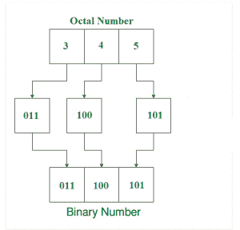

# 将八进制数转换为二进制数的程序

> 原文:[https://www . geesforgeks . org/program-to-convert-octal-number-to-binary-number/](https://www.geeksforgeeks.org/program-to-convert-octal-number-to-binary-number/)

给定一个八进制数作为输入，任务是将该数转换为二进制数。
**例:**

```
Input : Octal = 345
Output : Binary = 011100101
Explanation : 
Equivalent binary value of 3: 011
Equivalent binary value of 4: 100
Equivalent binary value of 5: 101

Input : Octal = 120
Output : Binary = 001010000
```

**八进制数**:八进制数是以 8 为基数的位置数字系统，使用八个不同的符号。
**二进制数**:二进制数是用基数为 2 的二进制数制表示的数，只使用两个符号:0(零)和 1(一)。

> **要将一个八进制数转换为二进制数，需要对八进制数每个数字的二进制等价物进行求值，并在最后进行组合，得到等价的二进制数。**



以下是上述方法的实现:

## C++

```
// C++ program to convert
// Octal number to Binary

#include <iostream>
using namespace std;

// Function to convert an
// Octal to Binary Number
string OctToBin(string octnum)
{
    long int i = 0;

    string binary = "";

    while (octnum[i]) {
        switch (octnum[i]) {
        case '0':
            binary += "000";
            break;
        case '1':
            binary += "001";
            break;
        case '2':
            binary += "010";
            break;
        case '3':
            binary += "011";
            break;
        case '4':
            binary += "100";
            break;
        case '5':
            binary += "101";
            break;
        case '6':
            binary += "110";
            break;
        case '7':
            binary += "111";
            break;
        default:
            cout << "\nInvalid Octal Digit "
                 << octnum[i];
            break;
        }
        i++;
    }

    return binary;
}

// Driver code
int main()
{
    // Get the Hexadecimal number
    string octnum = "345";

    // Convert Ocatl to Binary
    cout << "Equivalent Binary Value = "
         << OctToBin(octnum);

    return 0;
}
```

## Java 语言(一种计算机语言，尤用于创建网站)

```
// Java program to convert
// Octal number to Binary
import java.util.*;
class Solution
{

// Function to convert an
// Octal to Binary Number
static String OctToBin(String octnum)
{
    long i = 0;

    String binary = "";

    while (i<octnum.length()) {

        char c=octnum.charAt((int)i);
        switch (c) {
        case '0':
            binary += "000";
            break;
        case '1':
            binary += "001";
            break;
        case '2':
            binary += "010";
            break;
        case '3':
            binary += "011";
            break;
        case '4':
            binary += "100";
            break;
        case '5':
            binary += "101";
            break;
        case '6':
            binary += "110";
            break;
        case '7':
            binary += "111";
            break;
        default:
            System.out.println( "\nInvalid Octal Digit "+ octnum.charAt((int)i));
            break;
        }
        i++;
    }

    return binary;
}

// Driver code
public static void main(String args[])
{
    // Get the Hexadecimal number
    String octnum = "345";

    // Convert Ocatl to Binary
    System.out.println( "Equivalent Binary Value = "+ OctToBin(octnum));

}

}
//contributed by Arnab Kundu
```

## 蟒蛇 3

```
# Python3 program to convert
# Octal number to Binary

# defining a function that returns
# binary equivalent of the number
def OctToBin(octnum):

    binary = "" # initialising bin as String

    # While loop to extract each digit
    while octnum != 0:

        # extracting each digit
        d = int(octnum % 10)
        if d == 0:

            # concatenation of string using join function
            binary = "".join(["000", binary])
        elif d == 1:

            # concatenation of string using join function
            binary = "".join(["001", binary])
        elif d == 2:

            # concatenation of string using join function
            binary = "".join(["010", binary])
        elif d == 3:

            # concatenation of string using join function
            binary = "".join(["011", binary])
        elif d == 4:

            # concatenation of string using join function
            binary = "".join(["100", binary])
        elif d == 5:

            # concatenation of string using join function
            binary = "".join(["101", binary])
        elif d == 6:

            # concatenation of string using join function
            binary = "".join(["110",binary])
        elif d == 7:

            # concatenation of string using join function
            binary = "".join(["111", binary])
        else:

            # an option for invalid input
            binary = "Invalid Octal Digit"
            break

        # updating the oct for while loop
        octnum = int(octnum / 10)

    # returning the string binary that stores
    # binary equivalent of the number
    return binary

# Driver Code
octnum = 345

# value of function stored final_bin
final_bin = "" + OctToBin(octnum)

# result is printed
print("Equivalent Binary Value =", final_bin)

# This code is contributed by Animesh_Gupta
```

## C#

```
// C# program to convert Octal number to Binary

class GFG
{

// Function to convert an
// Octal to Binary Number
static string OctToBin(string octnum)
{
    int i = 0;

    string binary = "";

    while (i < octnum.Length)
    {

        char c = octnum[i];
        switch (c)
        {
        case '0':
            binary += "000";
            break;
        case '1':
            binary += "001";
            break;
        case '2':
            binary += "010";
            break;
        case '3':
            binary += "011";
            break;
        case '4':
            binary += "100";
            break;
        case '5':
            binary += "101";
            break;
        case '6':
            binary += "110";
            break;
        case '7':
            binary += "111";
            break;
        default:
            System.Console.WriteLine( "\nInvalid Octal Digit "+
                                                    octnum[i]);
            break;
        }
        i++;
    }

    return binary;
}

// Driver code
static void Main()
{
    // Get the Hexadecimal number
    string octnum = "345";

    // Convert Ocatl to Binary
    System.Console.WriteLine("Equivalent Binary Value = " +
                                         OctToBin(octnum));
}
}

// This code is contributed by mits
```

## 服务器端编程语言（Professional Hypertext Preprocessor 的缩写）

```
<?php
// PHP program to convert
// Octal number to Binary

// Function to convert an
// Octal to Binary Number
function OctToBin($octnum)
{
    $i = 0;

    $binary = (string)"";

    while ($i != strlen($octnum))
    {
        switch ($octnum[$i])
        {
        case '0':
            $binary.= "000";
            break;
        case '1':
            $binary .= "001";
            break;
        case '2':
            $binary .= "010";
            break;
        case '3':
            $binary .= "011";
            break;
        case '4':
            $binary .= "100";
            break;
        case '5':
            $binary .= "101";
            break;
        case '6':
            $binary .= "110";
            break;
        case '7':
            $binary .= "111";
            break;
        default:
            echo("\nInvalid Octal Digit ".
                             $octnum[$i]);
            break;
        }
        $i++;
    }
    return $binary;
}

// Driver code

// Get the Hexadecimal number
$octnum = "345";

/// Convert Ocatl to Binary
echo("Equivalent Binary Value = " .
                OctToBin($octnum));

// This code is contributed
// by PrinciRaj1992
```

## java 描述语言

```
<script>

// JavaScript program to convert
// Octal number to Binary

// Function to convert an
// Octal to Binary Number
function OctToBin(octnum)
{
    let i = 0;

    let binary = "";

    while (i<octnum.length) {

        let c=octnum[i];
        switch (c) {
        case '0':
            binary += "000";
            break;
        case '1':
            binary += "001";
            break;
        case '2':
            binary += "010";
            break;
        case '3':
            binary += "011";
            break;
        case '4':
            binary += "100";
            break;
        case '5':
            binary += "101";
            break;
        case '6':
            binary += "110";
            break;
        case '7':
            binary += "111";
            break;
        default:
            document.write( "<br>Invalid Octal Digit "+ octnum[i]);
            break;
        }
        i++;
    }

    return binary;
}

// Driver code
// Get the Hexadecimal number
let octnum = "345";

// Convert Ocatl to Binary
document.write( "Equivalent Binary Value = "+ OctToBin(octnum));

// This code is contributed by avanitrachhadiya2155

</script>
```

**Output:** 

```
Equivalent Binary Value = 011100101
```