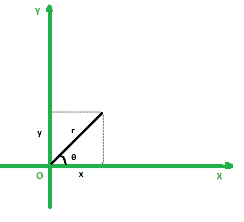

# 将极坐标转换为等效笛卡尔坐标的程序

> 原文:[https://www . geesforgeks . org/program-to-convert-polar-co-coordinates-to-等效-cartesian-co-coordinates/](https://www.geeksforgeeks.org/program-to-convert-polar-co-ordinates-to-equivalent-cartesian-co-ordinates/)

给定两个整数 **r** 和 **θ** (以度为单位)表示一个点的极坐标 **(r，θ)** ，任务是找到给定点的笛卡尔坐标。

**示例:**

> **输入:** r = 1.4142，θ = 45
> **输出:** 1.000，1.000
> 
> **输入:** r = 3，θ= 30
> T3】输出: 2.598，1.500

**逼近:**让点的笛卡尔坐标为(x，y)。极坐标和笛卡儿坐标可以用下面的等式联系起来:

> **x = r*cosθ** 和 **y = r*sinθ**

[](https://media.geeksforgeeks.org/wp-content/uploads/20210126235601/gr.png)

按照以下步骤解决问题:

*   [将 **θ** 从度数转换为弧度](https://www.geeksforgeeks.org/program-to-convert-degree-to-radian/)为 **θ(弧度)= θ(度数)* (3.14159 / 180)** 。
*   将 **x** 和 **y** 坐标分别存储在变量 **X** 和 **Y** 中。
*   应用变换公式，更新 **X = r * cosθ** 和 **Y = r * sinθ** 的值。
*   打印 **X** 和 **Y** 的值作为结果。

下面是上述方法的实现:

## C++14

```
// C++ program for the above approach
#include <bits/stdc++.h>
using namespace std;

// Function to convert degree to radian
double ConvertDegToRad(double degree)
{
    double pi = 3.14159;
    return (degree * (pi / 180.0));
}

// Function to convert the polar
// coordinate to cartesian
void ConvertToCartesian(
    pair<double, double> polar)
{

    // Convert degrees to radian
    polar.second = ConvertDegToRad(
        polar.second);

    // Applying the formula:
    // x = rcos(theta), y = rsin(theta)
    pair<double, double> cartesian
        = { polar.first * cos(polar.second),
            polar.first * sin(polar.second) };

    // Print cartesian coordinates
    printf("%0.3f, %0.3f",
           cartesian.first,
           cartesian.second);
}

// Driver Code
int main()
{
    // Given polar coordinates
    pair<double,
         double>
        polar = { 1.4142, 45 };

    // Function to convert polar
    // coordinates to equivalent
    // cartesian coordinates
    ConvertToCartesian(polar);

    return 0;
}
```

## Java 语言(一种计算机语言，尤用于创建网站)

```
// Java code of above approach
import java.util.*;

class GFG
{

  // Function to convert degree to radian
  static double ConvertDegToRad(double degree)
  {
    double pi = 3.14159;
    return (degree * (pi / 180.0));
  }

  // Function to convert the polar
  // coordinate to cartesian
  static void ConvertToCartesian(
    double[] polar)
  {

    // Convert degrees to radian
    polar[1] = ConvertDegToRad(
      polar[1]);

    // Applying the formula:
    // x = rcos(theta), y = rsin(theta)
    double[] cartesian
      = { polar[0] * Math.cos(polar[1]),
         polar[0] * Math.sin(polar[1]) };

    // Print cartesian coordinates
    System.out.print(String.format("%.3f", cartesian[0])+" "+String.format("%.3f", cartesian[1]));

  }

  // Driver code
  public static void main(String[] args)
  {
    // Given polar coordinates

    double[] polar = { 1.4142, 45 };

    // Function to convert polar
    // coordinates to equivalent
    // cartesian coordinates
    ConvertToCartesian(polar);

  }
}

// This code is contributed by offbeat
```

## 蟒蛇 3

```
# Python 3 program for the above approach
import math

# Function to convert degree to radian
def ConvertDegToRad(degree):
    pi = 3.14159
    return (degree * (pi / 180.0))

# Function to convert the polar
# coordinate to cartesian
def ConvertToCartesian(polar):

    # Convert degrees to radian
    polar[1] = ConvertDegToRad(polar[1])

    # Applying the formula:
    # x = rcos(theta), y = rsin(theta)
    cartesian = [polar[0] * math.cos(polar[1]),
                 polar[0] * math.sin(polar[1])]

    # Print cartesian coordinates
    print('%.3f' % cartesian[0],
          '%.3f' % cartesian[1])

# Driver Code
if __name__ == "__main__":

    # Given polar coordinates
    polar = [1.4142, 45]

    # Function to convert polar
    # coordinates to equivalent
    # cartesian coordinates
    ConvertToCartesian(polar)

    # This code is contributed by chitranayal.
```

## C#

```
// C# program for the above approach
using System;

class GFG
{

  // Function to convert degree to radian
  static Double ConvertDegToRad(Double degree)
  {
    Double pi = 3.14159;
    return (degree * (pi / 180.0));
  }

  // Function to convert the polar
  // coordinate to cartesian
  static void ConvertToCartesian(
    Double[] polar)
  {

    // Convert degrees to radian
    polar[1] = ConvertDegToRad(
      polar[1]);

    // Applying the formula:
    // x = rCos(theta), y = rSin(theta)
    Double[] cartesian
      = { polar[0] * Math.Cos(polar[1]),
         polar[0] * Math.Sin(polar[1]) };

    // Print cartesian coordinates
    Console.Write(String.Format("{0:0.000}", cartesian[0])+
                  ", "+String.Format("{0:0.000}", cartesian[1]));

  }

  // Driver code
  public static void Main()
  {

    // Given polar coordinates
    Double[] polar = { 1.4142, 45 };

    // Function to convert polar
    // coordinates to equivalent
    // cartesian coordinates
    ConvertToCartesian(polar);

  }
}

// This code is contributed by Shubham Singh
```

## java 描述语言

```
<script>

// JavaScript code of above approach

// Function to convert degree to radian
function ConvertDegToRad(degree)
{
    let pi = 3.14159;
    return (degree * (pi / 180.0));
}

// Function to convert the polar
  // coordinate to cartesian
function ConvertToCartesian(polar)
{
    // Convert degrees to radian
    polar[1] = ConvertDegToRad(
      polar[1]);

    // Applying the formula:
    // x = rcos(theta), y = rsin(theta)
    let cartesian
      = [ polar[0] * Math.cos(polar[1]),
         polar[0] * Math.sin(polar[1]) ];

    // Print cartesian coordinates
    document.write((cartesian[0]).toFixed(3)+", "
    +(cartesian[1]).toFixed(3));
}

// Driver code
let polar=[1.4142, 45 ];
// Function to convert polar
// coordinates to equivalent
// cartesian coordinates
ConvertToCartesian(polar);

// This code is contributed by avanitrachhadiya2155

</script>
```

**Output:** 

```
1.000, 1.000
```

***时间复杂度:**O(1)*
T5**辅助空间:** O(1)