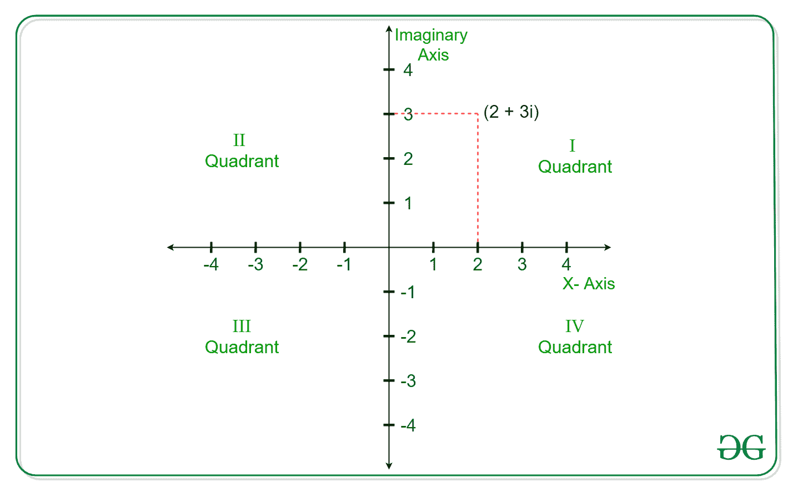
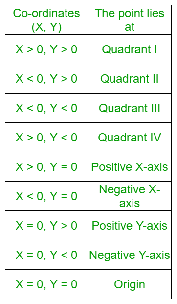

# 确定复数象限的程序

> 原文:[https://www . geeksforgeeks . org/确定复数象限的程序/](https://www.geeksforgeeks.org/program-to-determine-the-quadrant-of-a-complex-number/)

给定一个字符串形式的[复数](https://www.geeksforgeeks.org/complex-numbers-c-set-1/)**字符串**，任务是确定这个复数所在的[笛卡尔平面](https://www.geeksforgeeks.org/program-determine-quadrant-cartesian-plane/)的象限。

**示例:**

> **输入:**str = " 1+1i "
> T3】输出:象限 1
> 
> **输入:**str = " 0+0i "
> T3】输出:原点

**进场:**



这个想法是首先找到一个复数的实部和虚部。假设该点为 **(x，iy)** ，那么下表说明了该点相对于坐标的位置:



下面是上述方法的实现:

## C++

```
// C++ program to determine the quadrant
// of a complex number

#include <bits/stdc++.h>
using namespace std;

// Function to determine the quadrant
// of a complex number
void quadrant(string s)
{
    int l = s.length();
    int i;

    // Storing the index of '+'
    if (s.find('+') < l) {
        i = s.find('+');
    }

    // Storing the index of '-'
    else {
        i = s.find('-');
    }

    // Finding the real part
    // of the complex number
    string real = s.substr(0, i);

    // Finding the imaginary part
    // of the complex number
    string imaginary = s.substr(i + 1, l - 1);

    int x = stoi(real);
    int y = stoi(imaginary);

    if (x > 0 and y > 0)
        cout << "Quadrant 1";

    else if (x < 0 and y > 0)
        cout << "Quadrant 2";

    else if (x < 0 and y < 0)
        cout << "Quadrant 3";

    else if (x > 0 and y < 0)
        cout << "Quadrant 4";

    else if (x == 0 and y > 0)
        cout << "Lies on positive"
             << " Imaginary axis";

    else if (x == 0 and y < 0)
        cout << "Lies on negative"
             << " Imaginary axis";

    else if (y == 0 and x < 0)
        cout << "Lies on negative"
             << " X-axis";

    else if (y == 0 and x > 0)
        cout << "Lies on positive"
             << " X-axis";

    else
        cout << "Lies on the Origin";
}

// Driver code
int main()
{
    string s = "5+3i";
    quadrant(s);
    return 0;
}
```

## Java 语言(一种计算机语言，尤用于创建网站)

```
// Java program to determine the quadrant
// of a complex number
import java.util.*;

class GFG{

// Function to determine the quadrant
// of a complex number
static void quadrant(String s)
{
    int l = s.length();
    int i;

    // Storing the index of '+'
    if (s.contains("+")) {
        i = s.indexOf('+');
    }

    // Storing the index of '-'
    else {
        i = s.indexOf('-');
    }

    // Finding the real part
    // of the complex number
    String real = s.substring(0, i);

    // Finding the imaginary part
    // of the complex number
    String imaginary = s.substring(i + 1, l - 1);

    int x = Integer.valueOf(real);
    int y = Integer.valueOf(imaginary);

    if (x > 0 && y > 0)
        System.out.print("Quadrant 1");

    else if (x < 0 && y > 0)
        System.out.print("Quadrant 2");

    else if (x < 0 && y < 0)
        System.out.print("Quadrant 3");

    else if (x > 0 && y < 0)
        System.out.print("Quadrant 4");

    else if (x == 0 && y > 0)
        System.out.print("Lies on positive"
            + " Imaginary axis");

    else if (x == 0 && y < 0)
        System.out.print("Lies on negative"
            + " Imaginary axis");

    else if (y == 0 && x < 0)
        System.out.print("Lies on negative"
            + " X-axis");

    else if (y == 0 && x > 0)
        System.out.print("Lies on positive"
            + " X-axis");

    else
        System.out.print("Lies on the Origin");
}

// Driver code
public static void main(String[] args)
{
    String s = "5+3i";
    quadrant(s);
}
}

// This code is contributed by Rajput-Ji
```

## 蟒蛇 3

```
# Python 3 program to determine the quadrant
# of a complex number

# Function to determine the quadrant
# of a complex number
def quadrant(s):
    l = len(s)
    # Storing the index of '+'
    if ('+' in s):
        i = s.index('+')

    # Storing the index of '-'
    else:
        i = s.index('-')

    # Finding the real part
    # of the complex number
    real = s[0:i]

    # Finding the imaginary part
    # of the complex number
    imaginary = s[i + 1:l - 1]

    x = int(real)
    y = int(imaginary)

    if (x > 0 and y > 0):
        print("Quadrant 1")

    elif(x < 0 and y > 0):
        print("Quadrant 2")

    elif (x < 0 and y < 0):
        print("Quadrant 3")

    elif (x > 0 and y < 0):
        print("Quadrant 4")

    elif (x == 0 and y > 0):
        print("Lies on positive","Imaginary axis")

    elif (x == 0 and y < 0):
        print("Lies on negative","Imaginary axis")

    elif (y == 0 and x < 0):
        print("Lies on negative","X-axis")

    elif (y == 0 and x > 0):
        print("Lies on positive","X-axis")

    else:
        print("Lies on the Origin")

# Driver code
if __name__ == '__main__':
    s = "5+3i"
    quadrant(s)

# This code is contributed by Surendra_Gangwar
```

## C#

```
// C# program to determine the quadrant
// of a complex number
using System;

class GFG{

// Function to determine the quadrant
// of a complex number
static void quadrant(String s)
{
    int l = s.Length;
    int i;

    // Storing the index of '+'
    if (s.Contains("+")) {
        i = s.IndexOf('+');
    }

    // Storing the index of '-'
    else {
        i = s.IndexOf('-');
    }

    // Finding the real part
    // of the complex number
    String real = s.Substring(0, i);

    // Finding the imaginary part
    // of the complex number
    String imaginary = s.Substring(i + 1, l - 2 - i);

    int x = Int32.Parse(real);
    int y = Int32.Parse(imaginary);

    if (x > 0 && y > 0)
        Console.Write("Quadrant 1");

    else if (x < 0 && y > 0)
        Console.Write("Quadrant 2");

    else if (x < 0 && y < 0)
        Console.Write("Quadrant 3");

    else if (x > 0 && y < 0)
        Console.Write("Quadrant 4");

    else if (x == 0 && y > 0)
        Console.Write("Lies on positive"
            + " Imaginary axis");

    else if (x == 0 && y < 0)
        Console.Write("Lies on negative"
            + " Imaginary axis");

    else if (y == 0 && x < 0)
        Console.Write("Lies on negative"
            + " X-axis");

    else if (y == 0 && x > 0)
        Console.Write("Lies on positive"
            + " X-axis");

    else
        Console.Write("Lies on the Origin");
}

// Driver code
public static void Main(String[] args)
{
    String s = "5+3i";
    quadrant(s);
}
}

// This code is contributed by sapnasingh4991
```

## java 描述语言

```
<script>
// Javascript program

// Function to determine the quadrant
// of a complex number
function quadrant(s)
{
    var l = s.length;
    var i =0 ;

    // Storing the index of '+'
    if (s.indexOf("+") != -1) {
        i = s.indexOf("+");
    }

    // Storing the index of '-'
    else {
        i = s.indexOf("-");
    }

    // Finding the real part
    // of the complex number
    var real = s.substr(0, i);

    // Finding the imaginary part
    // of the complex number
    var imaginary = s.substr(i + 1, l - 1);

    var x = parseInt(real);
    var y = parseInt(imaginary);

    if (x > 0 && y > 0)
        document.write("Quadrant 1");

    else if (x < 0 && y > 0)
           document.write("Quadrant 2");

    else if (x < 0 && y < 0)
           document.write( "Quadrant 3");

    else if (x > 0 && y < 0)
          document.write( "Quadrant 4");

    else if (x == 0 && y > 0)
        document.write( "Lies on positive"+" Imaginary axis");

    else if (x == 0 && y < 0)
        document.write( "Lies on negative"+" Imaginary axis");

    else if (y == 0 && x < 0)
        document.write( "Lies on negative"+" X-axis");

    else if (y == 0 && x > 0)
        document.write( "Lies on positive"+" X-axis");

    else
        document.write( "Lies on the Origin");
}

var s = "5+3i";
quadrant(s);
</script>
```

**Output:** 

```
Quadrant 1
```