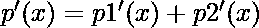
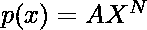

# 给定多项式的微分程序

> 原文:[https://www . geesforgeks . org/program-to-difference-the-给定多项式/](https://www.geeksforgeeks.org/program-to-differentiate-the-given-polynomial/)

给定多项式字符串 **str** ，任务是对给定字符串进行微分，微分后打印字符串。
**注意:**输入格式是术语和“+”、“-”符号之间有一个空格
**示例:**

> **输入:**str = " 4X<sup>3</sup>+3X<sup>1</sup>+2X<sup>2</sup>"
> **输出:**" 12X<sup>2</sup>+3X<sup>0</sup>+4X<sup>1</sup>"
> **解释:**
> p(X)= A * X<sup>N</sup>的导数为 p'(x) = x<sup>N–1</sup>
> **输入:**str = " 5X<sup>4</sup>+6X<sup>2</sup>+5X<sup>2</sup>"
> **输出:**" 20X<sup>3</sup>+12X<sup>1</sup>+10X<sup>1</sup>

**方法:**想法是观察当给定的方程由多个多项式组成时


，给定多项式的微分



。众所周知，的导数



是


因此，我们拆分给定的字符串，并区分其中的每个术语。
以下是上述方法的实现:

## C++

```
// C++ program to differentiate the
// given polynomial

#include "bits/stdc++.h"
#define MOD (1e9 + 7);
using ll = int64_t;
using ull = uint64_t;
#define ll long long
using namespace std;

// Function to differentiate the
// given term
string diffTerm(string pTerm)
{
    // Get the coefficient
    string coeffStr = "", S = "";
    int i;

    // Loop to get the coefficient
    for (i = 0; pTerm[i] != 'x'; i++)
        coeffStr.push_back(pTerm[i]);

    long long coeff
        = atol(coeffStr.c_str());

    // Loop to get the power of each term
    string powStr = "";
    for (i = i + 2; i != pTerm.size(); i++)
        powStr.push_back(pTerm[i]);

    long long power
        = atol(powStr.c_str());
    string a, b;

    // Converting the value
    // to the string
    ostringstream str1, str2;

    // For ax^n, we find (n)*a*x^(n-1)
    coeff = coeff * power;
    str1 << coeff;
    a = str1.str();
    power--;
    str2 << power;
    b = str2.str();
    S += a + "X^" + b;

    return S;
}

// Function to differentiate the
// given polynomial
string diffstr(string& poly)
{

    // We use istringstream to get
    // the input in tokens
    istringstream is(poly);

    string pTerm, S = "";

    // For every token, compute the
    // differentiation
    while (is >> pTerm) {

        // If the token is equal to
        // '+', '-' then
        // continue with the string
        if (pTerm == "+") {
            S += " + ";
            continue;
        }

        if (pTerm == "-") {
            S += " - ";
            continue;
        }

        // Otherwise find the differentiation
        // of that particular term
        else
            S += diffTerm(pTerm);
    }
    return S;
}

// Driver code
int main()
{
    string str = "5x^4 + 6x^2 + 5x^2";
    cout << diffstr(str);
    return 0;
}
```

## 蟒蛇 3

```
# Python3 program to differentiate
# the given polynomial
MOD = (1e9 + 7)

# Function to differentiate
# the given term
def diffTerm(pTerm):

    # Get the coefficient
    coeffStr = ""
    S = ""

    # Loop to get the
    # coefficient
    i = 0
    while (i < len(pTerm) and
           pTerm[i] != 'x'):
        coeffStr += (pTerm[i])
        i += 1

    coeff = int(coeffStr)

    # Loop to get the power
    # of each term
    powStr = ""
    j = i + 2
    while j < len(pTerm):
        powStr += (pTerm[j])
        j += 1

    power = int(powStr)

    # For ax^n, we find
    # (n)*a*x^(n-1)
    coeff = coeff * power
    a = str(coeff)
    power -= 1
    b = str(power)
    S += a + "X^" + b

    return S

# Function to differentiate
# the given polynomial
def diffstr(poly):

    pTerm = poly.split(" ")
    S = ""

    for i in range(len(pTerm)):

        # If the token is equal to
        # '+', '-' then
        # continue with the string
        if (pTerm[i] == "+"):
            S += " + "
            continue

        if (pTerm[i] == "-"):
            S += " - "
            continue

        # Otherwise find the differentiation
        # of that particular term
        else:
            S += diffTerm(pTerm[i])

    return S

# Driver code
if __name__ == "__main__":

    st = "5x^4 + 6x^2 + 5x^2"
    print(diffstr(st))

# This code is contributed by Chitranayal
```

**Output:** 

```
20X^3 + 12X^1 + 10X^1

```