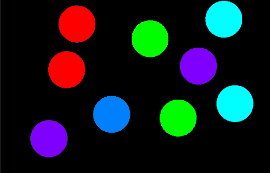

# 在 OpenGL 中使用鼠标移动绘制圆的程序

> 原文:[https://www . geesforgeks . org/program-to-draw-circles-使用鼠标在 opengl 中移动/](https://www.geeksforgeeks.org/program-to-draw-circles-using-mouse-moves-in-opengl/)

在本文中，任务是在 OpenGL 中使用鼠标单击绘制圆。

**OpenGL:** [OpenGL](https://www.geeksforgeeks.org/getting-started-with-opengl/) 是一个跨语言、跨平台的 [API](https://www.geeksforgeeks.org/introduction-to-apis/) 用于渲染 2D 和 3D [矢量](https://www.geeksforgeeks.org/vector-in-cpp-stl/) [图形](https://www.geeksforgeeks.org/computer-graphics-2/)。它将使用这个做很多设计和动画。

*   使用鼠标左键在控制台上的任意位置创建一个圆，创建的圆的[中心的坐标](https://www.geeksforgeeks.org/find-center-circle-using-endpoints-diameter/)取决于您单击的位置。
*   要改变圆的颜色，只需右击鼠标。
*   执行完所有操作后，只需按下键盘上的 Esc 键即可跳出程序。

**方法:**思路是利用下面内置的函数，在 OpenGL 中用一键画圆:

*   **glMatrixMode(GL _ PROJECTION):**该函数将当前矩阵设置为 PROJECTION。
*   **glLoadIdentity():** 函数用于将当前矩阵乘以恒等式矩阵。
*   **gluportho2d(0.0，800.0，0.0，600.0):** 设置全帧缓冲的平行(正投影)。
*   **glutCreateWindow(“鼠标点击时创建圆圈”):**如上图用户指定创建窗口。
*   **glClearColor(0，0，0，0):** 设置背景颜色。
*   **glClear(GL _ COLOR _ BUFFER _ BIT):**清除帧缓冲区，设置 glClearColor()函数调用中定义的值。
*   **glutDisplayFunc(显示):**它将显示事件与显示事件处理程序(显示)链接起来。
*   **glutMouseFunc(鼠标):**鼠标事件处理程序。
*   **glutKeyboardFunc(键盘):**键盘事件处理程序。
*   **glutMainLoop():** 此函数循环当前事件。

下面是一个在 OpenGL 中实现 [onClick](https://www.geeksforgeeks.org/html-onclick-event-attribute/) 功能的 C++程序:

## C++

```
// C++ program to implement onClick
// functionality in OpenGL to draw
// a circle
#include <GL/glut.h>
#include <iostream>
#include <math.h>
#include <stdlib.h>
#define xpix 500
#include <cstring>
using namespace std;

float r, g, b, x, y;
bool flag = true;
int counter = 0;

// Function works on mouse click
void mouse(int button, int state,
           int mousex, int mousey)
{
    if (button == GLUT_LEFT_BUTTON
        && state == GLUT_DOWN) {
        flag = true;
        x = mousex;
        y = 600 - mousey;
    }

    // Change color of circle
    else if (button == GLUT_RIGHT_BUTTON
             && state == GLUT_DOWN) {
        if (counter > 4) {
            counter = 0;
        }

        counter++;

        // Redisplay
        glutPostRedisplay();
    }
}

// Function that exits from program
void keyboard(unsigned char key,
              int x, int y)
{
    switch (key) {
    case 27:
        glutHideWindow();
    }
}

// Function to draw the circle
void display(void)
{
    float angle_theta;
    if (counter == 1) {
        glColor3f(1, 0, 0);
    }
    else if (counter == 2) {
        glColor3f(0, 1, 0);
    }
    else if (counter == 3) {
        glColor3f(0, 1, 1);
    }
    else if (counter == 4) {
        glColor3f(0.5, 0, 1);
    }
    else if (counter == 5) {

        glColor3f(0, 0.5, 1);
    }

    // Matrix mode
    glMatrixMode(GL_PROJECTION);
    glLoadIdentity();

    // Given the coordinates
    gluOrtho2D(0.0, 800.0,
               0.0, 600.0);

    // If the flag is true
    if (flag) {

        // Begin the pointer
        glBegin(GL_POLYGON);

        // Iterate through all the
        // 360 degrees
        for (int i = 0; i < 360; i++) {

            // Find the angle
            angle_theta = i * 3.142 / 180;
            glVertex2f(x + 50 * cos(angle_theta),
                       y + 50 * sin(angle_theta));
        }

        // Sets vertex
        glEnd();
    }

    // Flushes the frame buffer
    // to the screen
    glFlush();
}

// Driver Code
int main(int argc, char** argv)
{

    glutInit(&argc, argv);
    glutInitWindowSize(800, 600);
    glutInitWindowPosition(100, 100);
    glutInitDisplayMode(GLUT_SINGLE | GLUT_RGB);

    // Creates the window as
    // specified by the user
    glutCreateWindow("Circle Creation "
                     "on mouse click");

    // Sets the background color
    glClearColor(0, 0, 0, 0);

    // Clears the frame buffer
    glClear(GL_COLOR_BUFFER_BIT);

    // Links display event with the
    // display event handler(display)
    glutDisplayFunc(display);

    // Mouse event handler
    glutMouseFunc(mouse);

    // Keyboard event handler
    glutKeyboardFunc(keyboard);

    // Loops the current event
    glutMainLoop();
}
```

**输出:**

