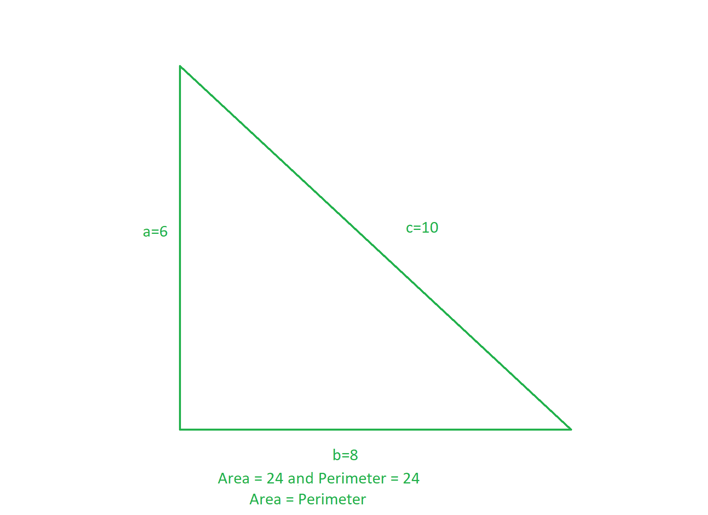

# 程序寻找所有具有相同面积和周长的可能三角形

> 原文:[https://www . geesforgeks . org/program-to-find-所有可能的三角形-具有相同的面积和周长/](https://www.geeksforgeeks.org/program-to-find-all-possible-triangles-having-same-area-and-perimeter/)

任务是找到所有具有相同[周长](https://en.wikipedia.org/wiki/Perimeter#:~:text=A%20cleaver%20of%20a%20triangle, at%20the%20triangle's%20Spieker%20center.)和[面积](https://en.wikipedia.org/wiki/Triangle#Computing_the_area_of_a_triangle)的可能三角形。

**示例:**

> [](https://media.geeksforgeeks.org/wp-content/uploads/20201019071935/gfg19.png)
> 
> 具有边(6，8，10)的三角形具有相同的周长(= (6 + 8 + 10) = 24)和面积(= 0.5 * 6 * 8 = 24)。

**方法:**这个想法是基于[鹭公式](https://www.geeksforgeeks.org/area-of-a-triangle-coordinate-geometry-class-10-maths/)的观察。以下是观察结果:

> 让三角形的边为 **a，b，c** 。
> **周长(P)** = a + b + c
> **面积(A)** 使用鹭的公式:
> 
> 
> 
> 其中 s = (a + b + c) / 2

**<u>实验观察</u> :**

> 我们知道:
> 4 * s<sup>2</sup>= s *(s–a)*(s–b)*(s–c)
> =>4 * s =(s–a)*(s–b)*(s–c)
> =>2 * 2 * 2 * 4 * s = 2 *(s–a)* 2 *(s-b)* 2 *(s–c)
> =>16 *(a+b+c) =(- a + b + c)*(a–b+ c)*(a+b–c)
> 
> 由于此条件:
> 的最大值(-a+b+ c)、(a–b+ c)、(a+b–c)如下:
> (-a+b+ c)*(a–b+ c)*(a+b–c)≤16 * 16 * 16 * 16
> =>16 *(a+b+ c)≤16 * 16 * 16

由上式可知，三角形的边数之和不超过 256，其[的三角形周长](https://www.geeksforgeeks.org/find-perimeter-triangle/)和[的三角形面积](https://www.geeksforgeeks.org/area-of-triangle-using-side-angle-side-length-of-two-sides-and-the-included-angle/)可以相同。因此，想法是在范围**【1，256】**上迭代三个嵌套循环，并打印具有相同面积和周长的边的三元组。

下面是上述方法的实现:

## C++

```
// C++ program for the above approach

#include <bits/stdc++.h>
using namespace std;

// Function to print sides of all the
// triangles having same perimeter & area
void samePerimeterAndArea()
{
    // Stores unique sides of triangles
    set<vector<int> > se;

    // i + j + k values cannot exceed 256
    for (int i = 1; i <= 256; ++i) {

        for (int j = 1; j <= 256; ++j) {

            for (int k = 1; k <= 256; ++k) {

                // Find the value of 2 * s
                int peri = i + j + k;

                // Find the value of
                // 2 * ( s - a )
                int mul1 = -i + j + k;

                // Find the value of
                // 2 * ( s - b )
                int mul2 = i - j + k;

                // Find the value of
                // 2 * ( s - c )
                int mul3 = i + j - k;

                // If triplets have same
                // area and perimeter
                if (16 * peri == mul1 * mul2 * mul3) {

                    // Store sides of triangle
                    vector<int> v = { i, j, k };

                    // Sort the triplets
                    sort(v.begin(), v.end());

                    // Inserting in set to
                    // avoid duplicate sides
                    se.insert(v);
                }
            }
        }
    }

    // Print sides of all desired triangles
    for (auto it : se) {
        cout << it[0] << " "
             << it[1] << " "
             << it[2] << endl;
    }
}

// Driver Code
int main()
{
    // Function call
    samePerimeterAndArea();

    return 0;
}
```

## 蟒蛇 3

```
# Python3 program for the above approach

# Function to print sides of all the
# triangles having same perimeter & area
def samePerimeterAndArea():

    # Stores unique sides of triangles
    se = []

    # i + j + k values cannot exceed 256
    for i in range(1, 256, 1):
        for j in range(1, 256, 1):
            for k in range(1, 256, 1):

                # Find the value of 2 * s
                peri = i + j + k

                # Find the value of
                # 2 * ( s - a )
                mul1 = -i + j + k
                if (k > 100):
                  break
                if (j > 100):
                  break
                if (i > 100):
                  break

                # Find the value of
                # 2 * ( s - b )
                mul2 = i - j + k

                # Find the value of
                # 2 * ( s - c )
                mul3 = i + j - k

                # If triplets have same
                # area and perimeter
                if (16 * peri == mul1 * mul2 * mul3):

                    # Store sides of triangle
                    v =  [i, j, k]

                    # Sort the triplets
                    v.sort(reverse = False)

                    # Inserting in set to
                    # avoid duplicate sides
                    se.append(v)
                    se.sort(reverse = False)

    # Print sides of all desired triangles
    temp = []
    temp.append(se[0])
    temp.append(se[6])
    temp.append(se[12])
    temp.append(se[18])
    temp.append(se[24])
    for it in temp:
        print(it[0], it[1], it[2])

# Driver Code
if __name__ == '__main__':

    # Function call
    samePerimeterAndArea()

# This code is contributed by ipg2016107
```

## java 描述语言

```
<script>

// JavaScript program for the above approach

// Function to print sides of all the
// triangles having same perimeter & area
const samePerimeterAndArea = () => {

    // Stores unique sides of triangles
    let se = [];

    // i + j + k values cannot exceed 256
    for(let i = 1; i <= 256; ++i)
    {
        for(let j = 1; j <= 256; ++j)
        {
            for(let k = 1; k <= 256; ++k)
            {

                // Find the value of 2 * s
                let peri = i + j + k;

                // Find the value of
                // 2 * ( s - a )
                let mul1 = -i + j + k;

                // Find the value of
                // 2 * ( s - b )
                let mul2 = i - j + k;

                // Find the value of
                // 2 * ( s - c )
                let mul3 = i + j - k;

                // If triplets have same
                // area and perimeter
                if (16 * peri == mul1 * mul2 * mul3)
                {

                    // Store sides of triangle
                    let v = [i, j, k];

                    // Sort the triplets
                    v.sort((a, b) => a - b);

                    // Inserting in se to check
                    // avoid duplicate sides
                    let check = -1;
                    for(let i = 0; i < se.length; ++i)
                    {
                        if (se[i][0] == v[0] &&
                            se[i][1] == v[1] &&
                            se[i][2] == v[2])
                            check = 1;
                    }
                    if (check === -1) se.push(v);
                }
            }
        }
    }

    // Print sides of all desired triangles
    for(let it = 0; it < se.length; ++it)
    {
        document.write(`${se[it]}<br/>`);
    }
}

// Driver Code

// Function call
samePerimeterAndArea();

// This code is contributed by rakeshsahni

</script>
```

**Output:** 

```
5 12 13
6 8 10
6 25 29
7 15 20
9 10 17
```

***时间复杂度:**O(256<sup>3</sup>)*
***辅助空间:** O(256 <sup>3</sup> )*