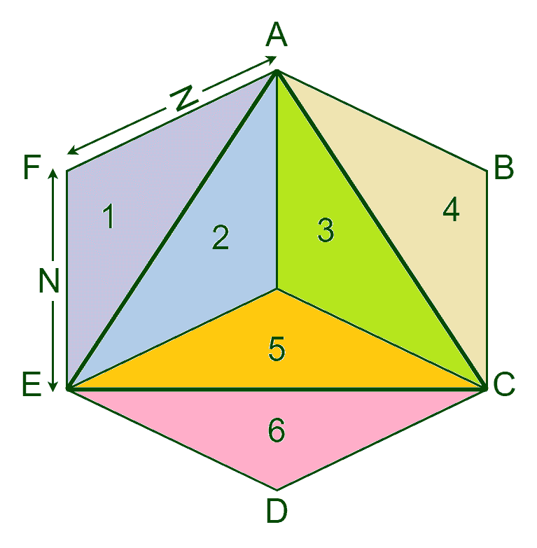

# 求 N 边正多边形内接三角形面积的程序

> 原文:[https://www . geesforgeks . org/program-to-find-三角形面积-n 边内切圆-正多边形/](https://www.geeksforgeeks.org/program-to-find-area-of-triangle-inscribed-in-n-sided-regular-polygon/)

给定内接在具有给定边长的 N 边正多边形中的三角形，使用多边形的任意 3 个顶点形成，任务是找到这个三角形的面积。
**例:**

```
Input: N = 6, side = 10
Output: 129.904

Input: N = 8, side = 5
Output: 45.2665
```

**方法:**考虑第一个例子:

*   给定的是一个 6 边正多边形 ABCDEF，其中内接一个三角形 AEC。

*   可以看出，三角形将给定的多边形分成 6 个相等的三角形区域，其中三角形 AEC 的交点就是三角形的质心。



*   求正多边形的面积。[正多边形](https://www.geeksforgeeks.org/area-of-a-n-sided-regular-polygon-with-given-side-length/)的面积可以借助公式 **(A*P)/2** 来计算，其中 P 是该多边形的周长， [A 是该多边形的周长](https://www.geeksforgeeks.org/apothem-of-a-n-sided-regular-polygon/)。

*   根据对称定律，每个三角化部分的面积将是(三角化面积= N 边正多边形的面积/ N)。

*   因为三角形的面积是 6 分之 3，所以三角形的面积是(3 *三角形面积)

*   所以一般来说，如果有一个面积为 A 的 N 边正多边形，内接于其中的一个三角形的面积将为 **(A/N)*3** 。

以下是上述方法的实现:

## C++

```
// C++ Program to find the area of a triangle
// inscribed in N-sided regular polygon

#include <bits/stdc++.h>
#include <cmath>
using namespace std;

// Function to find the area of the polygon
double area_of_regular_polygon(double n, double len)
{

    // area of a regular polygon with N sides
    // and side length len
    double P = (len * n);
    double A
        = len
          / (2 * tan((180 / n)
                     * 3.14159 / 180));
    double area = (P * A) / 2;

    return area;
}

// Function to find the area of a triangle
double area_of_triangle_inscribed(double n, double len)
{

    double area = area_of_regular_polygon(n, len);

    // area of one triangle
    // in an N-sided regular polygon
    double triangle = area / n;

    // area of inscribed triangle
    double ins_tri = (triangle * 3);

    return ins_tri;
}

// Driver code
int main()
{
    double n = 6, len = 10;

    cout << area_of_triangle_inscribed(n, len)
         << endl;

    return 0;
}
```

## Java 语言(一种计算机语言，尤用于创建网站)

```
// Java Program to find the area of a triangle
// inscribed in N-sided regular polygon
import java.util.*;

class GFG
{

// Function to find the area of the polygon
static double area_of_regular_polygon(double n,
                                      double len)
{

    // area of a regular polygon with N sides
    // and side length len
    double P = (len * n);
    double A = len / (2 * Math.tan((180 / n) *
                             3.14159 / 180));
    double area = (P * A) / 2;

    return area;
}

// Function to find the area of a triangle
static double area_of_triangle_inscribed(double n,
                                         double len)
{
    double area = area_of_regular_polygon(n, len);

    // area of one triangle
    // in an N-sided regular polygon
    double triangle = area / n;

    // area of inscribed triangle
    double ins_tri = (triangle * 3);

    return ins_tri;
}

// Driver code
static public void main(String[] arg)
{
    double n = 6, len = 10;

    System.out.printf("%.3f",
           area_of_triangle_inscribed(n, len));
}
}

// This code is contributed by PrinciRaj1992
```

## 蟒蛇 3

```
# Python3 Program to find the area
# of a triangle inscribed in
# N-sided regular polygon
import math

# Function to find the area of the polygon
def area_of_regular_polygon(n, len):

    # area of a regular polygon with
    # N sides and side length len
    P = (len * n);
    A = len / (2 * math.tan((180 / n) *
                      3.14159 / 180))
    area = (P * A) / 2

    return area

# Function to find the area of a triangle
def area_of_triangle_inscribed(n, len):

    area = area_of_regular_polygon(n, len)

    # area of one triangle
    # in an N-sided regular polygon
    triangle = area / n

    # area of inscribed triangle
    ins_tri = (triangle * 3);

    return ins_tri

# Driver code
n = 6
len = 10
print(round(area_of_triangle_inscribed(n, len), 3))

# This code is contributed by divyamohan
```

## C#

```
// C# Program to find the area of a triangle
// inscribed in N-sided regular polygon
using System;

class GFG
{

// Function to find the area of the polygon
static double area_of_regular_polygon(double n,
                                      double len)
{

    // area of a regular polygon with N sides
    // and side length len
    double P = (len * n);
    double A = len / (2 * Math.Tan((180 / n) *
                             3.14159 / 180));
    double area = (P * A) / 2;

    return area;
}

// Function to find the area of a triangle
static double area_of_triangle_inscribed(double n,
                                         double len)
{
    double area = area_of_regular_polygon(n, len);

    // area of one triangle
    // in an N-sided regular polygon
    double triangle = area / n;

    // area of inscribed triangle
    double ins_tri = (triangle * 3);

    return ins_tri;
}

// Driver code
static public void Main(String[] arg)
{
    double n = 6, len = 10;

    Console.Write("{0:F3}",
            area_of_triangle_inscribed(n, len));
}
}

// This code is contributed by PrinciRaj1992
```

## java 描述语言

```
<script>

// javascript Program to find the area of a triangle
// inscribed in N-sided regular polygon

// Function to find the area of the polygon
function area_of_regular_polygon(n, len)
{

    // area of a regular polygon with N sides
    // and side length len
    let P = (len * n);
    let A
        = len
          / (2 * Math.tan((180 / n)
                     * 3.14159 / 180));
    let area = (P * A) / 2;

    return area;
}

// Function to find the area of a triangle
function area_of_triangle_inscribed( n,  len)
{

    let area = area_of_regular_polygon(n, len);

    // area of one triangle
    // in an N-sided regular polygon
    let triangle = area / n;

    // area of inscribed triangle
    let ins_tri = (triangle * 3);

    return ins_tri;
}

// Driver code
let  n = 6, len = 10;

  document.write( area_of_triangle_inscribed(n, len).toFixed(3));

// This code is contributed by todaysgaurav

</script>
```

**Output:** 

```
129.904
```