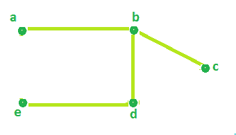

# 求无向图电路秩的程序

> 原文:[https://www . geesforgeks . org/program-to-find-circuit-rank-of-an-directed-graph/](https://www.geeksforgeeks.org/program-to-find-circuit-rank-of-an-undirected-graph/)

给定无向图的顶点数和边数。任务是确定赛道等级。
**回路秩:**无向图的回路秩定义为必须从图中移除的最小边数，以打破其所有循环，将其转换为树或林。
T4【示例】T5:

```
Input : Edges = 7 , Vertices = 5
Output : Circuit rank = 3

Input : Edges = 7 , Vertices = 6
Output : Circuit rank = 2
```

**配方**:T2

```
Circuit rank = Edges - (Vertices - 1)
```

看下面的示例图，


边总数= 7，顶点总数= 5。
根据上述公式，

```
Circuit Rank =  Edges - (Vertices - 1)
             =  7 - (5 - 1)
             = 3
```

因此，上图的电路秩= 3。
从下图可以看出，从上图中去掉 3 条边(a-d，a-e，c-d)，可以去掉所有的 It 循环。



以下是上述方法的实现:

## C++

```
// C++ Program to find Circuit Rank of an Undirected Graph
#include <bits/stdc++.h>
using namespace std;

// Function that calculates the
// Circuit rank of the Graph.
int Rank(int Edges, int Vertices)
{
    int result = 0;

    // calculates Circuit Rank
    result = Edges - Vertices + 1;

    return result;
}

// Driver Code
int main()
{
    int Edges = 7, Vertices = 5;

    cout << "Circuit Rank = " << Rank(Edges, Vertices);

    return 0;
}
```

## Java 语言(一种计算机语言，尤用于创建网站)

```
//Java Program to find Circuit Rank of an Undirected Graph

public class GFG {

    //Function that calculates the
    //Circuit rank of the Graph.
    static int Rank(int Edges, int Vertices)
    {
     int result = 0;

     // calculates Circuit Rank
     result = Edges - Vertices + 1;

     return result;
    }

    //Driver Code
    public static void main(String[] args) {

         int Edges = 7, Vertices = 5;

         System.out.println("Circuit Rank = " + Rank(Edges, Vertices));
    }
}
```

## 蟒蛇 3

```
# Python 3 program to find Circuit Rank of
# an Undirected Graph

# Function that calculates the
# Circuit rank of the Graph.
def Rank(Edges, Vertices) :

    # calculates Circuit Rank
    result = Edges - Vertices + 1

    return result

# Driver code    
if __name__ == "__main__" :

    Edges, Vertices = 7, 5

    print("Circuit Rank =",Rank(Edges, Vertices))

# This code is contributed by ANKITRAI1
```

## C#

```
// C# Program to find Circuit
// Rank of an Undirected Graph
using System;

class GFG
{

// Function that calculates the
// Circuit rank of the Graph.
static int Rank(int Edges,
                int Vertices)
{
    int result = 0;

    // calculates Circuit Rank
    result = Edges - Vertices + 1;

    return result;
}

// Driver Code
public static void Main()
{
    int Edges = 7, Vertices = 5;

    Console.WriteLine("Circuit Rank = " +
                       Rank(Edges, Vertices));
}
}

// This code is contributed
// by inder_verma
```

## 服务器端编程语言（Professional Hypertext Preprocessor 的缩写）

```
<?php
// PHP Program to find Circuit Rank of an Undirected Graph

// Function that calculates the
// Circuit rank of the Graph.
function Rank($Edges, $Vertices)
{
    $result = 0;

    // calculates Circuit Rank
    $result = $Edges - $Vertices + 1;

    return $result;
}

// Driver Code
$Edges = 7;
$Vertices = 5;

echo ("Circuit Rank = ");
echo (Rank($Edges, $Vertices));

// This code is contributed
// by Shivi_Aggarwal
?>
```

## java 描述语言

```
<script>

// Javascript Program to find Circuit
// Rank of an Undirected Graph

// Function that calculates the
// Circuit rank of the Graph.
function Rank(Edges, Vertices)
{
    var result = 0;

    // calculates Circuit Rank
    result = Edges - Vertices + 1;

    return result;
}

// Driver Code
var Edges = 7, Vertices = 5;
document.write( "Circuit Rank = " + Rank(Edges, Vertices));

</script>
```

**Output:** 

```
Circuit Rank = 3
```