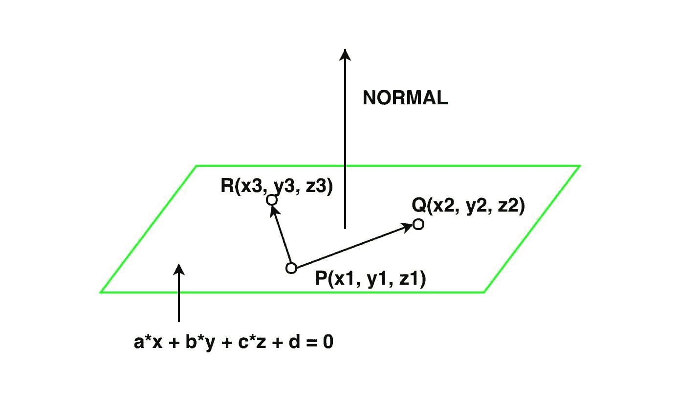

# 求平面通过 3 点方程的程序

> 原文:[https://www . geesforgeks . org/program-to-find-平面方程-通过 3 点/](https://www.geeksforgeeks.org/program-to-find-equation-of-a-plane-passing-through-3-points/)

给定三个点(x1，y1，z1)，(x2，y2，z2)，(x3，y3，z3)。任务是找到平面通过这三点的方程。



**例:**

> **输入:**x1 =-1 y1 = w Z1 = 1
> x2 = 0 y2 =-3 z2 = 2
> x3 = 1 y3 = 1 z3 =-4
> **输出:**平面的方程为 26 x + 7 y + 9 z + 3 = 0。
> **输入:** x1 = 2，y1 = 1，z1 = -1，1
> x2 = 0，y2 = -2，z2 = 0
> x3 = 1，y3 = -1，z3 = 2
> **输出:**平面的方程为-7 x + 5 y + 1 z + 10 = 0。

**逼近:**设 P、Q、R 分别为坐标为(x1、y1、z1)、(x2、y2、z2)、(x3、y3、z3)的三点。那么平面的方程就是*a *(x–x0)+b *(y–y0)+c *(z–z0)= 0*，其中 a、b、c 是垂直于平面的方向比，(x0、y0、z0)是通过平面的任意点(即 P、Q 或 R)的坐标。求平面法线的方向比，取平面内任意两个向量，设其为向量 PQ，向量 PR。

```
=> Vector PQ = (x2 - x1, y2 - y1, z2 - z1) = (a1, b1, c1).
=> Vector PR = (x3 - x1, y3 - y1, z3 - z1) = (a2, b2, c2).
```

这个平面的法向量将是向量 PQ×向量 PR。

```
=> PQ X PR = (b1 * c2 - b2 * c1) i 
              + (a2 * c1 - a1 * c2) j 
              + (a1 * b2 - b1 *a2) k = ai + bj + ck.
```

法向量的方向比是 a，b，c，从 P，Q，或 R 取任意一点，让它的坐标是(x0，y0，z0)。那么通过一个点(x0，y0，z0)并具有方向比 a，b，c 的平面方程将是

```
=> a * (x - x0) + b * (y - y0) + c * (z - z0) = 0.
=> a * x - a * x0 + b * y - b * y0 + c * z - c * z0 = 0.
=> a * x + b * y + c * z + (- a * x0 - b * y0 - c * z0) = 0.
```

以下是上述方法的实现:

## C++

```
// C++ program to find equation of a plane
// passing through given 3 points.
#include <bits/stdc++.h>
#include<math.h>
#include <iostream>
#include <iomanip>

using namespace std;

// Function to find equation of plane.
void equation_plane(float x1, float y1,
                    float z1, float x2,
                    float y2, float z2,
                    float x3, float y3, float z3)
{
    float a1 = x2 - x1;
    float b1 = y2 - y1;
    float c1 = z2 - z1;
    float a2 = x3 - x1;
    float b2 = y3 - y1;
    float c2 = z3 - z1;
    float a = b1 * c2 - b2 * c1;
    float b = a2 * c1 - a1 * c2;
    float c = a1 * b2 - b1 * a2;
    float d = (- a * x1 - b * y1 - c * z1);
    std::cout << std::fixed;
    std::cout << std::setprecision(2);
    cout << "equation of plane is " << a << " x + " << b
        << " y + " << c << " z + " << d << " = 0.";
}

// Driver Code
int main()
{

    float x1 =-1;
    float y1 = 2;
    float z1 = 1;
    float x2 = 0;
    float y2 =-3;
    float z2 = 2;
    float x3 = 1;
    float y3 = 1;
    float z3 =-4;
    equation_plane(x1, y1, z1, x2, y2, z2, x3, y3, z3);
    return 0;
}
// This code is contributed
// by Amber_Saxena.
```

## C

```
// C program to find equation of a plane
// passing through given 3 points.

#include<stdio.h>

// Function to find equation of plane.
void equation_plane(float x1, float y1,
                    float z1, float x2,
                    float y2, float z2,
                    float x3, float y3, float z3)
{
    float a1 = x2 - x1;
    float b1 = y2 - y1;
    float c1 = z2 - z1;
    float a2 = x3 - x1;
    float b2 = y3 - y1;
    float c2 = z3 - z1;
    float a = b1 * c2 - b2 * c1;
    float b = a2 * c1 - a1 * c2;
    float c = a1 * b2 - b1 * a2;
    float d = (- a * x1 - b * y1 - c * z1);
    printf("equation of plane is %.2f x + %.2f"
        " y + %.2f z + %.2f = 0.",a,b,c,d);
    return;
}

// Driver Code
int main()
{
    float x1 =-1;
    float y1 = 2;
    float z1 = 1;
    float x2 = 0;
    float y2 =-3;
    float z2 = 2;
    float x3 = 1;
    float y3 = 1;
    float z3 =-4;
    equation_plane(x1, y1, z1, x2, y2, z2, x3, y3, z3);
    return 0;
}
// This code is contributed
// by Amber_Saxena.
```

## Java 语言(一种计算机语言，尤用于创建网站)

```
// Java program to find equation
// of a plane passing through
// given 3 points.
import java .io.*;

class GFG
{

// Function to find equation of plane.
static void equation_plane(float x1, float y1,
                           float z1, float x2,
                           float y2, float z2,
                           float x3, float y3,
                           float z3)
{
    float a1 = x2 - x1;
    float b1 = y2 - y1;
    float c1 = z2 - z1;
    float a2 = x3 - x1;
    float b2 = y3 - y1;
    float c2 = z3 - z1;
    float a = b1 * c2 - b2 * c1;
    float b = a2 * c1 - a1 * c2;
    float c = a1 * b2 - b1 * a2;
    float d = (- a * x1 - b * y1 - c * z1);
    System.out.println("equation of plane is " + a +
                       " x + " + b + " y + " + c +
                       " z + " + d + " = 0.");
}

// Driver code
public static void main(String[] args)
{
    float x1 =-1;
    float y1 = 2;
    float z1 = 1;
    float x2 = 0;
    float y2 =-3;
    float z2 = 2;
    float x3 = 1;
    float y3 = 1;
    float z3 =-4;
    equation_plane(x1, y1, z1, x2,
                   y2, z2, x3, y3, z3);
}
}

// This code is contributed
// by Amber_Saxena.
```

## 计算机编程语言

```
# Python program to find equation of a plane
# passing through given 3 points.

# Function to find equation of plane.
def equation_plane(x1, y1, z1, x2, y2, z2, x3, y3, z3):

    a1 = x2 - x1
    b1 = y2 - y1
    c1 = z2 - z1
    a2 = x3 - x1
    b2 = y3 - y1
    c2 = z3 - z1
    a = b1 * c2 - b2 * c1
    b = a2 * c1 - a1 * c2
    c = a1 * b2 - b1 * a2
    d = (- a * x1 - b * y1 - c * z1)
    print "equation of plane is ",
    print a, "x +",
    print b, "y +",
    print c, "z +",
    print d, "= 0."

# Driver Code
x1 =-1
y1 = 2
z1 = 1
x2 = 0
y2 =-3
z2 = 2
x3 = 1
y3 = 1
z3 =-4
equation_plane(x1, y1, z1, x2, y2, z2, x3, y3, z3)
```

## C#

```
// C# program to find equation
// of a plane passing through
// given 3 points.
using System;

class GFG
{

// Function to find equation of plane.
static void equation_plane(float x1, float y1,
                           float z1, float x2,
                           float y2, float z2,
                           float x3, float y3,
                           float z3)
{
    float a1 = x2 - x1;
    float b1 = y2 - y1;
    float c1 = z2 - z1;
    float a2 = x3 - x1;
    float b2 = y3 - y1;
    float c2 = z3 - z1;
    float a = b1 * c2 - b2 * c1;
    float b = a2 * c1 - a1 * c2;
    float c = a1 * b2 - b1 * a2;
    float d = (- a * x1 - b * y1 - c * z1);
    Console.Write("equation of plane is " + a +
                      "x + " + b + "y + " + c +
                          "z + " + d + " = 0");
}

// Driver code
public static void Main()
{
    float x1 =-1;
    float y1 = 2;
    float z1 = 1;
    float x2 = 0;
    float y2 =-3;
    float z2 = 2;
    float x3 = 1;
    float y3 = 1;
    float z3 =-4;
    equation_plane(x1, y1, z1,
                   x2, y2, z2,
                   x3, y3, z3);
}
}

// This code is contributed
// by ChitraNayal
```

## 服务器端编程语言（Professional Hypertext Preprocessor 的缩写）

```
<?php
// PHP program to find equation
// of a plane passing through
// given 3 points.

// Function to find equation of plane.
function equation_plane($x1, $y1, $z1,
                        $x2, $y2, $z2,
                        $x3, $y3, $z3)
{
    $a1 = $x2 - $x1;
    $b1 = $y2 - $y1;
    $c1 = $z2 - $z1;
    $a2 = $x3 - $x1;
    $b2 = $y3 - $y1;
    $c2 = $z3 - $z1;
    $a = $b1 * $c2 - $b2 * $c1;
    $b = $a2 * $c1 - $a1 * $c2;
    $c = $a1 * $b2 - $b1 * $a2;
    $d = (- $a * $x1 - $b * $y1 - $c * $z1);
    echo sprintf("equation of the plane is %.2fx" .
                     " + %.2fy + %.2fz + %.2f = 0",
                                   $a, $b, $c, $d);
}

// Driver Code
$x1 =-1;
$y1 = 2;
$z1 = 1;
$x2 = 0;
$y2 =-3;
$z2 = 2;
$x3 = 1;
$y3 = 1;
$z3 =-4;
equation_plane($x1, $y1, $z1, $x2,
               $y2, $z2, $x3, $y3, $z3);

// This code is contributed
// by Amber_Saxena.
?>
```

## java 描述语言

```
<script>
// javascript program to find equation
// of a plane passing through
// given 3 points.

    // Function to find equation of plane.
    function equation_plane(x1 , y1 , z1 , x2 ,
    y2 , z2 , x3 , y3, z3) {
        var a1 = x2 - x1;
        var b1 = y2 - y1;
        var c1 = z2 - z1;
        var a2 = x3 - x1;
        var b2 = y3 - y1;
        var c2 = z3 - z1;
        var a = b1 * c2 - b2 * c1;
        var b = a2 * c1 - a1 * c2;
        var c = a1 * b2 - b1 * a2;
        var d = (-a * x1 - b * y1 - c * z1);
        document.write("equation of plane is " + a + " x + "
        + b + " y + " + c + " z + " + d + " = 0.");
    }

    // Driver code

        var x1 = -1;
        var y1 = 2;
        var z1 = 1;
        var x2 = 0;
        var y2 = -3;
        var z2 = 2;
        var x3 = 1;
        var y3 = 1;
        var z3 = -4;
        equation_plane(x1, y1, z1, x2, y2, z2, x3, y3, z3);

// This code is contributed by Rajput-Ji
</script>
```

**Output:** 

```
equation of plane is  26 x + 7 y + 9 z + 3 = 0.
```