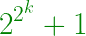

# 寻找前 N 个费马数字的程序

> 原文:[https://www . geesforgeks . org/program-to-find-first-n-Fermat-numbers/](https://www.geeksforgeeks.org/program-to-find-first-n-fermat-numbers/)

费马数是对 k>=0 的所有值都有效的非负奇数。到目前为止，只知道这个序列的前七个术语。首先，这个系列的五个术语是质数，但其余的不是。费马数的第 **kth** 项表示为



**序列:**

> 3、5、17、257、65537、4294967297、18446744073709551617

对于给定的 **N** ，任务是找到第一个 **N** 费马数。
**例:**

> **输入:** N = 4
> **输出:** 3、5、17、257
> **输入:** N = 7
> **输出:** 3、5、17、257、65537、4294967297、1844674073709551617

**方法:**
使用上述公式，我们将找到该系列的**第 n 个**项。
以下是上述方法的实施:

## C++

```
// CPP program to print fermat numbers
#include <bits/stdc++.h>
#include <boost/multiprecision/cpp_int.hpp>
using namespace boost::multiprecision;
#define llu int128_t
using namespace std;

/* Iterative Function to calculate (x^y) in O(log y) */
llu power(llu x, llu y)
{
    llu res = 1; // Initialize result

    while (y > 0) {
        // If y is odd, multiply x with the result
        if (y & 1)
            res = res * x;

        // n must be even now
        y = y >> 1; // y = y/2
        x = x * x; // Change x to x^2
    }
    return res;
}

// Function to find nth fermat number
llu Fermat(llu i)
{
    // 2 to the power i
    llu power2_i = power(2, i);

    // 2 to the power 2^i
    llu power2_2_i = power(2, power2_i);

    return power2_2_i + 1;
}

// Function to find first n Fermat numbers
void Fermat_Number(llu n)
{

    for (llu i = 0; i < n; i++) {

        // Calculate 2^2^i
        cout << Fermat(i);

        if(i!=n-1)
            cout << ", ";
    }
}

// Driver code
int main()
{
    llu n = 7;

    // Function call
    Fermat_Number(n);

    return 0;
}
```

## 蟒蛇 3

```
# Python3 program to print fermat numbers

# Iterative Function to calculate (x^y) in O(log y)
def power(x, y):

    res = 1 # Initialize result

    while (y > 0):

        # If y is odd,
        # multiply x with the result
        if (y & 1):
            res = res * x

        # n must be even now
        y = y >> 1 # y = y/2
        x = x * x # Change x to x^2
    return res

# Function to find nth fermat number
def Fermat(i):

    # 2 to the power i
    power2_i = power(2, i)

    # 2 to the power 2^i
    power2_2_i = power(2, power2_i)

    return power2_2_i + 1

# Function to find first n Fermat numbers
def Fermat_Number(n):

    for i in range(n):

        # Calculate 2^2^i
        print(Fermat(i), end = "")

        if(i != n - 1):
            print(end = ", ")

# Driver code
n = 7

# Function call
Fermat_Number(n)

# This code is contributed by Mohit Kumar
```

## java 描述语言

```
<script>

// Javascript program to print fermat numbers

/* Iterative Function to calculate (x^y) in O(log y) */
function power(x, y)
{
    let res = 1; // Initialize result

    while (y > 0) {
        // If y is odd, multiply x with the result
        if (y & 1)
            res = res * x;

        // n must be even now
        y = y >> 1; // y = y/2
        x = x * x; // Change x to x^2
    }
    return res;
}

// Function to find nth fermat number
function Fermat(i)
{
    // 2 to the power i
    let power2_i = power(2, i);

    // 2 to the power 2^i
    let power2_2_i = power(2, power2_i);

    return power2_2_i + 1;
}

// Function to find first n Fermat numbers
function Fermat_Number(n)
{

    for (let i = 0; i < n; i++) {

        // Calculate 2^2^i
        document.write(Fermat(i));

        if(i!=n-1)
            document.write(", ");
    }
}

// Driver code
    let n = 7;

    // Function call
    Fermat_Number(n);

</script>
```

**输出:**

```
3, 5, 17, 257, 65537, 4294967297, 18446744073709551617
```

**参考资料:**[https://en . Wikipedia . org/wiki/Fermat _ number](https://en.wikipedia.org/wiki/Fermat_number)