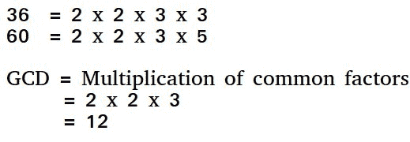

# 程序寻找 2 个数字的 HCF(最高公因数)

> 原文:[https://www . geesforgeks . org/program-to-find-hcf-最高公因数 2-numbers/](https://www.geeksforgeeks.org/program-to-find-hcf-highest-common-factor-of-2-numbers/)

两个数的 HCF(最高公因数)或 GCD(最大公约数)是两个数相除的最大数。



例如，20 和 28 的 GCD 是 4，98 和 56 的 GCD 是 14。

一个**简单的解决方案**是[找到两个数的所有素因子](https://www.geeksforgeeks.org/print-all-prime-factors-of-a-given-number/)，然后找到两个数中所有因子的交集。最后返回交集中元素的乘积。

一个**有效的解决方案**是使用[欧几里德算法](https://www.geeksforgeeks.org/euclidean-algorithms-basic-and-extended/)，这是用于此目的的主要算法。这个想法是，如果从一个较大的数字中减去一个较小的数字，两个数字的 GCD 不会改变。

## C++

```
// C++ program to find GCD of two numbers
#include <iostream>
using namespace std;

// Recursive function to return gcd of a and b
int gcd(int a, int b)
{

    // Everything divides 0
    if (a == 0 && b == 0)
        return 0;
    if (a == 0)
        return b;
    if (b == 0)
        return a;

    // base case
    if (a == b)
        return a;

    // a is greater
    if (a > b)
        return gcd(a - b, b);
    return gcd(a, b - a);
}

// Driver program to test above function
int main()
{
    int a = 0, b = 56;
    cout << "GCD of " << a << " and " << b <<  " is " << gcd(a, b);
    return 0;
}

// This code is contributed by shivanisinghss2110
```

## C

```
// C program to find GCD of two numbers
#include <stdio.h>

// Recursive function to return gcd of a and b
int gcd(int a, int b)
{
    // Everything divides 0
    if (a == 0 && b == 0)
        return 0;
    if (a == 0)
        return b;
    if (b == 0)
        return a;

    // base case
    if (a == b)
        return a;

    // a is greater
    if (a > b)
        return gcd(a - b, b);
    return gcd(a, b - a);
}

// Driver program to test above function
int main()
{
    int a = 0, b = 56;
    printf("GCD of %d and %d is %d ", a, b, gcd(a, b));
    return 0;
}
```

## Java 语言(一种计算机语言，尤用于创建网站)

```
// Java program to find GCD of two numbers
class Test {
    // Recursive function to return gcd of a and b
    static int gcd(int a, int b)
    {
        // Everything divides 0
        if (a == 0 && b == 0)
            return 0;
        if (a == 0)
            return b;
        if (b == 0)
            return a;

        // base case
        if (a == b)
            return a;

        // a is greater
        if (a > b)
            return gcd(a - b, b);
        return gcd(a, b - a);
    }

    // Driver method
    public static void main(String[] args)
    {
        int a = 98, b = 56;
        System.out.println("GCD of " + a + " and " + b
                           + " is " + gcd(a, b));
    }
}
```

## 蟒蛇 3

```
# Recursive function to return gcd of a and b
def gcd(a, b):

    # Everything divides 0
    if(a == 0 and b == 0):
        return 0

    if(a == 0):
        return b

    if(b == 0):
        return a

    # base case
    if(a == b):
        return a

    # a is greater
    if (a > b):
        return gcd(a-b, b)
    return gcd(a, b-a)

# Driver program to test above function
a = 98
b = 56
if(gcd(a, b)):
    print('GCD of', a, 'and', b, 'is', gcd(a, b))
else:
    print('not found')

# This code is contributed by Danish Raza
```

## C#

```
// C# program to find GCD of two
// numbers
using System;

class GFG {

    // Recursive function to return
    // gcd of a and b
    static int gcd(int a, int b)
    {

        // Everything divides 0
        if (a == 0 && b == 0)
            return 0;
        if (a == 0)
            return b;
        if (b == 0)
            return a;

        // base case
        if (a == b)
            return a;

        // a is greater
        if (a > b)
            return gcd(a - b, b);

        return gcd(a, b - a);
    }

    // Driver method
    public static void Main()
    {
        int a = 98, b = 56;
        Console.WriteLine("GCD of " + a + " and " + b
                          + " is " + gcd(a, b));
    }
}

// This code is contributed by anuj_67.
```

## 服务器端编程语言（Professional Hypertext Preprocessor 的缩写）

```
<?php
// PHP program to find GCD
// of two numbers

// Recursive function to
// return gcd of a and b
function gcd($a, $b)
{
    // Everything divides 0
    if($a==0 && $b==0)
        return 0 ;

    if($a == 0)
      return $b;

    if($b == 0)
      return $a;

    // base case
    if($a == $b)
        return $a ;

    // a is greater
    if($a > $b)
        return gcd( $a-$b , $b ) ;

    return gcd( $a , $b-$a ) ;
}

// Driver code
$a = 98 ;
$b = 56 ;

echo "GCD of $a and $b is ", gcd($a , $b) ;

// This code is contributed by Anivesh Tiwari
?>
```

## java 描述语言

```
<script>

// Javascript program to find GCD of two numbers

// Recursive function to return gcd of a and b
function gcd(a, b)
{

    // Everything divides 0
    if (a == 0 && b == 0)
        return 0;
    if (a == 0)
        return b;
    if (b == 0)
        return a;

    // Base case
    if (a == b)
        return a;

    // a is greater
    if (a > b)
        return gcd(a - b, b);

    return gcd(a, b - a);
}

// Driver code
var a = 98, b = 56;

document.write("GCD of " + a + " and " +
                  b + " is " +  gcd(a, b));

// This code is contributed by noob2000

</script>
```

**输出:**

```
GCD of 98 and 56 is 14
```

一个**更有效的解决方案**是在[欧几里德算法](https://www.geeksforgeeks.org/euclidean-algorithms-basic-and-extended/)中使用模算子。

## C++

```
// C++ program to find GCD of two numbers
#include <iostream>
using namespace std;

// Recursive function to return gcd of a and b
int gcd(int a, int b)
{
    if (b == 0)
        return a;
    return gcd(b, a % b);
}

// Driver program to test above function
int main()
{
    int a = 98, b = 56;
    cout<<"GCD of " <<a << " and "<< b << " is " << gcd(a, b);
    return 0;
}

// This code is contributed by shivanisinghss2110
```

## C

```
// C program to find GCD of two numbers
#include <stdio.h>

// Recursive function to return gcd of a and b
int gcd(int a, int b)
{
    if (b == 0)
        return a;
    return gcd(b, a % b);
}

// Driver program to test above function
int main()
{
    int a = 98, b = 56;
    printf("GCD of %d and %d is %d ", a, b, gcd(a, b));
    return 0;
}
```

## Java 语言(一种计算机语言，尤用于创建网站)

```
// Java program to find GCD of two numbers
class Test
{
    // Recursive function to return gcd of a and b
    static int gcd(int a, int b)
    {
      if (b == 0)
        return a;
      return gcd(b, a % b);
    }

    // Driver method
    public static void main(String[] args)
    {
        int a = 98, b = 56;
        System.out.println("GCD of " + a +" and " + b +
                                   " is " + gcd(a, b));
    }
}
```

## 蟒蛇 3

```
# Recursive function to return gcd of a and b
def gcd(a,b):

    # Everything divides 0
    if (b == 0):
         return a
    return gcd(b, a%b)

# Driver program to test above function
a = 98
b = 56
if(gcd(a, b)):
    print('GCD of', a, 'and', b, 'is', gcd(a, b))
else:
    print('not found')

# This code is contributed by Danish Raza
```

## C#

```
// C# program to find GCD of two
// numbers
using System;

class GFG {

    // Recursive function to return
    // gcd of a and b
    static int gcd(int a, int b)
    {     
       if (b == 0)
          return a;
       return gcd(b, a % b);
    }

    // Driver method
    public static void Main()
    {
        int a = 98, b = 56;
        Console.WriteLine("GCD of "
          + a +" and " + b + " is "
                      + gcd(a, b));
    }
}

// This code is contributed by anuj_67.
```

## 服务器端编程语言（Professional Hypertext Preprocessor 的缩写）

```
<?php
// PHP program to find GCD
// of two numbers

// Recursive function to
// return gcd of a and b
function gcd($a, $b)
{
    // Everything divides 0
    if($b==0)
        return $a ;

    return gcd( $b , $a % $b ) ;
}

// Driver code
$a = 98 ;
$b = 56 ;

echo "GCD of $a and $b is ", gcd($a , $b) ;

// This code is contributed by Anivesh Tiwari
?>
```

## java 描述语言

```
<script>

// Javascript program to find GCD of two numbers

// Recursive function to return gcd of a and b
function gcd(a, b)
{
    if (b == 0)
        return a;

    return gcd(b, a % b);
}

// Driver code
var a = 98, b = 56;

document.write("GCD of " + a +" and " + b +
                  " is " + gcd(a, b));

// This code is contributed by Ankita saini

</script>
```

**输出:**

```
GCD of 98 and 56 is 14
```

请参考两个以上(或数组)数字的[GCD](https://www.geeksforgeeks.org/gcd-two-array-numbers/)找到两个以上数字的 HCF。
如果你发现任何不正确的地方，或者你想分享更多关于上述话题的信息，请写评论