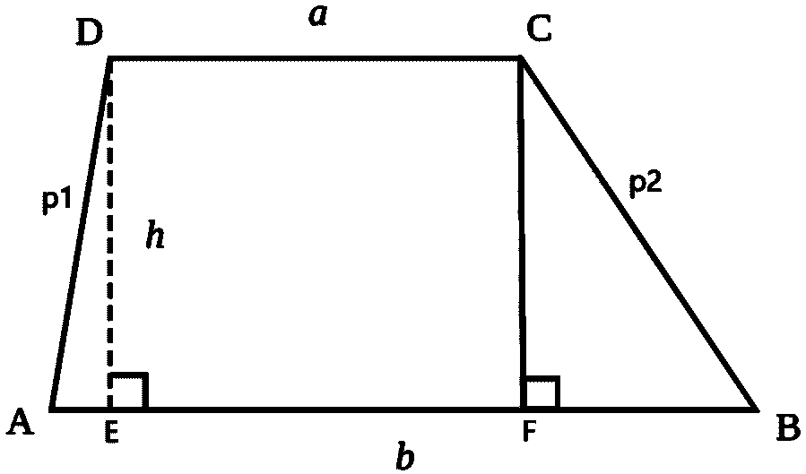

# 计算梯形高度的程序

> 原文:[https://www . geesforgeks . org/program-to-find-高度为梯形/](https://www.geeksforgeeks.org/program-to-find-height-of-a-trapezoid/)

给定两个整数 **a** 和 **b** 代表两个基的长度，两个整数 **p1** 和 **p2** 代表梯形的非平行边，任务就是求梯形的高度。

> [](https://media.geeksforgeeks.org/wp-content/uploads/20210129155117/Trapezoidsvg1.png)
> 
> A **梯形**是至少有一对平行边的凸四边形。平行的边称为梯形的底边，其他不平行的边称为边。也可以有一对底座。
> 图中，CD || AB。因此，它们形成了底座，而另外两侧即**公元**和**公元前**形成了腿。

**示例:**

> **输入:** a = 14，b = 13，p1 = 25，p2 = 10
> T3】输出: 11.2
> 
> **输入:** a = 8，b = 16，p1 = 25，p2 = 10
> T3】输出: 7.92401

**逼近:**求斜方肌的高度，在斜方肌的基底 **AB** 上构建垂线 **DE** 和 **CF** ，如下图所示。

[](https://media.geeksforgeeks.org/wp-content/uploads/20210129155117/Trapezoidsvg1.png)

现在**三角形 AED** 的面积和**三角形 CFB** 的面积可以用[鹭公式](https://www.geeksforgeeks.org/herons-formula/)计算，边为 **p1** 、 **p2** 、**(b–a)**。同样，其面积等于**0.5 *(b–a)* h**。
从这两个方程，计算出 **h** 的值，即梯形的高度。

> **Heron 公式:**考虑边为 **a、b** 和 **c** 的三角形，然后
> 三角形的面积，A =(s(s–A)(s–b)(s–c))<sup>1/2</sup>，其中 s = (a + b + c)/2
> 
> 同样，A = 0.5 *底*高
> 重新排列各项后，梯形的高度= (A * 2) /底

下面是上述方法的实现:

## C++

```
// C++ program for the above approach

#include <bits/stdc++.h>
using namespace std;

// Function to calculate height
// of the trapezoid
void findHeight(float p1, float p2,
                float b, float c)
{
    float a = max(p1, p2) - min(p1, p2);

    // Apply Heron's formula
    float s = (a + b + c) / 2;

    // Calculate the area
    float area = sqrt(s * (s - a)
                      * (s - b) * (s - c));

    // Calculate height of trapezoid
    float height = (area * 2) / a;

    // Print the height
    cout << "Height is: " << height;
}

// Driver Code
int main()
{
    // Given a, b, p1 and p2
    float p1 = 25, p2 = 10;
    float a = 14, b = 13;

    findHeight(p1, p2, a, b);

    return 0;
}
```

## Java 语言(一种计算机语言，尤用于创建网站)

```
// Java program to implement
// the above approach
import java.util.*;

class GFG
{

// Function to calculate height
// of the trapezoid
static void findHeight(float p1, float p2,
                float b, float c)
{
    float a = Math.max(p1, p2) - Math.min(p1, p2);

    // Apply Heron's formula
    float s = (a + b + c) / 2;

    // Calculate the area
    float area = (int)Math.sqrt(s * (s - a)
                      * (s - b) * (s - c));

    // Calculate height of trapezoid
    float height = (area * 2) / a;

    // Print the height
    System.out.print("Height is: " + height);
}

// Driver Code
public static void main(String args[])
{

    // Given a, b, p1 and p2
    float p1 = 25, p2 = 10;
    float a = 14, b = 13;

    findHeight(p1, p2, a, b);
}
}

// This code is contributed by splevel62.
```

## 蟒蛇 3

```
# Python3 program to implement
# the above approach
import math

# Function to calculate height
# of the trapezoid
def findHeight(p1, p2, b, c) :            
    a = max(p1, p2) - min(p1, p2)

    # Apply Heron's formula
    s = (a + b + c) // 2

    # Calculate the area
    area = math.sqrt(s * (s - a)
                      * (s - b) * (s - c))

    # Calculate height of trapezoid
    height = (area * 2) / a

    # Prthe height
    print("Height is: ",  height)

# Driver Code

# Given a, b, p1 and p2
p1 = 25
p2 = 10
a = 14
b = 13

findHeight(p1, p2, a, b)

# this code is contributed by sanjoy_62.
```

## C#

```
// C# program to implement
// the above approach
using System;

public class GFG
{

// Function to calculate height
// of the trapezoid
static void findHeight(float p1, float p2,
                float b, float c)
{
    float a = Math.Max(p1, p2) - Math.Min(p1, p2);

    // Apply Heron's formula
    float s = (a + b + c) / 2;

    // Calculate the area
    float area = (int)Math.Sqrt(s * (s - a)
                      * (s - b) * (s - c));

    // Calculate height of trapezoid
    float height = (area * 2) / a;

    // Print the height
    Console.Write("Height is: " + height);
}

// Driver Code
public static void Main(String []args)
{

    // Given a, b, p1 and p2
    float p1 = 25, p2 = 10;
    float a = 14, b = 13;

    findHeight(p1, p2, a, b);
}
}

// This code is contributed by shikhasingrajput
```

**Output:** 

```
Height is: 11.2
```

***时间复杂度:**O(1)*
T5**辅助空间:** O(1)