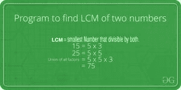

# 程序查找两个数的 LCM

> 原文:[https://www . geesforgeks . org/program-to-find-LCM-of-two-numbers/](https://www.geeksforgeeks.org/program-to-find-lcm-of-two-numbers/)



两个数的最小公倍数是两个数相除的最小数。

比如 15 和 20 的 LCM 是 60，5 和 7 的 LCM 是 35。

一个**简单的解决方案**是[找到两个数的所有素因子](https://www.geeksforgeeks.org/print-all-prime-factors-of-a-given-number/)，然后找到两个数中所有因子的并集。最后，返回联合元素的乘积。

一个**有效的解决方案**是基于两个数字‘a’和‘b’的 LCM 的以下公式。

```
   a x b = LCM(a, b) * GCD (a, b)

   LCM(a, b) = (a x b) / GCD(a, b)
```

我们讨论过[函数求两个数](https://www.geeksforgeeks.org/c-program-find-gcd-hcf-two-numbers/)的 GCD。使用 GCD，我们可以找到 LCM。

下面是上述想法的实现:

## C++

```
// C++ program to find LCM of two numbers
#include <iostream>
using namespace std;

// Recursive function to return gcd of a and b
long long gcd(long long int a, long long int b)
{
  if (b == 0)
    return a;
  return gcd(b, a % b);
}

// Function to return LCM of two numbers
long long lcm(int a, int b)
{
    return (a / gcd(a, b)) * b;
}

// Driver program to test above function
int main()
{
    int a = 15, b = 20;
    cout <<"LCM of " << a << " and "
         << b << " is " << lcm(a, b);
    return 0;
}
```

## C

```
// C program to find LCM of two numbers
#include <stdio.h>

// Recursive function to return gcd of a and b
int gcd(int a, int b)
{
    if (a == 0)
        return b;
    return gcd(b % a, a);
}

// Function to return LCM of two numbers
int lcm(int a, int b)
{
    return (a / gcd(a, b)) * b;
}

// Driver program to test above function
int main()
{
    int a = 15, b = 20;
    printf("LCM of %d and %d is %d ", a, b, lcm(a, b));
    return 0;
}
```

## Java 语言(一种计算机语言，尤用于创建网站)

```
// Java program to find LCM of two numbers.
class Test
{
    // Recursive method to return gcd of a and b
    static int gcd(int a, int b)
    {
        if (a == 0)
            return b;
        return gcd(b % a, a);
    }

    // method to return LCM of two numbers
    static int lcm(int a, int b)
    {
        return (a / gcd(a, b)) * b;
    }

    // Driver method
    public static void main(String[] args)
    {
        int a = 15, b = 20;
        System.out.println("LCM of " + a +
                           " and " + b +
                      " is " + lcm(a, b));
    }
}
```

## 蟒蛇 3

```
# Python program to find LCM of two numbers

# Recursive function to return gcd of a and b
def gcd(a,b):
    if a == 0:
        return b
    return gcd(b % a, a)

# Function to return LCM of two numbers
def lcm(a,b):
    return (a / gcd(a,b))* b

# Driver program to test above function
a = 15
b = 20
print('LCM of', a, 'and', b, 'is', lcm(a, b))

# This code is contributed by Danish Raza
```

## C#

```
// C# program to find LCM
// of two numbers.
using System;
class GFG {

    // Recursive method to
    // return gcd of a and b
    static int gcd(int a, int b)
    {
        if (a == 0)
            return b;
        return gcd(b % a, a);
    }

    // method to return
    // LCM of two numbers
    static int lcm(int a, int b)
    {
        return (a / gcd(a, b)) * b;
    }

    // Driver method
    public static void Main()
    {
        int a = 15, b = 20;
        Console.WriteLine("LCM of " + a +
         " and " + b + " is " + lcm(a, b));
    }
}

// This code is contributed by anuj_67.
```

## 服务器端编程语言（Professional Hypertext Preprocessor 的缩写）

```
<?php
// PHP program to find LCM of two numbers

// Recursive function to
// return gcd of a and b
function gcd( $a, $b)
{
   if ($a == 0)
        return $b;
    return gcd($b % $a, $a);
}

// Function to return LCM
// of two numbers
function lcm( $a, $b)
{
    return ($a / gcd($a, $b)) * $b;
}

    // Driver Code
    $a = 15;
    $b = 20;
    echo "LCM of ",$a, " and "
         ,$b, " is ", lcm($a, $b);

// This code is contributed by anuj_67.
?>
```

## java 描述语言

```
<script>

// Javascript program to find LCM of two numbers

// Recursive function to return gcd of a and b
function gcd(a, b)
{
if (b == 0)
    return a;
return gcd(b, a % b);
}

// Function to return LCM of two numbers
function lcm(a, b)
{
    return (a / gcd(a, b)) * b;
}

// Driver program to test above function

    let a = 15, b = 20;
    document.write("LCM of " + a + " and "
    + b + " is " + lcm(a, b));

// This code is contributed by Mayank Tyagi

</script>
```

**Output**

```
LCM of 15 and 20 is 60
```

***时间复杂度:** O(log(max(a，b))*

***辅助空间:** O(log(max(a，b))*

https://youtu.be/anSfYgbo694

如果您发现任何不正确的地方，或者您想分享更多关于上面讨论的主题的信息，请写评论