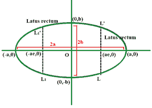
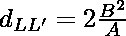

# 求椭圆直肠长度的程序

> 原文:[https://www . geesforgeks . org/program-to-find-latus-长度-椭圆直肠/](https://www.geeksforgeeks.org/program-to-find-length-of-latus-rectum-of-an-ellipse/)

给定两个整数 **A** 和 **B，**用通式**(x<sup>2</sup>/A<sup>2</sup>)+(y<sup>2</sup>/B<sup>2</sup>)= 1**表示一个[椭圆的](https://en.wikipedia.org/wiki/Ellipse)[半长轴和半短轴](https://en.wikipedia.org/wiki/Semi-major_and_semi-minor_axes)的长度，任务是求椭圆的直肠闭锁长度

**示例:**

> **输入:** A = 3，B = 2
> T3】输出: 2.66666
> 
> **输入:** A = 6，B = 3
> T3】输出: 3

**方法:**给定的问题可以基于以下观察来解决:

> *   **The ellipse **rectum** is the focal chord perpendicular to the long axis, and its length is equal to:
>     **
> 
> 
> 
> 椭圆
> 
> *   The length of major axis is **2a.**
> *   The minor axis length is **2b.**
> *   Therefore, the length of levator ani rectum is
>     

按照以下步骤解决给定的问题:

*   初始化两个变量，说**长**和**短，**分别存储**椭圆**的长轴长度(= **2A** )和短轴长度(= **2B** )。
*   计算**小调** 的[平方，与大调相除。将结果存储在双变量中，比如**latus _ 直肠**。](https://www.geeksforgeeks.org/calculate-square-of-a-number-without-using-and-pow/)
*   打印**latus _ 直肠**的值作为最终结果。**T3】**

下面是上述方法的实现:

## C++

```
// C++ program for the above approach
#include <iostream>
using namespace std;

// Function to calculate the length
// of the latus rectum of an ellipse
double lengthOfLatusRectum(double A,
                           double B)
{
    // Length of major axis
    double major = 2.0 * A;

    // Length of minor axis
    double minor = 2.0 * B;

    // Length of the latus rectum
    double latus_rectum = (minor*minor)/major;

    return latus_rectum;
}

// Driver Code
int main()
{
    // Given lengths of semi-major
  // and semi-minor axis
    double A = 3.0, B = 2.0;

    // Function call to calculate length
    // of the latus rectum of a ellipse
    cout << lengthOfLatusRectum(A, B);
    return 0;
}
```

## Java 语言(一种计算机语言，尤用于创建网站)

```
// Java program for the above approach
import java.util.*;

class GFG{

// Function to calculate the length
// of the latus rectum of an ellipse
static double lengthOfLatusRectum(double A,
                                  double B)
{

    // Length of major axis
    double major = 2.0 * A;

    // Length of minor axis
    double minor = 2.0 * B;

    // Length of the latus rectum
    double latus_rectum = (minor * minor) / major;

    return latus_rectum;
}

// Driver code
public static void main(String[] args)
{

    // Given lengths of semi-major
    // and semi-minor axis
    double A = 3.0, B = 2.0;

    // Function call to calculate length
    // of the latus rectum of a ellipse
    System.out.print(lengthOfLatusRectum(A, B));
}
}

// This code is contributed by susmitakundugoaldanga
```

## 蟒蛇 3

```
# Python3 program for the above approach

# Function to calculate the length
# of the latus rectum of an ellipse
def lengthOfLatusRectum(A, B):

    # Length of major axis
    major = 2.0 * A

    # Length of minor axis
    minor = 2.0 * B

    # Length of the latus rectum
    latus_rectum = (minor*minor)/major
    return latus_rectum

# Driver Code
if __name__ == "__main__":

    # Given lengths of semi-major
        # and semi-minor axis
    A = 3.0
    B = 2.0

    # Function call to calculate length
    # of the latus rectum of a ellipse
    print('%.5f' % lengthOfLatusRectum(A, B))

    # This code is contributed by ukasp.
```

## C#

```
// C# program for the above approach
using System;

class GFG
{

  // Function to calculate the length
  // of the latus rectum of an ellipse
  static double lengthOfLatusRectum(double A,
                                    double B)
  {
    // Length of major axis
    double major = 2.0 * A;

    // Length of minor axis
    double minor = 2.0 * B;

    // Length of the latus rectum
    double latus_rectum = (minor*minor)/major;

    return latus_rectum;
  }

  // Driver Code
  public static void Main()
  {

    // Given lengths of semi-major
    // and semi-minor axis
    double A = 3.0, B = 2.0;

    // Function call to calculate length
    // of the latus rectum of a ellipse
    Console.WriteLine(lengthOfLatusRectum(A, B));
  }
}

// This code is contributed by souravghosh0416.
```

## java 描述语言

```
<script>

// Javascript program for the above approach

// Function to calculate the length
// of the latus rectum of an ellipse
function lengthOfLatusRectum(A, B)
{

    // Length of major axis
    var major = 2.0 * A;

    // Length of minor axis
    var minor = 2.0 * B;

    // Length of the latus rectum
    var latus_rectum = (minor * minor) / major;

    return latus_rectum;
}

// Driver code

// Given lengths of semi-major
// and semi-minor axis
var A = 3.0, B = 2.0;

document.write(lengthOfLatusRectum(A, B));

// This code is contributed by Ankita saini

</script>
```

**Output:** 

```
2.66667
```

***时间复杂度:**O(1)*
T5**辅助空间:** O(1)