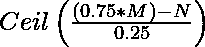

# 计划找到参加讲座的最少次数，以保持 75%

> 原文:[https://www . geesforgeks . org/program-to-find-最少听课次数-出席-维持-75/](https://www.geeksforgeeks.org/program-to-find-minimum-number-of-lectures-to-attend-to-maintain-75/)

考虑到《数据结构》这门学科，到目前为止，该学科开设的课程总数为，一些学生在这些课程中只参加。找到他们必须参加的最少的讲座次数，这样他们的出勤率就能保持下去。

**示例:**

> 输入:M = 7，N = 6
> 输出:0 场听课
> 由于到目前为止已经开了 7 场课，其中已经开了 6 场，大于
> 的 75%，所以不再听课
> 
> 输入:M = 9，N = 1
> 输出:23 节课参加
> 9 节课，只参加了 1 节课。再上 23 节课后，总共上了 1+23 = 24 节课
> ，总课时数= 9+23 = 32 节。所以 24/32 = 75%。因此 23 是
> 的最小值。

**求解:**
使用公式，

应用公式前，首先检查 N 乘 M 是否有 75%。如果没有，则应用公式

## C++

```
// C++ Program to find minimum number of lectures to attend
// to maintain 75% attendance

#include <cmath>
#include <iostream>
using namespace std;

// Function to compute minimum lecture
int minimumLectures(int m, int n)
{
    int ans = 0;

    // Formula to compute
    if (n < (int)ceil(0.75 * m))
        ans = (int)ceil(((0.75 * m) - n) / 0.25);
    else
        ans = 0;

    return ans;
}

// Driver function
int main()
{
    int M = 9, N = 1;
    cout << minimumLectures(M, N);
    return 0;
}
```

## Java 语言(一种计算机语言，尤用于创建网站)

```
// Java Program to find minimum number of lectures to attend
// to maintain 75% attendance

public class GFG {

    // Method to compute minimum lecture
    static int minimumLectures(int m, int n)
    {
        int ans = 0;

        // Formula to compute
        if (n < (int)Math.ceil(0.75 * m))
            ans = (int)Math.ceil(((0.75 * m) - n) / 0.25);
        else
            ans = 0;

        return ans;
    }

    // Driver Code
    public static void main(String[] args)
    {
        int M = 9, N = 1;
        System.out.println(minimumLectures(M, N));
    }
}
```

## 计算机编程语言

```
# Python Program to find minimum number of lectures to attend
# to maintain 75 % attendance

import math

# Function to compute minimum lecture
def minimumLecture(m, n):
    ans = 0

    # Formula to compute
    if(n < math.ceil(0.75 * m)):
        ans = math.ceil(((0.75 * m) - n) / 0.25)
    else:
        ans = 0
    return ans

# Driver Code

M = 9
N = 1

print(minimumLecture(M, N))
```

## C#

```
// C# Program to find minimum
// number of lectures to attend
// to maintain 75% attendance
using System;

class GFG
{

// Method to compute minimum lecture
static int minimumLectures(int m, int n)
{
    int ans = 0;

    // Formula to compute
    if (n < (int)Math.Ceiling(0.75 * m))
        ans = (int)Math.Ceiling(((0.75 * m) -
                                 n) / 0.25);
    else
        ans = 0;

    return ans;
}

// Driver Code
public static void Main()
{
    int M = 9, N = 1;
    Console.WriteLine(minimumLectures(M, N));
}
}

// This code is contributed
// by anuj_67
```

## 服务器端编程语言（Professional Hypertext Preprocessor 的缩写）

```
<?php
// PHP Program to find minimum
// number of lectures to attend
// to maintain 75% attendance

// Function to compute minimum lecture
function minimumLectures($m, $n)
{
    $ans = 0;

    // Formula to compute
    if ($n < ceil(0.75 * $m))
        $ans = (int)ceil(((0.75 * $m) -
                          $n) / 0.25);
    else
        $ans = 0;

    return $ans;
}

// Driver Code
$M = 9; $N = 1;
echo minimumLectures($M, $N);

// This code is contributed
// by anuj_67
?>
```

## java 描述语言

```
<script>
    // Javascript Program to find minimum
    // number of lectures to attend
    // to maintain 75% attendance

    // Method to compute minimum lecture
    function minimumLectures(m, n)
    {
        let ans = 0;

        // Formula to compute
        if (n < Math.ceil(0.75 * m))
            ans = Math.ceil(((0.75 * m) - n) / 0.25);
        else
            ans = 0;

        return ans;
    }

    let M = 9, N = 1;
    document.write(minimumLectures(M, N));

</script>
```

**输出:**

```
23
```