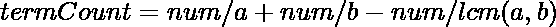

# 寻找可被 a 或 b 整除的第 n 项的程序

> 原文:[https://www . geesforgeks . org/program-to-find-n-term-可被 a 或 b 除尽/](https://www.geeksforgeeks.org/program-to-find-nth-term-divisible-by-a-or-b/)

给定两个整数和。任务是找到可被或整除的第 n 项。
**例:**

```
Input : a = 2, b = 5, N = 10
Output : 16

Input : a = 3, b = 7, N = 25
Output : 57
```

**天真的方法:**一个简单的方法是遍历从 1 开始的所有项，直到我们找到期望的第 n 项，该第 n 项可以被或整除。该解决方案的时间复杂度为 0(N)。
**高效途径:**思路是用[二分搜索法](https://www.geeksforgeeks.org/binary-search/)。这里我们可以用公式计算出从 1 到有多少个数可以被 a 或 b 整除:

LCM(a，b)的所有倍数都将被和整除，所以我们需要去掉这些项。现在，如果可分项的数量小于 N，我们将增加二分搜索法的低位，否则降低高位，直到可分项的数量等于 N。
下面是上述想法的实现:

## C++

```
// C++ program to find nth term
// divisible by a or b

#include <bits/stdc++.h>
using namespace std;

// Function to return
// gcd of a and b
int gcd(int a, int b)
{
    if (a == 0)
        return b;

    return gcd(b % a, a);
}

// Function to calculate how many numbers
// from 1 to num are divisible by a or b
int divTermCount(int a, int b, int lcm, int num)
{
    // calculate number of terms divisible by a and
    // by b then, remove the terms which is are
    // divisible by both a and b
    return num / a + num / b - num / lcm;
}

// Binary search to find the nth term
// divisible by a or b
int findNthTerm(int a, int b, int n)
{
    // set low to 1 and high to max(a, b)*n, here
    // we have taken high as 10^18
    int low = 1, high = INT_MAX, mid;
    int lcm = (a * b) / gcd(a, b);

    while (low < high) {
        mid = low + (high - low) / 2;

        // if the current term is less than
        // n then we need to increase low
        // to mid + 1
        if (divTermCount(a, b, lcm, mid) < n)
            low = mid + 1;

        // if current term is greater than equal to
        // n then high = mid
        else
            high = mid;
    }

    return low;
}

// Driver code
int main()
{
    int a = 2, b = 5, n = 10;
    cout << findNthTerm(a, b, n) << endl;

    return 0;
}
```

## Java 语言(一种计算机语言，尤用于创建网站)

```
// Java program to find nth term
// divisible by a or b
class GFG
{
// Function to return
// gcd of a and b
static int gcd(int a, int b)
{
    if (a == 0)
        return b;

    return gcd(b % a, a);
}

// Function to calculate how many numbers
// from 1 to num are divisible by a or b
static int divTermCount(int a, int b,
                        int lcm, int num)
{
    // calculate number of terms
    // divisible by a and by b then,
    // remove the terms which is are
    // divisible by both a and b
    return num / a + num / b - num / lcm;
}

// Binary search to find the
// nth term divisible by a or b
static int findNthTerm(int a, int b, int n)
{
    // set low to 1 and high to max(a, b)*n, 
    // here we have taken high as 10^18
    int low = 1, high = Integer.MAX_VALUE, mid;
    int lcm = (a * b) / gcd(a, b);

    while (low < high)
    {
        mid = low + (high - low) / 2;

        // if the current term is less
        // than n then we need to increase
        // low to mid + 1
        if (divTermCount(a, b, lcm, mid) < n)
            low = mid + 1;

        // if current term is greater
        // than equal to n then high = mid
        else
            high = mid;
    }

    return low;
}

// Driver code
public static void main (String[] args)
{
    int a = 2, b = 5, n = 10;
    System.out.println(findNthTerm(a, b, n));
}
}

// This code is contributed by Smitha
```

## 蟒蛇 3

```
# Python 3 program to find nth term
# divisible by a or b
import sys

# Function to return gcd of a and b
def gcd(a, b):
    if a == 0:
        return b
    return gcd(b % a, a)

# Function to calculate how many numbers
# from 1 to num are divisible by a or b
def divTermCount(a, b, lcm, num):

    # calculate number of terms divisible
    # by a and by b then, remove the terms
    # which are divisible by both a and b
    return num // a + num // b - num // lcm

# Binary search to find the nth term
# divisible by a or b
def findNthTerm(a, b, n):

    # set low to 1 and high to max(a, b)*n,
    # here we have taken high as 10^18
    low = 1; high = sys.maxsize
    lcm = (a * b) // gcd(a, b)
    while low < high:
        mid = low + (high - low) // 2

        # if the current term is less
        # than n then we need to increase 
        # low to mid + 1
        if divTermCount(a, b, lcm, mid) < n:
            low = mid + 1

        # if current term is greater
        # than equal to n then high = mid
        else:
            high = mid
    return low

# Driver code
a = 2; b = 5; n = 10
print(findNthTerm(a, b, n))

# This code is contributed by Shrikant13
```

## C#

```
// C# program to find nth term
// divisible by a or b
using System;

class GFG
{
// Function to return gcd of a and b
static int gcd(int a, int b)
{
    if (a == 0)
        return b;

    return gcd(b % a, a);
}

// Function to calculate how many numbers
// from 1 to num are divisible by a or b
static int divTermCount(int a, int b,
                        int lcm, int num)
{
    // calculate number of terms
    // divisible by a and by b then,
    // remove the terms which is are
    // divisible by both a and b
    return num / a + num / b - num / lcm;
}

// Binary search to find the
// nth term divisible by a or b
static int findNthTerm(int a, int b, int n)
{
    // set low to 1 and high to max(a, b)*n,
    // here we have taken high as 10^18
    int low = 1, high = int.MaxValue, mid;
    int lcm = (a * b) / gcd(a, b);

    while (low < high)
    {
        mid = low + (high - low) / 2;

        // if the current term is less
        // than n then we need to increase
        // low to mid + 1
        if (divTermCount(a, b, lcm, mid) < n)
            low = mid + 1;

        // if current term is greater
        // than equal to n then high = mid
        else
            high = mid;
    }

    return low;
}

// Driver code
static public void Main ()
{
    int a = 2, b = 5, n = 10;
    Console.WriteLine(findNthTerm(a, b, n));
}
}

// This code is contributed by Sach_Code
```

## java 描述语言

```
<script>

// JavaScript program to find nth term
// divisible by a or b

// Function to return
// gcd of a and b
function gcd(a , b)
{
    if (a == 0)
        return b;

    return gcd(b % a, a);
}

// Function to calculate how many numbers
// from 1 to num are divisible by a or b
function divTermCount(a , b, lcm , num)
{
    // calculate number of terms
    // divisible by a and by b then,
    // remove the terms which is are
    // divisible by both a and b
    return parseInt(num / a) +
    parseInt(num / b) - parseInt(num / lcm);
}

// Binary search to find the
// nth term divisible by a or b
function findNthTerm(a , b , n)
{
    // set low to 1 and high to max(a, b)*n, 
    // here we have taken high as 10^18
    var low = 1, high = Number.MAX_VALUE, mid;
    var lcm = parseInt((a * b) / gcd(a, b));

    while (low < high)
    {
        mid = low + parseInt((high - low) / 2);

        // if the current term is less
        // than n then we need to increase
        // low to mid + 1
        if (divTermCount(a, b, lcm, mid) < n)
            low = mid + 1;

        // if current term is greater
        // than equal to n then high = mid
        else
            high = mid;
    }

    return low;
}

// Driver code
var a = 2, b = 5, n = 10;
document.write(findNthTerm(a, b, n));

// This code is contributed by Amit Katiyar

</script>
```

**Output:** 

```
16
```