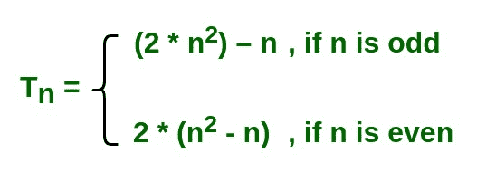

# 查找系列 1 第 n 项的程序 4 15 24 45 60 92

> 原文:[https://www . geesforgeks . org/program-to-find-n 系列术语-1-4-15-24-45-60-92/](https://www.geeksforgeeks.org/program-to-find-nth-term-of-the-series-1-4-15-24-45-60-92/)

给定一个数字 n，任务是找到数列的第 n 项

> 1, 4, 15, 24, 45, 60, 91, 112, 153… ..

其中 0 < n < 100000000。
**例:**

```
Input: n = 10
Output: 180

Input: n = 5
Output: 45
```

**方法:**
这个想法很简单，但很难识别。
如果 n 是奇数，第 n 项将是[(2 *(n^2))–n]。
如果 n 为偶数，则第 n 项为[2 *(n^2)–n)]。



**执行:**

## C++

```
#include <stdio.h>

// function to calculate nth term of the series
long long int nthTerm(long long int n)
{
    // variable nth will store the nth term of series
    long long int nth;

    // if n is even
    if (n % 2 == 0)
        nth = 2 * ((n * n) - n);

    // if n is odd
    else
        nth = (2 * n * n) - n;

    // return nth term
    return nth;
}

// Driver code
int main()
{
    long long int n;

    n = 5;

    printf("%lld\n", nthTerm(n));

    n = 25;
    printf("%lld\n", nthTerm(n));

    n = 25000000;
    printf("%lld\n", nthTerm(n));

    n = 250000007;
    printf("%lld\n", nthTerm(n));

    return 0;
}
```

## Java 语言(一种计算机语言，尤用于创建网站)

```
// Java implementation of the above approach

class GFG
{

    // function to calculate nth
    // term of the series
    static long nthTerm(long n)
    {
        // variable nth will store the
        // nth term of series
        long nth;

        // if n is even
        if (n % 2 == 0)
            nth = 2 * ((n * n) - n);

        // if n is odd
        else
            nth = (2 * n * n) - n;

        // return nth term
        return nth;
    }

    // Driver code
    public static void main(String []args)
    {
        long n;
        n = 5;
        System.out.println(nthTerm(n));

        n = 25;
        System.out.println(nthTerm(n));

        n = 25000000;
        System.out.println(nthTerm(n));

        n = 250000007;
        System.out.println(nthTerm(n));
    }
}

// This code is contributed by Ryuga
```

## 蟒蛇 3

```
# function to calculate nth term of the series
def nthTerm(n):

    # variable nth will store the nth
    # term of series
    nth = 0

    # if n is even
    if (n % 2 == 0):
        nth = 2 * ((n * n) - n)

    # if n is odd
    else:
        nth = (2 * n * n) - n

    # return nth term
    return nth

# Driver code
n = 5

print(nthTerm(n))

n = 25
print(nthTerm(n))

n = 25000000
print(nthTerm(n))

n = 250000007
print(nthTerm(n))

# This code is contributed by
# Mohit kumar 29
```

## C#

```
// C# implementation of the above approach
using System;

class GFG
{

    // function to calculate nth
    // term of the series
    static long nthTerm(long n)
    {
        // variable nth will store the
        // nth term of series
        long nth;

        // if n is even
        if (n % 2 == 0)
            nth = 2 * ((n * n) - n);

        // if n is odd
        else
            nth = (2 * n * n) - n;

        // return nth term
        return nth;
    }

    // Driver code
    public static void Main()
    {
        long n;
        n = 5;
        Console.WriteLine(nthTerm(n));

        n = 25;
        Console.WriteLine(nthTerm(n));

        n = 25000000;
        Console.WriteLine(nthTerm(n));

        n = 250000007;
        Console.WriteLine(nthTerm(n));
    }
}

// This code is contributed by chandan_jnu
```

## 服务器端编程语言（Professional Hypertext Preprocessor 的缩写）

```
<?php
// function to calculate nth term
// of the series
function nthTerm($n)
{
    // variable nth will store the
    // nth term of series
    $nth;

    // if n is even
    if ($n % 2 == 0)
        $nth = 2 * (($n * $n) - $n);

    // if n is odd
    else
        $nth = (2 * $n * $n) - $n;

    // return nth term
    return $nth;
}

// Driver code
$n = 5;
echo nthTerm($n), "\n";

$n = 25;
echo nthTerm($n), "\n";

$n = 25000000;
echo nthTerm($n), "\n";

$n = 250000007;
echo nthTerm($n), "\n";

// This code is contributed by jit_t
?>
```

## java 描述语言

```
<script>

// function to calculate nth term of the series
function nthTerm( n)
{
    // variable nth will store the nth term of series
   let nth;

    // if n is even
    if (n % 2 == 0)
        nth = 2 * ((n * n) - n);

    // if n is odd
    else
        nth = (2 * n * n) - n;

    // return nth term
    return nth;
}

// Driver code

    let n = 5;

    document.write( nthTerm(n) + "<br/>");

    n = 25;
   document.write( nthTerm(n) + "<br/>");

    n = 25000000;
    document.write( nthTerm(n) + "<br/>");

    n = 250000007;
    document.write( nthTerm(n) + "<br/>");

// This code contributed by gauravrajput1

</script>
```

**Output:** 

```
45
1225
1249999950000000
125000006750000091
```