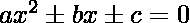
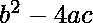
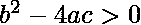
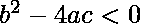

# 求二次方程解个数的程序

> 原文:[https://www . geesforgeks . org/program-to-find-number-in-quarted-equation/](https://www.geeksforgeeks.org/program-to-find-number-of-solutions-in-quadratic-equation/)

给定一个 a，b，c 值的方程，其中 a，b 为任意值，c 为常数，求这个二次方程有多少解？
**例:**

```
Input : 
Output : 2 solutions
Input : 
Output : no solution
```

**解:**
为了检查方程是否有解，使用了二次判别式。

> 公式如下:

*各条件如下:*

*   如果判别式为正，那么二次方程有两个解。
*   如果判别式等于，那么二次方程只有一个解。
*   如果判别式为负，则二次方程无解。

**节目:**

## C++

```
// C++ Program to find the solutions of specified equations
#include <iostream>
using namespace std;

// Method to check for solutions of equations
void checkSolution(int a, int b, int c)
{

    // If the expression is greater than 0, then 2 solutions
    if (((b * b) - (4 * a * c)) > 0)
        cout << "2 solutions";

    // If the expression is equal 0, then 2 solutions
    else if (((b * b) - (4 * a * c)) == 0)
        cout << "1 solution";

    // Else no solutions
    else
        cout << "No solutions";
}

int main()
{
    int a = 2, b = 5, c = 2;
    checkSolution(a, b, c);
    return 0;
}
```

## Java 语言(一种计算机语言，尤用于创建网站)

```
// Java Program to find the solutions of specified equations
public class GFG {

    // Method to check for solutions of equations
    static void checkSolution(int a, int b, int c)
    {

        // If the expression is greater than 0,
        // then 2 solutions
        if (((b * b) - (4 * a * c)) > 0)
            System.out.println("2 solutions");

        // If the expression is equal 0, then 2 solutions
        else if (((b * b) - (4 * a * c)) == 0)
            System.out.println("1 solution");

        // Else no solutions
        else
            System.out.println("No solutions");
    }

    // Driver Code
    public static void main(String[] args)
    {
        int a = 2, b = 5, c = 2;
        checkSolution(a, b, c);
    }
}
```

## 蟒蛇 3

```
# Python3 Program to find the
# solutions of specified equations

# function to check for
# solutions of equations
def checkSolution(a, b, c) :

    # If the expression is greater
    # than 0, then 2 solutions
    if ((b * b) - (4 * a * c)) > 0 :
        print("2 solutions")

    # If the expression is equal 0,
    # then 1 solutions
    elif ((b * b) - (4 * a * c)) == 0 :
        print("1 solution")

    # Else no solutions
    else :
        print("No solutions")

# Driver code
if __name__ == "__main__" :

    a, b, c = 2, 5, 2
    checkSolution(a, b, c)

# This code is contributed
# by ANKITRAI1
```

## C#

```
// C# Program to find the solutions
// of specified equations
using System;
class GFG
{

// Method to check for solutions of equations
static void checkSolution(int a, int b, int c)
{

    // If the expression is greater
    // than 0, then 2 solutions
    if (((b * b) - (4 * a * c)) > 0)
        Console.WriteLine("2 solutions");

    // If the expression is equal to 0,
    // then 2 solutions
    else if (((b * b) - (4 * a * c)) == 0)
        Console.WriteLine("1 solution");

    // Else no solutions
    else
        Console.WriteLine("No solutions");
}

// Driver Code
public static void Main()
{
    int a = 2, b = 5, c = 2;
    checkSolution(a, b, c);
}
}

// This code is contributed by inder_verma
```

## 服务器端编程语言（Professional Hypertext Preprocessor 的缩写）

```
<?php
// Program to find the solutions
// of specified equations

// Method to check for solutions
// of equations
function checkSolution($a, $b, $c)
{

    // If the expression is greater
    // than 0, then 2 solutions
    if ((($b * $b) - (4 * $a * $c)) > 0)
        echo "2 solutions";

    // If the expression is equal 0,
    // then 2 solutions
    else if ((($b * $b) -
              (4 * $a * $c)) == 0)
        echo "1 solution";

    // Else no solutions
    else
        echo"No solutions";
}

// Driver Code
$a = 2; $b = 5; $c = 2;
checkSolution($a, $b, $c);

// This code is contributed
// by inder_verma
?>
```

## java 描述语言

```
<script>

// Javascript Program to find the solutions
// of specified equations

// Method to check for solutions of equations
function checkSolution(a, b, c)
{

    // If the expression is greater than 0,
    // then 2 solutions
    if (((b * b) - (4 * a * c)) > 0)
        document.write("2 solutions");

    // If the expression is equal 0, then 2 solutions
    else if (((b * b) - (4 * a * c)) == 0)
        document.write("1 solution");

    // Else no solutions
    else
        document.write("No solutions");
}

// Driver Code
var a = 2, b = 5, c = 2;

checkSolution(a, b, c);

// This code is contributed by Ankita saini

</script>
```

**输出:**

```
2 solutions
```