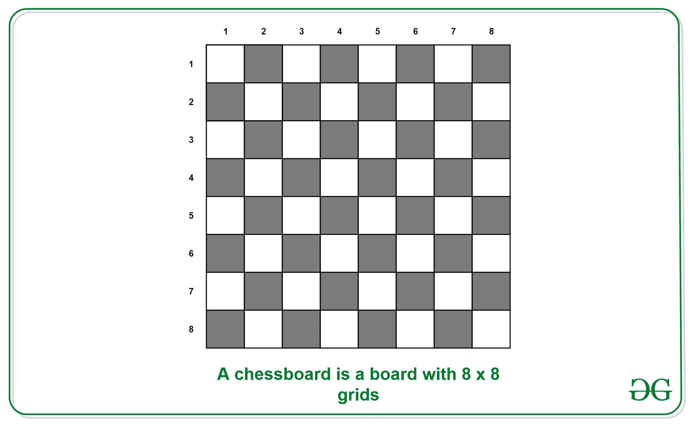

# 拼图|寻找棋盘中方块数的程序

> 原文:[https://www . geesforgeks . org/program-to-find-棋盘上的方块数/](https://www.geeksforgeeks.org/program-to-find-number-of-squares-on-a-chessboard/)

**<u>拼图</u> :** 给你一个棋盘，要求你找出棋盘上的方块数。棋盘是一个 8×8 网格的棋盘，如下图所示。



**<u>解</u> :** 仔细看棋盘我们可以看到，除了 1×1 的方块，还可以有 2×2、3×3、4×4、5×5、6×6、7×7、8×8 的方块组合。为了得到正方形的总数，我们需要找到所有形成的正方形。

```
1 x 1: 8 * 8 = 64 squares.
2 x 2: 7 * 7 = 49 squares.
3 x 3: 6 * 6 = 36 squares.
4 x 4: 5 * 5 = 25 squares.
5 x 5: 4 * 4 = 16 squares.
6 x 6: 3 * 3 = 9 squares.
7 x 7: 2 * 2 = 4 squares.
8 x 8: 1 * 1 = 1 square.
```

因此，我们在一个棋盘上总共有= 64 + 49 + 36 + 25 + 16 + 9 + 4 + 1 = 204 个方格。

**<u>【一般过程】</u>**
给定一个 n×n 的格子，在里面数方格。

**示例:**

```
Input: n = 2
Output: 5 (4 squares of 1 unit + 1 square of 2 units)

Input: n = 3
Output: 14 (9 squares of 1 unit + 4 square of 2 units 
                                + 1 square of 1 unit) 
```

对于尺寸为 n*n 的网格，形成的正方形总数为:

```
1^2 + 2^2 + 3^2 + ... + n^2 = n(n+1)(2n+1) / 6 
```

下面是上面公式的实现。由于 n*(n+1)*(2n+1)的值会导致 n 的大值溢出，下面是程序中使用的一些有趣的技巧。

1.  long int 用于返回。
2.  首先计算 n * (n + 1) / 2，因为值 n * (n + 1)将始终是 2 的倍数。

请注意，溢出仍然可能发生，但上述技巧只是减少了溢出的机会。

## C

```
<script>

// Java  find number of squares in a
// chessboard

// Function to return count of squares;
function countSquares( n)
{
    // A better way to write n*(n+1)*(2n+1)/6
    return (n * (n + 1) / 2) * (2*n + 1) / 3;
}

// Driver Code

let n = 4;
document.write("Count of squares is " + countSquares(n));

</script>
```

## Java 语言(一种计算机语言，尤用于创建网站)

```
// Java  find number of squares in a
// chessboard

class GFG
{
    // Function to return count of squares;
    static int countSquares(int n)
    {
        // A better way to write n*(n+1)*(2n+1)/6
        return (n * (n + 1) / 2) * (2 * n + 1) / 3;
    }

    // Driver code
    public static void main (String[] args)
    {
        int n = 3;
        System.out.println("Count of squares is "
                           +countSquares(n));
    }
}

// This code is contributed by Anant Agarwal.
```

## 蟒蛇 3

```
# python code to find number
# of squares in a chessboard

# Function to return count
# of squares;
def countSquares(n):

    # better way to write
    # n*(n+1)*(2n+1)/6
    return ((n * (n + 1) / 2)
           * (2 * n + 1) / 3)

# Driver code
n = 4
print("Count of squares is ",
              countSquares(n))

# This code is contributed by sam007.
```

## C#

```
// C# find number of squares in a
// chessboard
using System;

public class GFG {

    static int countSquares(int n)
    {
        // A better way to write
        // n*(n+1)*(2n+1)/6
        return (n * (n + 1) / 2)
                * (2 * n + 1) / 3;
    }

    // Driver code
    public static void Main ()
    {
        int n = 4;
        Console.WriteLine("Count of"
                     + "squares is "
                 + countSquares(n));
    }
}

// This code is contributed by Sam007.
```

## 服务器端编程语言（Professional Hypertext Preprocessor 的缩写）

```
<?php
// PHP program to find number
// of squares in a chessboard

// Function to return
// count of squares;
function countSquares($n)
{
    // A better way to
    // write n*(n+1)*(2n+1)/6
    return ($n * ($n + 1) / 2) *
               (2 * $n + 1) / 3;
}

// Driver Code
$n = 4;
echo "Count of squares is " ,
            countSquares($n);

// This code is contributed
// by nitin mittal.
?>
```

## java 描述语言

```
<script>

// Java  find number of squares in a
// chessboard

// Function to return count of squares;
function countSquares( n)
{
    // A better way to write n*(n+1)*(2n+1)/6
    return (n * (n + 1) / 2) * (2*n + 1) / 3;
}

// Driver Code

let n = 4;
document.write("Count of squares is " + countSquares(n));

</script>
```

**输出:**

```
Count of squares is 30
```

本文由**里沙布**供稿。如果你发现任何不正确的地方，请写评论，或者你想分享更多关于上面讨论的话题的信息