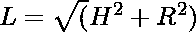
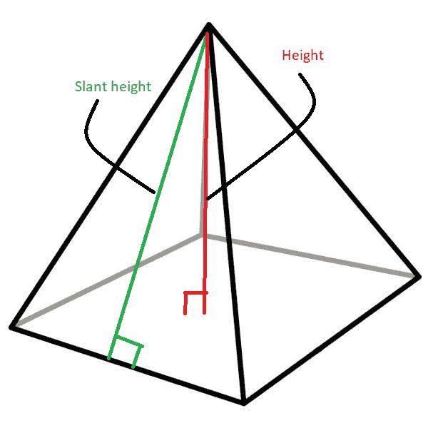

# 求圆锥体和棱锥体倾斜高度的程序

> 原文:[https://www . geesforgeks . org/program-to-find-斜面-锥体和金字塔高度/](https://www.geeksforgeeks.org/program-to-find-slant-height-of-cone-and-pyramid/)

给定两个整数 **H1** 和 **R** 代表一个[锥体的高度和半径](https://www.geeksforgeeks.org/calculate-volume-surface-area-cone/)和两个整数 **H2** 和 **S** 代表一个[金字塔](https://www.geeksforgeeks.org/program-for-volume-of-pyramid/)底部的高度和长度，任务是找出锥体和金字塔的倾斜高度。

**示例:**

> **输入:** H1 = 4.5，R = 6，H2 = 4，S = 4.8
> **输出:**
> 锥体倾斜高度为:7.5
> 金字塔倾斜高度为:4.66476
> 
> **输入:** H1 = 2，R = 4，H2 = 4，S = 8
> **输出:**
> 锥体倾斜高度为:4.47214
> 金字塔倾斜高度为:5.65685

**方法:**圆锥或棱锥等物体的倾斜高度是从沿侧面的任意顶点到底部(沿面中心)的距离。右圆锥的倾斜高度在整个表面上是一致的，由下式给出:

> [](https://media.geeksforgeeks.org/wp-content/uploads/20210131235903/cone2.png)
> 
> 
> 其中，
> **L** 为右圆锥的倾斜高度
> **R** 为右圆锥的半径
> **H** 为右圆锥的高度

金字塔的倾斜高度由下式给出:

> [](https://media.geeksforgeeks.org/wp-content/uploads/20210201000717/pyramid.jpg)
> 
> 
> 
> 其中，
> **L** 是金字塔的偏高
> *T5【S】T6*T8*是金字塔底部的侧面*T12**H**是金字塔的高度

下面是上述方法的实现:

## C++

```
// C++ program for the above approach
#include <bits/stdc++.h>
using namespace std;

// Function to calculate slant
// height of a cone
void coneSlantHeight(double cone_h,
                     double cone_r)
{
    // Store the slant height of cone
    double slant_height_cone
        = sqrt(pow(cone_h, 2)
               + pow(cone_r, 2));

    // Print the result
    cout << "Slant height of cone is: "
         << slant_height_cone << '\n';
}

// Function to find the slant
// height of a pyramid
void pyramidSlantHeight(double pyramid_h,
                        double pyramid_s)
{

    // Store the slant height of pyramid
    double slant_height_pyramid
        = sqrt(pow(pyramid_s / 2, 2)
               + pow(pyramid_h, 2));

    // Print the result
    cout << "Slant height of pyramid is: "
         << slant_height_pyramid << '\n';
}

// Driver Code
int main()
{
    // Dimensions of Cone
    double H1 = 4.5, R = 6;

    // Function Call for slant height
    // of Cone
    coneSlantHeight(H1, R);

    // Dimensions of Pyramid
    double H2 = 4, S = 4.8;

    // Function to calculate
    // slant height of a pyramid
    pyramidSlantHeight(H2, S);

    return 0;
}
```

## Java 语言(一种计算机语言，尤用于创建网站)

```
// Java program for the above approach
import java.io.*;
class GFG
{

    // Function to calculate slant
    // height of a cone
    static void coneSlantHeight(double cone_h,
                         double cone_r)
    {

        // Store the slant height of cone
        double slant_height_cone
            = Math.sqrt(Math.pow(cone_h, 2)
                   + Math.pow(cone_r, 2));

        // Print the result
        System.out.println("Slant height of cone is: " +
        slant_height_cone);
    }

    // Function to find the slant
    // height of a pyramid
    static void pyramidSlantHeight(double pyramid_h,
                            double pyramid_s)
    {

        // Store the slant height of pyramid
        double slant_height_pyramid
            = Math.sqrt(Math.pow(pyramid_s / 2, 2)
                   + Math.pow(pyramid_h, 2));

        // Print the result
        System.out.println("Slant height of pyramid is: " +
        slant_height_pyramid);
    }

    // Driver Code
    public static void main (String[] args)
    {

        // Dimensions of Cone
        double H1 = 4.5, R = 6;

        // Function Call for slant height
        // of Cone
        coneSlantHeight(H1, R);

        // Dimensions of Pyramid
        double H2 = 4, S = 4.8;

        // Function to calculate
        // slant height of a pyramid
        pyramidSlantHeight(H2, S);

    }
}

// This code is contributed by AnkThon
```

## 蟒蛇 3

```
# Python 3 program for the above approach
from math import sqrt,pow
# Function to calculate slant
# height of a cone
def coneSlantHeight(cone_h, cone_r):
  # Store the slant height of cone
  slant_height_cone = sqrt(pow(cone_h, 2) + pow(cone_r, 2))

  # Print the result
  print("Slant height of cone is:",slant_height_cone)

# Function to find the slant
# height of a pyramid
def pyramidSlantHeight(pyramid_h, pyramid_s):
  # Store the slant height of pyramid
  slant_height_pyramid = sqrt(pow(pyramid_s/2, 2) + pow(pyramid_h, 2))

   # Print the result
  print("Slant height of pyramid is:","{:.5f}".format(slant_height_pyramid))

# Driver Code
if __name__ == '__main__':
  # Dimensions of Cone
  H1 = 4.5
  R = 6

  # Function Call for slant height
  # of Cone
  coneSlantHeight(H1, R);

  # Dimensions of Pyramid
  H2 = 4
  S = 4.8

  # Function to calculate
  # slant height of a pyramid
  pyramidSlantHeight(H2, S)
```

## C#

```
// C# program for the above approach
using System;
public class GFG
{

  // Function to calculate slant
  // height of a cone
  static void coneSlantHeight(double cone_h,
                              double cone_r)
  {

    // Store the slant height of cone
    double slant_height_cone
      = Math.Sqrt(Math.Pow(cone_h, 2)
                  + Math.Pow(cone_r, 2));

    // Print the result
    Console.WriteLine("Slant height of cone is: " +
                      slant_height_cone);
  }

  // Function to find the slant
  // height of a pyramid
  static void pyramidSlantHeight(double pyramid_h,
                                 double pyramid_s)
  {

    // Store the slant height of pyramid
    double slant_height_pyramid
      = Math.Sqrt(Math.Pow(pyramid_s / 2, 2)
                  + Math.Pow(pyramid_h, 2));

    // Print the result
    Console.WriteLine("Slant height of pyramid is: " +
                      slant_height_pyramid);
  }

  // Driver Code
  public static void Main (string[] args)
  {

    // Dimensions of Cone
    double H1 = 4.5, R = 6;

    // Function Call for slant height
    // of Cone
    coneSlantHeight(H1, R);

    // Dimensions of Pyramid
    double H2 = 4, S = 4.8;

    // Function to calculate
    // slant height of a pyramid
    pyramidSlantHeight(H2, S);

  }
}

// This code is contributed by AnkThon
```

## java 描述语言

```
<script>

// javascript program for the above approach

  // Function to calculate slant
  // height of a cone

  function coneSlantHeight( cone_h,
                            cone_r)
  {

    // Store the slant height of cone

    var slant_height_cone =
    Math.sqrt(Math.pow(cone_h, 2) +
    Math.pow(cone_r, 2));

    // Print the result

    document.write("Slant height of cone is: "
            + slant_height_cone + "<br>");
  }

  // Function to find the slant
  // height of a pyramid
   function pyramidSlantHeight( pyramid_h, pyramid_s)
  {

    // Store the slant height of pyramid

 var slant_height_pyramid =
 Math.sqrt(Math.pow(pyramid_s / 2, 2) +
 Math.pow(pyramid_h, 2));

    document.write("Slant height of pyramid is: "
             + slant_height_pyramid.toFixed(5));
  }

  // Driver Code

    // Dimensions of Cone

    var H1 = 4.5, R = 6;

    // Function Call for slant height
    // of Cone
    coneSlantHeight(H1, R);

    // Dimensions of Pyramid
    var H2 = 4, S = 4.8;

    // Function to calculate
    // slant height of a pyramid
    pyramidSlantHeight(H2, S);

</script>
```

**Output:** 

```
Slant height of cone is: 7.5
Slant height of pyramid is: 4.66476
```

***时间复杂度:**O(1)*
T5**辅助空间:** O(1)