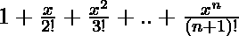
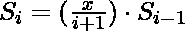
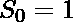

# 程序求 1 + x/2 的和！+ x^2/3！+…+x^n/(n+1)！

> 原文:[https://www . geesforgeks . org/program-to-find-sum-1-x-2-x2-3-xn-n1/](https://www.geeksforgeeks.org/program-to-find-sum-of-1-x-2-x2-3-xn-n1/)

给定一个数 x 和 n，任务是找出以下 x 到 n 项的和:

> 

**示例:**

```
Input: x = 5, n = 2
Output: 7.67
Explanation:
    Sum of first two termed

Input: x = 5, n = 4
Output: 18.08
Explanation:

```

**方法:**迭代循环到第 n 项，计算每次迭代的公式，即

```
nth term of the series = 
```

以下是上述方法的实现:

## C++

```
// C++ Program to compute sum of
// 1 + x/2! + x^2/3! +...+x^n/(n+1)!

#include <iostream>
#include <math.h>
using namespace std;

// Method to find the factorial of a number
int fact(int n)
{
    if (n == 1)
        return 1;

    return n * fact(n - 1);
}

// Method to compute the sum
double sum(int x, int n)
{
    double i, total = 1.0;

    // Iterate the loop till n
    // and compute the formula
    for (i = 1; i <= n; i++) {
        total = total + (pow(x, i) / fact(i + 1));
    }

    return total;
}

// Driver code
int main()
{

    // Get x and n
    int x = 5, n = 4;

    // Print output
    cout << "Sum is: " << sum(x, n);

    return 0;
}
```

## Java 语言(一种计算机语言，尤用于创建网站)

```
// Java Program to compute sum of
// 1 + x/2! + x^2/3! +...+x^n/(n+1)!

public class SumOfSeries {

    // Method to find factorial of a number
    static int fact(int n)
    {
        if (n == 1)
            return 1;

        return n * fact(n - 1);
    }

    // Method to compute the sum
    static double sum(int x, int n)
    {
        double total = 1.0;

        // Iterate the loop till n
        // and compute the formula
        for (int i = 1; i <= n; i++) {
            total = total + (Math.pow(x, i) / fact(i + 1));
        }

        return total;
    }

    // Driver Code
    public static void main(String[] args)
    {

        // Get x and n
        int x = 5, n = 4;

        // Find and print the sum
        System.out.print("Sum is: " + sum(x, n));
    }
}
```

## 蟒蛇 3

```
# Python3 Program to compute sum of
# 1 + x / 2 ! + x ^ 2 / 3 ! +...+x ^ n/(n + 1)!

# Method to find the factorial of a number
def fact(n):
    if n == 1:
        return 1
    else:
        return n * fact(n - 1)

# Method to compute the sum
def sum(x, n):
    total = 1.0

    # Iterate the loop till n
    # and compute the formula
    for i in range (1, n + 1, 1):
        total = total + (pow(x, i) / fact(i + 1))

    return total

# Driver code
if __name__== '__main__':

    # Get x and n
    x = 5
    n = 4

    # Print output
    print ("Sum is: {0:.4f}".format(sum(x, n)))

# This code is contributed by
# SURENDRA_GANGWAR
```

## C#

```
// C# Program to compute sum of
// 1 + x/2! + x^2/3! +...+x^n/(n+1)!
using System;

class SumOfSeries {

    // Method to find factorial of a number
    static int fact(int n)
    {
        if (n == 1)
            return 1;

        return n * fact(n - 1);
    }

    // Method to compute the sum
    static double sum(int x, int n)
    {
        double total = 1.0;

        // Iterate the loop till n
        // and compute the formula
        for (int i = 1; i <= n; i++) {
            total = total + (Math.Pow(x, i) / fact(i + 1));
        }

        return total;
    }

    // Driver Code
    public static void Main()
    {

        // Get x and n
        int x = 5, n = 4;

        // Find and print the sum
        Console.WriteLine("Sum is: " + sum(x, n));
    }
}

// This code is contributed
// by anuj_67..
```

## 服务器端编程语言（Professional Hypertext Preprocessor 的缩写）

```
<?php
// PHP Program to compute sum of
// 1 + x/2! + x^2/3! +...+x^n/(n+1)!

// Function to find the factorial
// of a number
function fact($n)
{
    if ($n == 1)
        return 1;

    return $n * fact($n - 1);
}

// Function to compute the sum
function sum($x, $n)
{
    $total = 1.0;

    // Iterate the loop till n
    // and compute the formula
    for ($i = 1; $i <= $n; $i++)
    {
        $total = $total + (pow($x, $i) /
                          fact($i + 1));
    }

    return $total;
}

// Driver code

// Get x and n
$x = 5;
$n = 4;

// Print output
echo "Sum is: ", sum($x, $n);

// This code is contributed by ANKITRAI1
?>
```

## java 描述语言

```
<script>
// java scritpt  Program to compute sum of
// 1 + x/2! + x^2/3! +...+x^n/(n+1)!

// Function to find the factorial
// of a number
function fact(n)
{
    if (n == 1)
        return 1;

    return n * fact(n - 1);
}

// Function to compute the sum
function sum(x, n)
{
    let total = 1.0;

    // Iterate the loop till n
    // and compute the formula
    for (let i = 1; i <= n; i++)
    {
        total = total + (Math.pow(x, i) /
                        fact(i + 1));
    }

    return total.toFixed(4);
}

// Driver code

// Get x and n
let x = 5;
let n = 4;

// Print output
document.write( "Sum is: "+ sum(x, n));

// This code is contributed by sravan kumar Gottumukkala
</script>
```

**Output:** 

```
Sum is: 18.0833
```

**有效方法:**上述算法的时间复杂度为 O( )，因为对于每个和迭代，计算的阶乘为 O(n)。可以观察到系列的术语可以写成，其中。现在我们可以迭代来计算总和。
以下是上述方法的实施:

## C++

```
// C++ implementation of the approach
#include <iostream>
using namespace std;

// Function to compute the series sum
double sum(int x, int n)
{
    double total = 1.0;

    // To store the value of S[i-1]
    double previous = 1.0;

    // Iterate over n to store sum in total
    for (int i = 1; i <= n; i++)
    {

        // Update previous with S[i]
        previous = (previous * x) / (i + 1);
        total = total + previous;
    }
    return total;
}

// Driver code
int main()
{
    // Get x and n
    int x = 5, n = 4;

    // Find and print the sum
    cout << "Sum is: " << sum(x, n);

    return 0;
}

// This code is contributed by jit_t
```

## Java 语言(一种计算机语言，尤用于创建网站)

```
// Java implementation of the approach

public class GFG {

    // Function to compute the series sum
    static double sum(int x, int n)
    {

        double total = 1.0;

        // To store the value of S[i-1]
        double previous = 1.0;

        // Iterate over n to store sum in total
        for (int i = 1; i <= n; i++) {

            // Update previous with S[i]
            previous = (previous * x) / (i + 1);
            total = total + previous;
        }

        return total;
    }

    // Driver code
    public static void main(String[] args)
    {

        // Get x and n
        int x = 5, n = 4;

        // Find and print the sum
        System.out.print("Sum is: " + sum(x, n));
    }
}
```

## 蟒蛇 3

```
# Python implementation of the approach

# Function to compute the series sum
def sum(x, n):
    total = 1.0;

    # To store the value of S[i-1]
    previous = 1.0;

    # Iterate over n to store sum in total
    for i in range(1, n + 1):

        # Update previous with S[i]
        previous = (previous * x) / (i + 1);
        total = total + previous;

    return total;

# Driver code
if __name__ == '__main__':

    # Get x and n
    x = 5;
    n = 4;

    # Find and print the sum
    print("Sum is: ", sum(x, n));

# This code is contributed by 29AjayKumar
```

## C#

```
// C# implementation of the approach
using System;

class GFG
{

    // Function to compute the series sum
    public double sum(int x, int n)
    {
        double total = 1.0;

        // To store the value of S[i-1]
        double previous = 1.0;

        // Iterate over n to store sum in total
        for (int i = 1; i <= n; i++)
        {

            // Update previous with S[i]
            previous = ((previous * x) / (i + 1));
            total = total + previous;
        }

        return total;
    }
}

// Driver code
class geek
{
    public static void Main()
    {
        GFG g = new GFG();

        // Get x and n
        int x = 5, n = 4;

        // Find and print the sum
        Console.WriteLine("Sum is: " + g.sum(x, n));
    }
}

// This code is contributed by SoM15242
```

## java 描述语言

```
<script>
    // Javascript implementation of the approach

    // Function to compute the series sum
    function sum(x, n)
    {
        let total = 1.0;

        // To store the value of S[i-1]
        let previous = 1.0;

        // Iterate over n to store sum in total
        for (let i = 1; i <= n; i++)
        {

            // Update previous with S[i]
            previous = ((previous * x) / (i + 1));
            total = total + previous;
        }

        return total;
    }

    // Get x and n
    let x = 5, n = 4;

    // Find and print the sum
    document.write("Sum is: " + sum(x, n));

</script>
```

**Output:** 

```
Sum is: 18.083333333333336
```

**时间复杂度:** O(n)