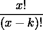
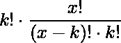
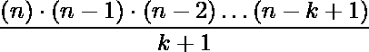

# 程序求给定序列的和

> 原文:[https://www . geesforgeks . org/program-to-find-sum-of-the-sequence/](https://www.geeksforgeeks.org/program-to-find-sum-of-the-given-sequence/)

给定两个数字和。任务是找出下面给出的序列的和。

> **(1 * 2 * 3 *……* k)+(2 * 3 *……* k *(k+1))+(3 * 4 *..*(k+1)*(k+2)) +…..+((n-k+1)*(n-k+2)*……*(n-k+k))。**

由于输出可能很大，请在模 10^9+7.下打印答案
**例** :

```
Input : N = 3, K = 2
Output : 8

Input : N = 4, K = 2
Output : 20
```

让我们举一个例子，试着把它简化成一个通式。
在给定的例子中 **n = 3** 和 **k=2** ，

```
Sum = 1*2 + 2*3 
```

我们知道:

所以每个术语都是这样的形式:



如果我们乘和除，它就变成了



其中无非是，

所以，

但是既然 n 这么大我们不能直接算出来，只好简化上面的表达式。
关于简化，我们得到:



以下是上述思路的实现:

## C++

```
// CPP program to find the sum of the
// given sequence

#include <bits/stdc++.h>
using namespace std;

const long long MOD = 1000000007;

// function to find moudulo inverse
// under 10^9+7
long long modInv(long long x)
{
    long long n = MOD - 2;
    long long result = 1;
    while (n) {
        if (n & 1)
            result = result * x % MOD;
        x = x * x % MOD;
        n = n / 2;
    }

    return result;
}

// Function to find the sum of the
// given sequence
long long getSum(long long n, long long k)
{
    long long ans = 1;

    for (long long i = n + 1; i > n - k; i--)
        ans = ans * i % MOD;
    ans = ans * modInv(k + 1) % MOD;

    return ans;
}

// Driver code
int main()
{
    long long n = 3, k = 2;

    cout<<getSum(n,k);

    return 0;
}
```

## Java 语言(一种计算机语言，尤用于创建网站)

```
// Java program to find the sum of the
// given sequence

class GFG {

    static long MOD = 1000000007;

// function to find moudulo inverse
// under 10^9+7
    static long modInv(long x) {
        long n = MOD - 2;
        long result = 1;
        while (n > 0) {
            if ((n & 1) > 0) {
                result = result * x % MOD;
            }
            x = x * x % MOD;
            n = n / 2;
        }

        return result;
    }

// Function to find the sum of the
// given sequence
    static long getSum(long n, long k) {
        long ans = 1;

        for (long i = n + 1; i > n - k; i--) {
            ans = ans * i % MOD;
        }
        ans = ans * modInv(k + 1) % MOD;

        return ans;
    }

// Driver code
    public static void main(String[] args) {
        long n = 3, k = 2;
        System.out.println(getSum(n, k));
    }
}
```

## 蟒蛇 3

```
# Python3 program to find the sum
# of the given sequence

MOD = 1000000007;

# function to find moudulo inverse
# under 10^9+7
def modInv(x):

    n = MOD - 2;
    result = 1;
    while (n):
        if (n&1):
            result = result * x % MOD;
        x = x * x % MOD;
        n = int(n / 2);

    return result;

# Function to find the sum of
# the given sequence
def getSum(n, k):

    ans = 1;

    for i in range(n + 1, n - k, -1):
        ans = ans * i % MOD;
    ans = ans * modInv(k + 1) % MOD;

    return ans;

# Driver code
n = 3;
k = 2;

print(getSum(n,k));

# This code is contributed by mits
```

## C#

```
// C# program to find the sum of the
// given sequence
using System;

// function to find moudulo inverse
// under 10^9+7
class gfg
{
    public long MOD = 1000000007;
 public long modInv(long x)
 {
    long n = MOD - 2;
    long result = 1;
    while (n >0) {
        if ((n & 1) > 0)
            result = result * x % MOD;
        x = x * x % MOD;
        n = n / 2;
    }

    return result;
}

// Function to find the sum of the
// given sequence
  public long getSum(long n, long k)
  {
    long ans = 1;

    for (long i = n + 1; i > n - k; i--)
        ans = ans * i % MOD;
    ans = ans * modInv(k + 1) % MOD;

    return ans;
 }
}

// Driver code
class geek
{
  public static int Main()
 {
     gfg g = new gfg();
    long n = 3, k = 2;

    Console.WriteLine(g.getSum(n,k));

    return 0;
 }
}
//This code is contributed by SoumikMondal
```

## 服务器端编程语言（Professional Hypertext Preprocessor 的缩写）

```
<?php
// PHP program to find the sum of
// the given sequence

// function to find moudulo inverse
// under 10^9+7
function modInv($x)
{
    $MOD = 1000000007;
    $n = $MOD - 2;
    $result = 1;
    while ($n)
    {
        if ($n & 1)
            $result = $result * $x % $MOD;
        $x = $x * $x % $MOD;
        $n = $n / 2;
    }

    return $result;
}

// Function to find the sum of the
// given sequence
function getSum($n, $k)
{
    $MOD = 1000000007;
    $ans = 1;

    for ($i = $n + 1; $i > $n - $k; $i--)
        $ans = $ans * $i % $MOD;
    $ans = $ans * modInv($k + 1) % $MOD;

    return $ans;
}

// Driver code
$n = 3; $k = 2;

echo getSum($n, $k);

// This code is contributed
// by Akanksha Rai
?>
```

## java 描述语言

```
<script>

// Javascript program to find the sum of the
// given sequence

var MOD = 100000007;

// function to find moudulo inverse
// under 10^9+7
function modInv(x)
{
    var n = MOD - 2;
    var result = 1;
    while (n) {
        if (n & 1)
            result = result * x % MOD;
        x = x * x % MOD;
        n = n / 2;
    }

    return result;
}

// Function to find the sum of the
// given sequence
function getSum(n, k)
{
    var ans = 1;

    for (var i = n + 1; i > n - k; i--)
        ans = ans * i % MOD;
    ans = ans * modInv(k + 1) % MOD;

    return ans;
}

// Driver code
var n = 3, k = 2;

document.write( getSum(n,k));

// This code is contributed by noob2000.
</script>
```

**Output:** 

```
8
```