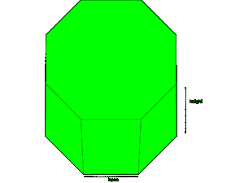

# 求八角棱镜表面积和体积的程序

> 原文:[https://www . geesforgeks . org/program-to-find-八角棱镜的表面积和体积/](https://www.geeksforgeeks.org/program-to-find-surface-area-and-volume-of-octagonal-prism/)

给定八边形棱镜的底部长度、高度和距离，我们必须为给定的参数找到八边形棱镜的表面积和体积。八边形棱镜是一个立体的三维物体，总共有 10 个面、24 条边和 16 个顶点。两端的两个面是八边形，其余的面是矩形。



其中 **a** 为基长， **h** 为高度， **d** 为八角棱镜的距离。

> 面积= 2 *基底*距离
> 表面积= (2 *面积)+ ( 8 *基底*高度)
> 体积=(面积*高度)

**例:**

> **输入:** h = 2，a = 4，d = 3
> **输出:**
> 表面积:112
> 体积:48
> **输入:** h = 1，a = 6，d = 2
> **输出:**
> 表面积:96
> 体积:24

## C++

```
// C++ program to find the
// Surface area and volume
// of octagonal prism
#include <iostream>
using namespace std;

// Function to find the
// Volume of octagonal prism
void find_volume(float area, float h)
{
    // Formula to calculate
    // volume = (area * h)
    float Volume = (area * h);

    // Display volume
    cout << "Volume: "
         << Volume << endl;
}

// Function to find the
// surface area of octagonal prism
void find_Surface_area(float area,
                       float a, float h)
{

    // Formula to calculate Surface area
    float Surface_area = (2 * area) +
                         (8 * a * h);

    cout << "Surface area: "
         << Surface_area << endl;
}

// Driver Code
int main()
{
    float h = 1;
    float a = 6;
    float d = 2;
    float area = 2 * a * d;

    find_Surface_area(area, a, h);

    find_volume(area, h);

    return 0;
}

// This code is contributed by AnkitRai01
```

## Java 语言(一种计算机语言，尤用于创建网站)

```
// Java program to find the
// Surface area and volume
// of octagonal prism
public class GFG {

    // Function to find the
    // Volume of octagonal prism
    static void find_volume(double area,double h){

        // Formula to calculate
        // volume = (area * h)
        double Volume = (area * h) ;

        // Display volume
        System.out.println("Volume: " + Volume);
    }

    // Function to find the
    // surface area of octagonal prism
    static void find_Surface_area(double area, double a, double h){

        // Formula to calculate Surface area
        double Surface_area = (2 * area)+(8 * a * h) ;

        System.out.println("Surface area: " + Surface_area) ;
    }

    // Driver Code
    public static void main (String[] args)
    {
        double h = 1 ;
        double a = 6 ;
        double d = 2 ;
        double area = 2 * a * d ;

        find_Surface_area(area, a, h) ;

        find_volume(area, h) ;

    }
}

// This code is contributed by AnkitRai01
```

## 蟒蛇 3

```
# Python3 program to find the
# Surface area and volume
# of octagonal prism
import math

# Function to find the
# Volume of octagonal prism
def find_volume(area, h):

    # Formula to calculate
    # volume = (area * h)
    Volume = (area * h)

    # Display volume
    print("Volume: ", end =" ")
    print(Volume)

# Function to find the
# surface area of octagonal prism
def find_Surface_area(area, a, h):

    # Formula to calculate Surface area
    Surface_area = (2 * area)+(8 * a * h)

    print("Surface area: ", end =" ")
    print(Surface_area)

# Driver Code
h = 1
a = 6
d = 2
area = 2 * a * d

find_Surface_area(area, a, h)

find_volume(area, h)
```

## C#

```
// C# program to find the surface area
// and volume of octagonal prism
using System;

class GFG {

// Function to find the volume
// of octagonal prism
static void find_volume(double area, double h)
{

    // Formula to calculate
    // volume = (area * h)
    double Volume = (area * h);

    // Display volume
    Console.WriteLine("Volume: " + Volume);
}

// Function to find the surface 
// area of octagonal prism
static void find_Surface_area(double area, double a,
                                           double h)
{

    // Formula to calculate surface area
    double Surface_area = (2 * area) + (8 * a * h);

    Console.WriteLine("Surface area: " + Surface_area);
}

// Driver Code
public static void Main (string[] args)
{
    double h = 1;
    double a = 6;
    double d = 2;
    double area = 2 * a * d;

    find_Surface_area(area, a, h);
    find_volume(area, h);
}
}

// This code is contributed by AnkitRai01
```

## java 描述语言

```
<script>
// javascript program to find the
// Surface area and volume
// of octagonal prism

// Function to find the
// Volume of octagonal prism
function find_volume( area,  h)
{

    // Formula to calculate
    // volume = (area * h)
    let Volume = (area * h);

    // Display volume
    document.write( "Volume: "
         + Volume +"<br/>");
}

// Function to find the
// surface area of octagonal prism
function find_Surface_area( area,
                        a,  h)
{

    // Formula to calculate Surface area
    let Surface_area = (2 * area) +
                         (8 * a * h);

    document.write("Surface area: "
         +Surface_area  +"<br/>");
}

// Driver Code
    let h = 1;
    let a = 6;
    let d = 2;
    let area = 2 * a * d;
    find_Surface_area(area, a, h);
    find_volume(area, h);

// This code is contributed by todaysgaurav

</script>
```

**Output:** 

```
Surface area:  96
Volume:  24
```