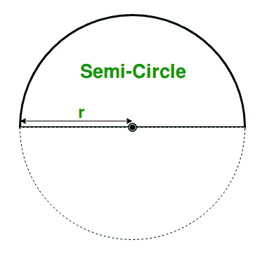

# 求半圆面积和周长的程序

> 原文:[https://www . geesforgeks . org/program-to-find-a-a-a-半圆的面积和周长/](https://www.geeksforgeeks.org/program-to-find-the-area-and-perimeter-of-a-semicircle/)

假设半圆的半径为 r，任务是找出半圆的面积和周长。
**例:**

```
Input: r = 10
Output: Area = 157.00, Perimeter = 31.4

Input: r = 25
Output: Area =981.250000, Perimeter = 78.500000
```

**方法:**
在数学中，半圆是形成半个圆的点的一维轨迹。半圆的面积是构成它的圆面积的一半。圆的任何直径都可以把它切成两个相等的半圆。



> **半圆面积=<sup>1</sup>‖<sub>2</sub>*π* r<sup>2</sup>**
> **半圆周长= π *r**
> 其中“r”为半圆半径。

以下是上述方法的实现:

## C++

```
// C++ program to find the
// Area and Perimeter of a Semicircle

#include <iostream>
using namespace std;

// Function for calculating the area
float area(float r)
{
    // Formula for finding the area
    return (0.5)*(3.14)*(r * r);
}

// Function for calculating the perimeter
float perimeter(float r)
{
    // Formula for finding the perimeter
    return (3.14)*(r);
}

// driver code
int main()
{

    // Get the radius
    int r = 10;

    // Find the area
    cout << "The Area of Semicircle: "
         << area(r) << endl;

    // Find the perimeter
    cout << "The Perimeter of Semicircle: "
         << perimeter(r) << endl;

    return 0;
}
```

## C

```
// C program to find the
// Area and Perimeter of a Semicircle

#include <stdio.h>

// Function for calculating the area
float area(float r)
{
    // Formula for finding the area
    return (0.5)*(3.14)*(r * r);
}

// Function for calculating the perimeter
float perimeter(float r)
{
    // Formula for finding the perimeter
    return (3.14)*(r);
}

// driver code
int main()
{

    // Get the radius
    float r = 10;

    // Find the area
    printf("The Area of Semicircle: %f\n",
        area(r));

    // Find the perimeter
    printf("The Perimeter of Semicircle: %f\n",
        perimeter(r));
    return 0;
}
```

## Java 语言(一种计算机语言，尤用于创建网站)

```
// Java program to find the
// Area and Perimeter of a Semicircle

import java.io.*;

class GFG {

// Function for calculating the area
static float area(float r)
{
    // Formula for finding the area
    return (float)((0.5)*(3.14)*(r * r));
}

// Function for calculating the perimeter
static float perimeter(float r)
{
    // Formula for finding the perimeter
    return (float)((3.14)*(r));
}

// driver code

    public static void main (String[] args) {
    // Get the radius
    float r = 10;

    // Find the area
    System.out.println("The Area of Semicircle: "+
        area(r));

    // Find the perimeter
    System.out.println("The Perimeter of Semicircle:"+
        +perimeter(r));
    }
}
 // This code is contributed
// by anuj_67..
```

## 蟒蛇 3

```
# Python3 program to find the
# Area and Perimeter of a Semicircle

# Function for calculating the area
def area(r):

    # Formula for finding the area
    return (0.5)*(3.14)*(r * r)

#Function for calculating the perimeter
def perimeter(r):

    #Formula for finding the perimeter
    return (3.14)*(r)

# driver code
if __name__=='__main__':
    # Get the radius
    r = 10

    # Find the area
    print ("The Area of Semicircle: "
           ,area(r))

    # Find the perimeter
    print ("The Perimeter of Semicircle: "
           ,perimeter(r))

# This code is contributed by
# SURENDRA_GANGWAR
```

## C#

```
// C# program to find the
// Area and Perimeter of a Semicircle
using System;

class GFG {

// Function for calculating the area
static float area(float r)
{
    // Formula for finding the area
    return (float)((0.5)*(3.14)*(r * r));
}

// Function for calculating the perimeter
static float perimeter(float r)
{
    // Formula for finding the perimeter
    return (float)((3.14)*(r));
}

// Driver Code
public static void Main()
{
    // Get the radius
    float r = 10;

    // Find the area
    Console.WriteLine("The Area of Semicircle: " +
                                         area(r));

    // Find the perimeter
    Console.WriteLine("The Perimeter of Semicircle:" +
                                        perimeter(r));
}
}

// This code is contributed
// by Akanksha Rai(Abby_akku)
```

## 服务器端编程语言（Professional Hypertext Preprocessor 的缩写）

```
<?php
// PHP program to find the
// Area and Perimeter of a Semicircle

// Function for calculating the area
function area($r)
{
    // Formula for finding the area
    return (0.5) * (3.14) * ($r * $r);
}

// Function for calculating
// the perimeter
function perimeter($r)
{
    // Formula for finding
    // the perimeter
    return (3.14) * ($r);
}

// Driver code

// Get the radius
$r = 10;

// Find the area
echo "The Area of Semicircle: ",
    area($r),"\n" ;

// Find the perimeter
echo "The Perimeter of Semicircle: ",
    perimeter($r),"\n" ;

// This code is contributed
// by ANKITRAI1
?>
```

## java 描述语言

```
<script>
// javascript program to find the
// Area and Perimeter of a Semicircle

// Function for calculating the area
    function area(r) {
        // Formula for finding the area
        return  ((0.5) * (3.14) * (r * r));
    }

    // Function for calculating the perimeter
    function perimeter(r) {
        // Formula for finding the perimeter
        return  ((3.14) * (r));
    }

    // driver code

        // Get the radius
        var r = 10;

        // Find the area
        document.write("The Area of Semicircle: " + area(r).toFixed(6)+"<br/>");

        // Find the perimeter
        document.write("The Perimeter of Semicircle: " +
        perimeter(r).toFixed(6)+"<br/>");

// This code contributed by gauravrajput1

</script>
```

**Output:** 

```
The Area of Semicircle: 157.000000
The Perimeter of Semicircle: 31.400000
```