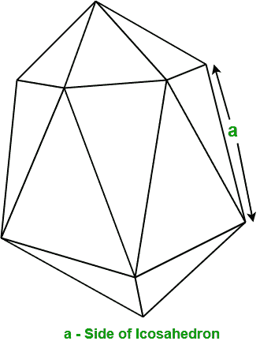
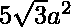

# 求二十面体面积和体积的程序

> 原文:[https://www . geesforgeks . org/program-to-find-面积和体积的二十面体/](https://www.geeksforgeeks.org/program-to-find-the-area-and-volume-of-icosahedron/)

给定二十面体的边。任务是找到给定二十面体的面积和体积。
**例** :

```
Input : a = 5
Output : Area: 216.506
         Volume: 272.712

Input : a = 10
Output : Area: 866.0254
         Volume: 2181.695
```

在几何中，二十面体是一种正多面体，它包含 20 个相同的等边三角形面、30 条边和 12 个顶点。



**求二十面体面积和体积的公式:**设 **a** 为二十面体的边，然后

> **二十面体的表面积** = 
> 和，**二十面体的体积** = 

## C++

```
// C++ program to find the Area and
// volume of Icosahedron
#include <bits/stdc++.h>
using namespace std;

// Function to find area of Icosahedron
float findArea(float a)
{
    float area;

    // Formula to calculating area
    area = 5 * sqrt(3) * a * a;

    return area;
}

// Function to find volume of Icosahedron
float findVolume(float a)
{
    float volume;

    // Formula to calculating volume
    volume = ((float)5 / 12) * (3 + sqrt(5)) * a * a * a;

    return volume;
}

// Driver Code
int main()
{
    float a = 5;

    // Function call to find area of Icosahedron.
    cout << "Area: " << findArea(a) << endl;

    // Function call to find volume of Icosahedron.
    cout << "Volume: " << findVolume(a);

    return 0;
}
```

## Java 语言(一种计算机语言，尤用于创建网站)

```
// Java program to find the Area and
// volume of Icosahedron
import java.io.*;

class GFG {

    // Function to find area of Icosahedron
    static float findArea(float a)
    {
        float area;

        // Formula to calculating area
        area = (float)(5 * Math.sqrt(3) * a * a);

        return area;
    }

    // Function to find volume of Icosahedron
    static float findVolume(float a)
    {
        float volume;

        // Formula to calculating volume
        volume = (float)(((float)5 / 12) * (3 + Math.sqrt(5)) * a * a * a);

        return volume;
    }

    // Driver code
    public static void main (String[] args)
    {
        float a = 5;

        // Function call to find area of Icosahedron.
        System.out.println("Area: " + findArea(a));

        // Function call to find volume of Icosahedron.
        System.out.println("Volume: " + findVolume(a));
    }
}
```

## 蟒蛇 3

```
# Python3 program to
# find the Area and
# volume of Icosahedron

# import math module
# to use sqrt function
from math import sqrt

# Function to find
# area of Icosahedron
def findArea(a):

    # Formula to calculate area
    area = 5 * sqrt(3) * a * a
    return area

# Function to find
# volume of Icosahedron
def findVolume(a):

    # Formula to calculate volume
    volume = ((5 / 12) *
              (3 + sqrt(5)) *
               a * a * a)
    return volume

# Driver Code
a = 5

# Function call to
# find area of Icosahedron.
print("Area: " , findArea(a))

# Function call to find
# volume of Icosahedron.
print("Volume: " , findVolume(a))

# This code is contributed
# by ihritik
```

## C#

```
// C# program to find the Area and
// volume of Icosahedron
using System;

public class GFG {

    // Function to find area of Icosahedron
    static float findArea(float a)
    {
        float area;

        // Formula to calculating area
        area = (float)(5 * Math.Sqrt(3) * a * a);

        return area;
    }

    // Function to find volume of Icosahedron
    static float findVolume(float a)
    {
        float volume;

        // Formula to calculating volume
        volume = (float)(((float)5 / 12) * (3 + Math.Sqrt(5)) * a * a * a);

        return volume;
    }

    // Driver code
    static public void Main ()
    {
        float a = 5;

        // Function call to find area of Icosahedron.
        Console.WriteLine("Area: " + findArea(a));

        // Function call to find volume of Icosahedron.
        Console.WriteLine("Volume: " + findVolume(a));
        //Code
    }
}
```

## 服务器端编程语言（Professional Hypertext Preprocessor 的缩写）

```
<?php
// PHP program to find
// the Area and volume
// of Icosahedron

// Function to find area
// of Icosahedron
function findArea($a)
{
    $area;

    // Formula to
    // calculating area
    $area = 5 * sqrt(3) *
                $a * $a;

    return $area;
}

// Function to find
// volume of Icosahedron
function findVolume($a)
{
    $volume;

    // Formula to
    // calculating volume
    $volume = ((float)5 / 12) *
                (3 + sqrt(5)) *
                  $a * $a * $a;

    return $volume;
}

// Driver Code
$a = 5;

// Function call to find
// area of Icosahedron.
echo "Area: " , findArea($a), "\n";

// Function call to find
// volume of Icosahedron.
echo "Volume: " , findVolume($a);

// This code is contributed
// by jit_t
?>
```

## java 描述语言

```
<script>
// javascript program to find the Area and
// volume of Icosahedron

// Function to find area of Icosahedron
function findArea( a)
{
    let area;

    // Formula to calculating area
    area = 5 * Math.sqrt(3) * a * a;

    return area;
}

// Function to find volume of Icosahedron
function findVolume( a)
{
    let volume;

    // Formula to calculating volume
    volume = (5 / 12) * (3 + Math.sqrt(5)) * a * a * a;

    return volume;
}

// Driver Code
    let a = 5;

    // Function call to find area of Icosahedron.
    document.write( "Area: " + findArea(a).toFixed(3) +"<br/>");

    // Function call to find volume of Icosahedron.
    document.write("Volume: " + findVolume(a).toFixed(3));

// This code is contributed by todaysgaurav

</script>
```

**Output:** 

```
Area: 216.506
Volume: 272.712
```