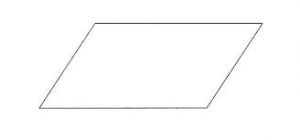

# 计算平行四边形面积的程序

> 原文:[https://www . geeksforgeeks . org/program-to-find-a-area-of-a-a-parallels/](https://www.geeksforgeeks.org/program-to-find-the-area-of-a-parallelogram/)

给定平行四边形的边，任务是计算平行四边形的面积。



**例:**

```
Input: base = 30, height = 40
Output: 1200.000000
    As Area of parallelogram = base * height,
    Therefore, Area = 30 * 40 = 1200.00
```

**进场:**

> **平行四边形面积=底*高**

以下是上述方法的实现:

## C++

```
#include <iostream>
using namespace std;

// function to calculate the area
float CalArea(float base, float height)
{
    return (base * height);
}
// driver code
int main()
{
    float base, height, Area;
    base = 30;
    height = 40;

    // function calling
    Area = CalArea(base, height);
    // displaying the area
    cout << "Area of Parallelogram is :" << Area;
    return 0;
}
```

## C

```
#include <stdio.h>

// function to calculate the area
float CalArea(float base, float height)
{
    return (base * height);
}

// driver code
int main()
{
    float base, height, Area;
    base = 30;
    height = 40;

    // function calling
    Area = CalArea(base, height);

    // displaying the area
    printf("Area of Parallelogram is : %f\n", Area);
    return 0;
}
```

## Java 语言(一种计算机语言，尤用于创建网站)

```
public class parallelogram {
    public static void main(String args[])
    {
        int base = 30;
        int height = 40;

        // formula for calculating the area
        int area_parallelogram = base * height;

        // displayin g the area
        System.out.println("Area of the parallelogram = " + area_parallelogram);
    }
}
```

## 计算机编程语言

```
base = 30
height = 40 

# formula for finding the area
area_parallelogram = base * height

# displaying the output
print("Area of the parallelogram = "+str(area_parallelogram))
```

## C#

```
using System;
class parallelogram
{
public static void Main()
{
    int b_ase = 30;
    int height = 40;

    // formula for calculating the area
    int area_parallelogram = b_ase * height;

    // displayin g the area
    Console.WriteLine("Area of the parallelogram = " +
                                  area_parallelogram);
}
}

// This code is contributed by vt_m
```

## 服务器端编程语言（Professional Hypertext Preprocessor 的缩写）

```
<?php   
   $base = 30; 
   $height = 40; 
   $area_parallelogram=$base*$height; 
    echo "Area of the parallelogram = "; 
    echo $area_parallelogram; 
?>
```

## java 描述语言

```
<script>

let base = 30;
let height = 40;
let area_parallelogram=base*height;
document.write( "Area of the parallelogram = ");
document.write(area_parallelogram.toFixed(6));

// This code is contributed by Bobby

</script>
```

**Output:** 

```
Area of Parallelogram is : 1200.000000
```