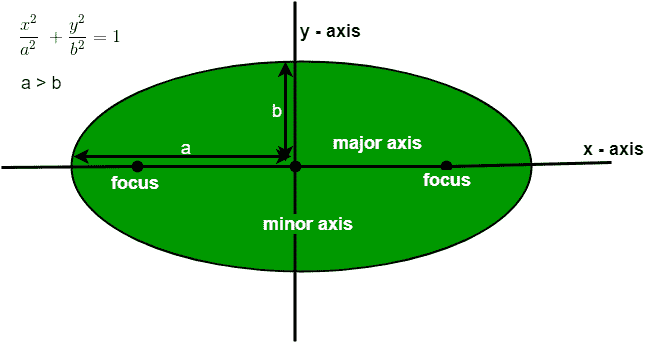

# 计算椭圆面积的程序

> 原文:[https://www . geeksforgeeks . org/program-to-find-the-area-of-a-platform/](https://www.geeksforgeeks.org/program-to-find-the-area-of-an-ellipse/)

给定一个椭圆，其半长轴长度为 **a** ，半短轴长度为 **b** 。任务是找到椭圆的面积。
在数学中，椭圆是平面上由两个焦点围绕的曲线，这样，对于曲线上的每个点，到两个焦点的距离之和是恒定的，或者我们可以说它是圆的推广。



**椭圆相关重要点** :

*   **中心:**椭圆内的一点，是连接两个焦点的线段的中点。换句话说，它是短轴和长轴的交点。
*   **长轴:**椭圆的最大直径称为长轴。
*   **短轴:**椭圆的最短直径称为短轴。
*   **弦:**连接椭圆上任意两点的线段。
*   **焦点:**这是定义椭圆的两个固定点。
*   **直肠闭锁:**穿过椭圆焦点并垂直于椭圆长轴的线段称为椭圆的直肠闭锁。

**椭圆面积:**求椭圆面积的公式如下:

```
Area = 3.142 * a * b
```

其中 a 和 b 分别是半长轴和半短轴，3.142 是π的值。
**例:**

```
Input : a = 5, b = 4
Output : 62.48

Input : a = 10, b = 5
Output : 157.1
```

## C++

```
// C++ program to find area of
// an Ellipse.
#include<bits/stdc++.h>
using namespace std;

// Function to find area of an
// ellipse.
void findArea( float a, float b)
{
    float Area;

    // formula to find the area
    // of an Ellipse.
    Area = 3.142 * a * b ;

    // Display the result
    cout << "Area: " << Area;
}

// Driver code
int main()
{
    float a = 5, b = 4;

    findArea(a, b);

    return 0;
}
```

## Java 语言(一种计算机语言，尤用于创建网站)

```
// Java program to find area of
// an Ellipse.
class GFG {

    // Function to find area of an
    // ellipse.
    static void findArea( float a, float b)
    {
        float Area;

        // formula to find the area
        // of an Ellipse.
        Area = (float)3.142 * a * b ;

        // Display the result
        System.out.println("Area: " + Area);
    }

    // Driver code
    public static void main (String[] args)
    {
        float a = 5, b = 4;

        findArea(a, b);
    }
}
```

## 蟒蛇 3

```
# Python3 program to find
# area of an Ellipse.

# Function to find area
# of an ellipse.
def findArea(a, b):

    # formula to find the
    # area of an Ellipse.
    Area = 3.142 * a * b ;

    # Display the result
    print("Area:", round(Area, 2));

# Driver code
a = 5;
b = 4;

findArea(a, b);

# This code is contributed
# by mits
```

## C#

```
// C# program to find area of
// an Ellipse.
using System;
class GFG
{

    // Function to find area
    // of an ellipse.
    static void findArea(float a,
                         float b)
    {
        float Area;

        // formula to find the
        // area of an Ellipse.
        Area = (float)3.142 * a * b ;

        // Display the result
        Console.WriteLine("Area: " +
                           Area);
    }

    // Driver code
    public static void Main ()
    {
        float a = 5, b = 4;

        findArea(a, b);
    }
}

// This code is contributed
// by anuj_67.
```

## 服务器端编程语言（Professional Hypertext Preprocessor 的缩写）

```
<?php
// PHP program to find
// area of an Ellipse.

// Function to find area
// of an ellipse.
function findArea($a, $b)
{
    $Area;

    // formula to find the
    // area of an Ellipse.
    $Area = 3.142 * $a * $b ;

    // Display the result
    echo "Area: " . $Area;
}

// Driver code
$a = 5; $b = 4;

findArea($a, $b);

// This code is contributed
// by anuj_67.
?>
```

## java 描述语言

```
<script>

// JavaScript program to find area of
// an Ellipse.   

// Function to find area of an ellipse.
    function findArea(a , b) {
        var Area;

        // formula to find the area
        // of an Ellipse.
        Area =  3.142 * a * b;

        // Display the result
        document.write("Area: " + Area.toFixed(2));
    }

    // Driver code

        var a = 5, b = 4;

        findArea(a, b);

// This code is contributed by aashish1995

</script>
```

**Output:** 

```
Area: 62.84
```