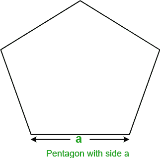
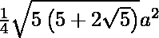

# 寻找五边形面积的程序

> 原文:[https://www . geesforgeks . org/program-to-find-the-area-of-Pentagon/](https://www.geeksforgeeks.org/program-to-find-the-area-of-pentagon/)

给定五边形的一边，任务是找到五边形的面积。
**例:**

```
Input : a = 5
Output: Area of Pentagon: 43.0119

Input : a = 10
Output: Area of Pentagon: 172.047745
```

正五边形是所有边和角都相等的五边几何形状。它的内角是 108 度，外角是 72 度。五边形的内角之和是 540 度。



设 a 为五边形的边，那么求五边形面积的公式由
面积=T2 给出

## C++

```
// C++ program to find the area of Pentagon
#include<bits/stdc++.h>
using namespace std;

// Function to find area of pentagon
float findArea(float a)
{
    float area;

    // Formula to find area
    area = (sqrt(5 * (5 + 2 * (sqrt(5)))) * a * a) / 4;

    return area;
}

// Driver code
int main()
{
    float a = 5;

    // function calling
    cout << "Area of Pentagon: " << findArea(a);

    return 0;
}
```

## Java 语言(一种计算机语言，尤用于创建网站)

```
// Java program to find the area of Pentagon
import java.io.*;

class GFG {

    // Function to find area of pentagon
    static float findArea(float a)
    {
        float area;

        // Formula to find area
        area = (float)(Math.sqrt(5 * (5 + 2
                * (Math.sqrt(5)))) * a * a) / 4;

        return area;
    }

    // Driver code
    public static void main (String[] args)
    {
        float a = 5;

        System.out.println("Area of Pentagon: "
                               + findArea(a));
    }
}
```

## 蟒蛇 3

```
# Python3 program to find
# the area of Pentagon

# Import Math module
# to use sqrt function
from math import sqrt

# Function to find
# area of pentagon

def findArea(a):

    # Formula to find area
    area = (sqrt(5 * (5 + 2 *
           (sqrt(5)))) * a * a) / 4
    return area

# Driver code
a = 5

# call function findArea()
# to calculate area of pentagon
# and print the calculated area
print("Area of Pentagon: ",
               findArea(a))

# This code is contributed
# by ihritik
```

## C#

```
// C# program to find
// the area of Pentagon
using System;

class GFG
{

    // Function to find
    // area of pentagon
    static float findArea(float a)
    {
        float area;

        // Formula to find area
        area = (float)(Math.Sqrt(5 * (5 + 2 *
                      (Math.Sqrt(5)))) *
                             a * a) / 4;

        return area;
    }

    // Driver code
    public static void Main ()
    {
        float a = 5;

        Console.WriteLine("Area of Pentagon: "+
                                  findArea(a));
    }
}

// This code is contributed
// by anuj_67.
```

## 服务器端编程语言（Professional Hypertext Preprocessor 的缩写）

```
<?php
// PHP program to find
// the area of Pentagon

// Function to find
// area of pentagon
function findArea($a)
{
    $area;

    // Formula to find area
    $area = (sqrt(5 * (5 + 2 *
            (sqrt(5)))) * $a *
                      $a) / 4;

    return $area;
}

// Driver code
$a = 5;

// function calling
echo "Area of Pentagon: " ,
              findArea($a);

// This code is contributed
// by anuj_67.
?>
```

## java 描述语言

```
<script>

// Javascript program to find the area of Pentagon

// Function to find area of pentagon
function findArea(a)
{
    let area;

    // Formula to find area
    area = (Math.sqrt(5 * (5 + 2 * (Math.sqrt(5)))) * a * a) / 4;
    return area;
}

// Driver code
    let a = 5;

    // function calling
    document.write("Area of Pentagon: " + findArea(a));

// This code is contributed by Mayank Tyagi
</script>
```

**Output:** 

```
Area of Pentagon: 43.0119
```