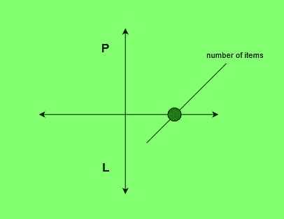

# 寻找盈亏平衡点的程序

> 原文:[https://www . geesforgeks . org/program-to-find-the-break-point/](https://www.geeksforgeeks.org/program-to-find-the-break-even-point/)

根据每月支出清单


组织的销售价格


以及日常维护


每个项目的任务是计算盈亏平衡点。
**盈亏平衡点**是指为了中和总支出，即总体上既不盈利也不亏损而卖出的物品数量。
**示例:**

> 投入:支出= 18000，S = 600，M = 100
> 产出:36
> 我们需要销售 36 个项目来支付支出和维护开销
> 投入:支出= 3550，S = 90，M = 65
> 产出:142



**进场:**

1.  计算所有支出的总和。
2.  从售价中减去维护费(成本价)。
3.  将支出总额除以上述获得的金额，以获得最小的销售项目数(盈亏平衡点)。

以下是上述方法的实现:

## C++

```
// C++ program to find the break-even point.

#include <iostream>
#include <math.h>
using namespace std;

// Function to calculate Break Even Point
int breakEvenPoint(int exp, int S, int M)
{
    float earn = S - M;

    // Calculating number of articles to be sold
    int res = ceil(exp / earn);

    return res;
}

// Main Function
int main()
{
    int exp = 3550, S = 90, M = 65;
    cout << breakEvenPoint(exp, S, M);
    return 0;
}
```

## Java 语言(一种计算机语言，尤用于创建网站)

```
// Java program to find Break Even Point
import java.io.*;
import java.lang.*;

class GFG
{
// Function to calculate
// Break Even Point
public static int breakEvenPoint(int exp1,
                                 int S, int M)
{
    double earn = S - M;

    double exp = exp1;

    // Calculating number of
    // articles to be sold
    double res = Math.ceil(exp / earn);

    int res1 = (int) res;

    return res1;
}

// Driver Code
public static void main (String[] args)
{
    int exp = 3550, S = 90, M = 65;
    System.out.println(breakEvenPoint(exp, S, M));
}
}

// This code is contributed
// by Naman_Garg
```

## 蟒蛇 3

```
# Python 3 program to find
# Break Even Point
import math

# Function to calculate
# Break Even Point
def breakEvenPoint(exp, S, M):

    earn = S - M

    # Calculating number of
    # articles to be sold
    if res != 0:
      res = math.ceil(exp / earn)
    # if profit is 0, it will never make ends meet
    else:
      res = float('inf')

    return res

# Driver Code
if __name__ == "__main__" :

    exp = 3550
    S = 90
    M = 65

    print (int(breakEvenPoint(exp, S, M)))

# This code is contributed
# by Naman_Garg
```

## C#

```
// C# program to find Break Even Point
using System;

class GFG
{
// Function to calculate
// Break Even Point
public static int breakEvenPoint(int exp1,
                                int S, int M)
{
    double earn = S - M;

    double exp = exp1;

    // Calculating number of
    // articles to be sold
    double res = Math.Ceiling(exp / earn);

    int res1 = (int) res;

    return res1;
}

// Driver Code
public static void Main ()
{
    int exp = 3550, S = 90, M = 65;
    Console.WriteLine(breakEvenPoint(exp, S, M));
}
}

// This code is contributed
// by inder_verma..
```

## 服务器端编程语言（Professional Hypertext Preprocessor 的缩写）

```
<?php
// PHP program to find the break-even point.

// Function to calculate Break Even Point
function breakEvenPoint($exp, $S, $M)
{
    $earn = $S - $M;

    // Calculating number of articles
    // to be sold
    $res = ceil($exp / $earn);

    return $res;
}

// Driver Code
$exp = 3550; $S = 90; $M = 65;
echo breakEvenPoint($exp, $S, $M);

// This code is contributed
// by inder_verma..
?>
```

## java 描述语言

```
<script>

// Javascript program to find the break-even point.

// Function to calculate Break Even Point
function breakEvenPoint(exp, S, M)
{
    var earn = S - M;

    // Calculating number of articles to be sold
    var res = Math.ceil(exp / earn);

    return res;
}

// Main Function
var exp = 3550, S = 90, M = 65;
document.write( breakEvenPoint(exp, S, M));

</script>
```

**Output:** 

```
142
```