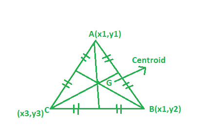
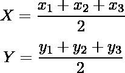

# 计算三角形质心的程序

> 原文:[https://www . geesforgeks . org/program-to-find-the-质心三角形/](https://www.geeksforgeeks.org/program-to-find-the-centroid-of-the-triangle/)

给定三角形的顶点。任务是找到三角形的质心:
**例:**

```
Input: A(1, 2), B(3, -4), C(6, -7)
Output: (3.33, -3)

Input: A(6, 2), B(5, -9), C(2, -7)
Output: (6.5, -9)
```



**方法:**假设一个三角形的顶点是(x1，y1) (x2，y2) (x3，y3)，那么这个三角形的质心可以从下面的公式中找到:



## C++

```
// CPP program to find the centroid of triangle
#include <bits/stdc++.h>
using namespace std;

// Driver code
int main()
{
    // coordinate of the vertices
    float x1 = 1, x2 = 3, x3 = 6;
    float y1 = 2, y2 = -4, y3 = -7;

    // Formula to calculate centroid
    float x = (x1 + x2 + x3) / 3;
    float y = (y1 + y2 + y3) / 3;

    cout << setprecision(3);
    cout << "Centroid = "
         << "(" << x << ", " << y << ")";

    return 0;
}
```

## Java 语言(一种计算机语言，尤用于创建网站)

```
// Java program to find the centroid of triangle
import java.util.*;
import java.lang.*;

class GFG
{

// Driver code
public static void main(String args[])
{
    // coordinate of the vertices
    float x1 = 1, x2 = 3, x3 = 6;
    float y1 = 2, y2 = -4, y3 = -7;

    // Formula to calculate centroid
    float x = (x1 + x2 + x3) / 3;
    float y = (y1 + y2 + y3) / 3;

    //System.out.print(setprecision(3));
    System.out.println("Centroid = "
        + "(" + x + ", " + y + ")");
}
}

// This code is contributed
// by Akanksha Rai(Abby_akku)
```

## 蟒蛇 3

```
# Python3 program to find
# the centroid of triangle

# Driver code    
if __name__ == "__main__" :

    # coordinate of the vertices
    x1, x2, x3 = 1, 3, 6
    y1, y2, y3 = 2, -4, -7

    # Formula to calculate centroid
    x = round((x1 + x2 + x3) / 3, 2)
    y = round((y1 + y2 + y3) / 3, 2)

    print("Centroid =","(",x,",",y,")")

# This code is contributed by ANKITRAI1
```

## C#

```
// C# program to find the
// centroid of triangle
using System;

class GFG
{

// Driver code
static public void Main ()
{

    // coordinate of the vertices
    float x1 = 1, x2 = 3, x3 = 6;
    float y1 = 2, y2 = -4, y3 = -7;

    // Formula to calculate centroid
    float x = (x1 + x2 + x3) / 3;
    float y = (y1 + y2 + y3) / 3;

    //System.out.print(setprecision(3));
    Console.Write("Centroid = " +
                  "(" + x + ", " + y + ")");
}
}

// This code is contributed
// by RaJ
```

## 服务器端编程语言（Professional Hypertext Preprocessor 的缩写）

```
<?php
// PHP program to find the
// centroid of triangle

// Driver code

// coordinate of the vertices
$x1 = 1;
$x2 = 3 ;
$x3 = 6;
$y1 = 2;
$y2 = -4;
$y3 = -7;

// Formula to calculate centroid
$x = round(($x1 + $x2 + $x3) / 3, 2);
$y = round(($y1 + $y2 + $y3) / 3, 2);

echo "Centroid = " .
     "(" .$x .", " .$y .")";

// This code is contributed
// by ChitraNayal
?>
```

## java 描述语言

```
<script>

// javascript program to find the centroid of triangle

// Driver code

// coordinate of the vertices
var x1 = 1, x2 = 3, x3 = 6;
var y1 = 2, y2 = -4, y3 = -7;

// Formula to calculate centroid
var x = (x1 + x2 + x3) / 3;
var y = (y1 + y2 + y3) / 3;

// document.write(setprecision(3));
document.write("Centroid = "
    + "(" + x.toFixed(2) + ", " + y + ")");

// This code contributed by shikhasingrajput
</script>
```

**Output:** 

```
Centroid = (3.33, -3)
```