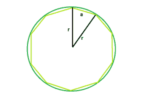

# 求任意正多边形外接圆的程序

> 原文:[https://www . geesforgeks . org/program-to-find-外接圆任意正多边形/](https://www.geeksforgeeks.org/program-to-find-the-circumcircle-of-any-regular-polygon/)

给定边长为 **a** 的 **n** 边多边形。任务是找出多边形中圆的面积。
**例:**

```
Input: n = 10, a = 3
Output: 1.99737

Input: n = 5, a = 6
Output: 3.02487
```



**逼近**:一个正 **n** -gon 将圆分割成 **n** 块，这样三角形的中心角就是一个被**n**:**360°/n**分割的整圆。
对三角形的三个边长应用**余弦定律**，得到

> **C2 = a2+B2–2ab cos C**
> **or，a2 = R2+R2–2rr cos(360/n)**
> **or，a2 = 2r 2–2r 2 cos(360/n)**
> **or，C2 = R2(2–2 cos(360/n))**
> **所以，a = r√(2-2cos(360/n))**
> 【T15

以下是上述方法的实现:

## C++

```
// C++ Program to find the radius
// of the circumcircle of the given polygon

#include <bits/stdc++.h>
using namespace std;

// Function to find the radius
// of the circumcircle
float findRadiusOfcircumcircle(float n, float a)
{

    // these cannot be negative
    if (n < 0 || a < 0)
        return -1;

    // Radius of the circumcircle
    float radius = a / sqrt(2 - (2 * cos(360 / n)));

    // Return the radius
    return radius;
}

// Driver code
int main()
{

    float n = 5, a = 6;

    // Find the radius of the circumcircle
    cout << findRadiusOfcircumcircle(n, a) << endl;

    return 0;
}
```

## Java 语言(一种计算机语言，尤用于创建网站)

```
// Java Program to find the radius
// of the circumcircle of the given polygon

import java.io.*;

class GFG {

// Function to find the radius
// of the circumcircle
static float findRadiusOfcircumcircle(float n, float a)
{

    // these cannot be negative
    if (n < 0 || a < 0)
        return -1;

    // Radius of the circumcircle
    float radius = (float)(a / Math.sqrt(2 - (2 * Math.cos(360 / n))));

    // Return the radius
    return radius;
}

// Driver code

    public static void main (String[] args) {
        float n = 5, a = 6;

    // Find the radius of the circumcircle
    System.out.println( findRadiusOfcircumcircle(n, a)) ;

    }
}
// This code is contributed
// by anuj_67..
```

## 蟒蛇 3

```
# Python3 Program to find the
# radius of the circumcircle
# of the given polygon

# from math import all methods
from math import *

# Function to find the radius
# of the circumcircle
def findRadiusOfcircumcircle(n, a) :

    # these cannot be negative
    if n < 0 or a < 0 :
        return -1

    # Radius of the circumcircle
    radius = a / sqrt(2 - (2 * cos(360 / n)))

    # Return the radius
    return radius

# Driver code
if __name__ == "__main__" :

    n , a = 5, 6

    # Find the radius of the circumcircle
    print(round(findRadiusOfcircumcircle(n, a), 5))

# This code is contributed
# by ANKITRAI1
```

## C#

```
// C# Program to find the radius
// of the circumcircle of the given polygon
using System;

class GFG
{

// Function to find the radius
// of the circumcircle
static float findRadiusOfcircumcircle(float n,
                                      float a)
{

    // these cannot be negative
    if (n < 0 || a < 0)
        return -1;

    // Radius of the circumcircle
    float radius = (float)(a / Math.Sqrt(2 -
                   (2 * Math.Cos(360 / n))));

    // Return the radius
    return radius;
}

// Driver code
public static void Main ()
{
    float n = 5, a = 6;

    // Find the radius of the circumcircle
    Console.WriteLine(findRadiusOfcircumcircle(n, a));
}
}

// This code is contributed
// by anuj_67
```

## 服务器端编程语言（Professional Hypertext Preprocessor 的缩写）

```
<?php
// PHP Program to find the radius
// of the circumcircle of the
// given polygon

// Function to find the radius
// of the circumcircle
function findRadiusOfcircumcircle($n, $a)
{

    // these cannot be negative
    if ($n < 0 || $a < 0)
        return -1;

    // Radius of the circumcircle
    $radius = $a / sqrt(2 - (2 *
                    cos(360 / $n)));

    // Return the radius
    return $radius;
}

// Driver code
$n = 5;
$a = 6;

// Find the radius of the circumcircle
echo findRadiusOfcircumcircle($n, $a);

// This code is contributed by Anuj_67..
?>
```

## java 描述语言

```
<script>
// javascript Program to find the radius
// of the circumcircle of the given polygon

// Function to find the radius
// of the circumcircle
function findRadiusOfcircumcircle(n , a)
{

    // these cannot be negative
    if (n < 0 || a < 0)
        return -1;

    // Radius of the circumcircle
    var radius = (a / Math.sqrt(2 - (2 * Math.cos(360 / n))));

    // Return the radius
    return radius;
}

// Driver code
var n = 5, a = 6;

// Find the radius of the circumcircle
document.write( findRadiusOfcircumcircle(n, a).toFixed(5)) ;

// This code is contributed by shikhasingrajput
</script>
```

**Output:** 

```
3.02487
```