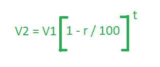

# 计算价值折旧的程序

> 原文:[https://www . geesforgeks . org/program-to-find-the-折旧价值/](https://www.geeksforgeeks.org/program-to-find-the-depreciation-of-value/)

任何容易磨损的物品的价值都会随着时间的推移而降低。这种减少称为其[折旧](https://en.wikipedia.org/wiki/Depreciation)。给定三个变量 **V1** 、 **R** 和 **T** ，其中 **V1** 为初始值， **R** 为折旧率， **T** 为年内时间。任务是找到 **T** 年后物品的价值。
**举例:**

> **输入:** V1 = 200，R = 10，T = 2
> **输出:** 162
> **输入:** V1 = 560，R = 5，T = 3
> **输出:** 480.13

**方法:**与**复利**一样，在约定的时间间隔结束时，定期向本金增加利息，以产生新的本金。同样，折旧价值是在约定的时间间隔结束时产生新价值的金额的减少价值。
因此如果 **V1** 是某一时间的价值而 **R%** 是每年的折旧率(折旧率不能超过 100%)，那么 **T** 年年末的价值 **V2** 就是:



以下是上述方法的实现:

## C++

```
// CPP program to find depreciation of the value
// initial value, rate and time are given
#include <bits/stdc++.h>
using namespace std;

// Function to return the depreciation of value
float Depreciation(float v, float r, float t)
{

    float D = v * pow((1 - r / 100), t);

    return D;
}

// Driver Code
int main()
{
    float V1 = 200, R = 10, T = 2;

    cout << Depreciation(V1, R, T);

    return 0;
}
```

## Java 语言(一种计算机语言，尤用于创建网站)

```
// Java program to find depreciation of the value
// initial value, rate and time are given
import java.io.*;

class GFG
{

// Function to return the depreciation of value
static float Depreciation(float v,
                          float r, float t)
{
    float D = (float)(v * Math.pow((1 - r / 100), t));

    return D;
}

// Driver code
public static void main(String[] args)
{
    float V1 = 200, R = 10, T = 2;

    System.out.print(Depreciation(V1, R, T));
}
}

// This code is contributed by anuj_67..
```

## 蟒蛇 3

```
# Python 3 program to find depreciation of the value
# initial value, rate and time are given
from math import pow

# Function to return the depreciation of value
def Depreciation(v, r, t):
    D = v * pow((1 - r / 100), t)

    return D

# Driver Code
if __name__ == '__main__':
    V1 = 200
    R = 10
    T = 2

    print(int(Depreciation(V1, R, T)))

# This code is contributed by
# Surendra_Gangwar
```

## C#

```
// C# program to find depreciation of the value
// initial value, rate and time are given
using System;

class GFG
{

// Function to return the depreciation of value
static float Depreciation(float v, float r, float t)
{

    float D = (float) (v * Math.Pow((1 - r / 100), t));

    return D;
}

// Driver code
public static void Main()
{
    float V1 = 200, R = 10, T = 2;

    Console.WriteLine(Depreciation(V1, R, T));
}
}

// This code is contributed by nidhiva
```

## java 描述语言

```
// javascript program to find depreciation of the value
// initial value, rate and time are given

// Function to return the depreciation of value
 function Depreciation( v,  r,  t)
{

    var D =  v * Math.pow((1 - r / 100), t)
    return D;
}

// Driver code
    var V1 = 200,  R = 10,  T = 2;
    document.write(Depreciation(V1, R, T));

// This code is contributed by bunnyram19. 
```

**Output:** 

```
162
```